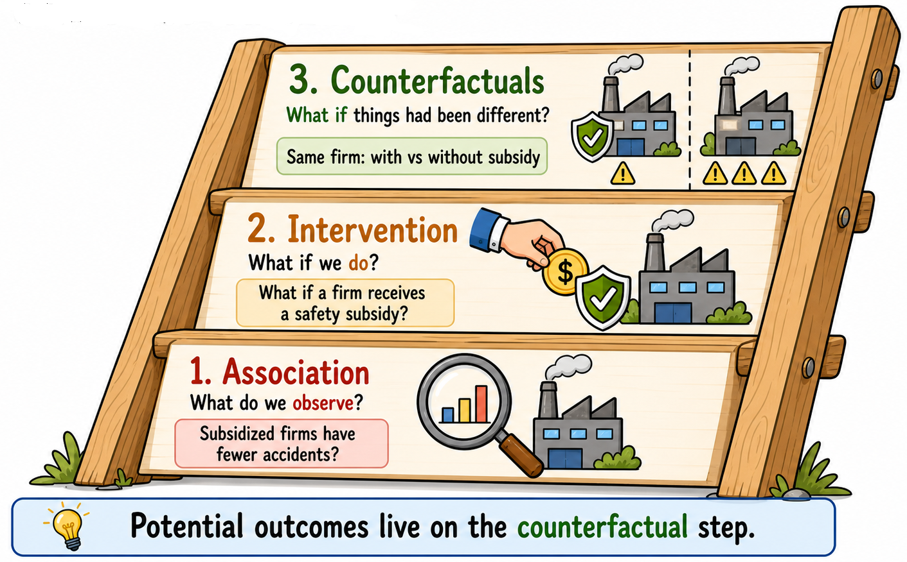

## What Is Impact Evaluation and Why Does It Matter?

Does the opening of a nursery school in a neighborhood increase local employment? Do subsidies aimed at improving workplace safety actually reduce occupational injuries? Do local jurisdiction amalgamations affect voters' political engagement? How many people died because of the COVID-19 pandemic?

These are all **causal questions**. They ask whether a specific policy, intervention, or shock produced a change in an outcome of interest. In the language of impact evaluation, we usually refer to this policy, intervention, or shock more generally as the **treatment**. The treatment may be the opening of a nursery school, the provision of workplace-safety subsidies, a municipal amalgamation, or a large unexpected shock such as the COVID-19 pandemic. The outcome may be parents' employment, occupational injuries, voter turnout, or pandemic-related deaths.

But how can we answer such questions in a credible way?

## An example: the opening of a nursery school

Consider the first example. Suppose that, at time $t_0$, a neighborhood has no nursery school. At time $t_1$, a new nursery school opens. By time $t_2$, we observe the employment status of parents of young children in that neighborhood.

Nursery schools may serve several purposes, from supporting child development to helping families manage care responsibilities. In this example, however, we focus on one specific mechanism: access to childcare may free up parents’ time and make it easier for them to participate in the labor market.

However, observing what happens after the nursery school opens is not enough to establish whether it caused a change in parents' employment. To answer this question, we need to think in **counterfactual terms**.

::: {.callout-note}
## The counterfactual question

What would have happened to parents’ employment in the treated neighborhood if the nursery school had not opened?
:::

This is the central difficulty of impact evaluation. We observe the employment status of parents in the treated neighborhood after the nursery school opens, but we cannot observe what their employment status would have been, at the same time, if the nursery school had not opened. The counterfactual is therefore missing. The goal of impact evaluation methods is to find a credible way to **fill in this missing information**.

::: {.callout-important}
## Back to basics

The causal question is not whether the outcome changed over time, but **whether it changed because of the treatment, and by how much**.

To answer it, we need a credible counterfactual: a convincing approximation of what the outcome of treated units would have been in the post-treatment period had they not received the treatment.
:::

## Three intuitive comparisons

There are several intuitive ways one might try to estimate the effect of the nursery school.

**Option A**: We could use **a before–after comparison.** We could compare parents’ employment in the neighborhood before the nursery school opened, at $t_0$, with parents’ employment after the opening, at $t_2$.

**Option B**: We could use **a cross-sectional comparison**. We could compare parents’ employment in the treated neighborhood after the nursery school opened, at $t_2$, with parents’ employment in other neighborhoods where no nursery school opened during the same period.

**Option C**: We could use **a difference-in-differences comparison.** We could compare the change in parents’ employment in the treated neighborhood between $t_0$ and $t_2$ with the change in parents’ employment over the same period in neighborhoods that did not receive a new nursery school.

Each of these approaches is intuitive. Yet each can also be misleading.

## Why simple comparisons may fail

::: {.callout-warning}
## Identification issues with simple comparisons

**Option A**: A before–after comparison may confuse the effect of the nursery school with other changes occurring over time. Parents’ employment may have increased even without the new facility. For example, the local labor market may already have been on an upward trend before the nursery school opened. In that case, attributing the entire increase in parents’ employment to the nursery school would overstate its effect. Similarly, if a negative economic shock occurred between $t_1$ and $t_2$, we might wrongly attribute the consequences of that shock to the nursery school.

**Option B**: A cross-sectional comparison may also lead to wrong conclusions. Neighborhoods with and without a new nursery school may differ in many ways even before the policy is introduced. They may have different income levels, demographic structures, education levels, labor-market opportunities, or demand for childcare. As these differences are usually related to employment, comparing the two groups of parents after the nursery school opens would not correctly identify the employment effect of the nursery school itself.

**Option C**: A difference-in-differences comparison is the most sophisticated among these simple alternatives, but it still relies on an assumption that may not hold in this application. The key requirement is the **parallel-trends assumption**: if the nursery school had not opened, parents’ employment in the treated neighborhood would have evolved similarly to parents’ employment in the comparison neighborhoods. However, if parents’ employment was already evolving differently in the treated neighborhood before the opening, this assumption may not be credible. In that case, the estimated effect may still mix the impact of the nursery school with other pre-existing differences in parents’ employment trends.

:::

## Why observational data are challenging

Constructing a credible counterfactual is not easy, especially when working with **observational data**, as in the examples above. In observational settings, policies are not usually assigned at random. Nursery schools may open in neighborhoods with specific characteristics. Workplace-safety subsidies may be received by firms that are more proactive, more exposed to risk, or better informed about public programs. Municipal amalgamations may involve municipalities with particular administrative or political characteristics.

For this reason, a simple comparison between treated and untreated units may be misleading: it may reflect pre-existing differences between the two groups rather than the causal effect of the treatment.

## Why randomized controlled trials help

Estimating the causal effect would be easier in an **RCT**. Suppose, for example, that a large number of similar neighborhoods applied to receive a new nursery school, but budget constraints allowed the government to build only some of them.

If the neighborhoods receiving the new facility were chosen at random, then, on average, the treated and untreated neighborhoods would be comparable before the policy. This is because random assignment breaks the link between treatment status and the pre-existing characteristics of neighborhoods: richer and poorer areas, neighborhoods with higher or lower employment, and places with stronger or weaker demand for childcare would all have the same probability of receiving the new nursery school.

With a sufficiently large number of neighborhoods, say a few hundred, the law of large numbers helps make the treated and untreated groups similar, on average, in terms of these characteristics. In that case, neighborhoods without a new facility would provide, on average, a credible approximation of the counterfactual outcome for the treated neighborhoods in the absence of the policy.

::: {.callout-important appearance="simple"}
## Why randomization is powerful

Randomization is powerful because it creates treated and untreated groups that are comparable **by design**, before the intervention takes place. Differences observed after the intervention can then be more plausibly attributed to the intervention itself, rather than to pre-existing differences between the two groups.

This is why RCTs are often considered the benchmark for causal evaluation.
:::

## What Can We Do When an RCT Is Not an Option?

In many policy contexts, however, randomization is not feasible. It may be too costly, politically unacceptable, ethically problematic, or simply impossible because the policy has already been implemented.

Much of impact evaluation therefore deals with a practical question:

::: {.callout-note}
## The practical question

How can we construct a credible counterfactual when random assignment is not available?
:::

The methods discussed in this book can be seen as different answers to this question. Each method tries, in its own way, to approximate the missing counterfactual under certain assumptions. The key issue is not to choose the most sophisticated method, but to understand **which available method is supported by the most credible assumptions in the empirical setting under analysis**.

::: {.callout-important}
## RCT thinking in observational studies

Donald Rubin puts the point very sharply:

> “Valid frequentist causal inferences from an observational study can only be obtained if you embed the observational study within a hypothetical randomized experiment. [...] Otherwise you are just looking at computer output and implied associations, and making up, generally silly, although sometimes interesting, stories.”

Source: This quote is from Rubin's interview in *Observational Studies* [@rubin2022interview].

This statement captures a central lesson of impact evaluation: **even when we cannot run an RCT, we should still think as if we were trying to approximate one**. This means asking what the corresponding randomized experiment would look like. If randomization had been possible, what would the study population have been? Which units would have been randomly assigned to treatment and control? What would the control condition have been?

In observational studies, we must then ask how the actual setting differs from this ideal experiment. Why did some units receive the treatment while others did not? Which pre-treatment characteristics may have influenced treatment assignment? Which untreated units are most comparable to the treated units? And under which assumptions can this observational comparison approximate the comparison that randomization would have created?

This way of thinking is useful because it disciplines the design of observational studies. It forces the researcher to move beyond the mechanical application of an evaluation method and to make explicit the comparison that gives the causal estimate its meaning. In this sense, **RCT thinking** is not only relevant for randomized experiments. It is also a benchmark for observational studies: it helps clarify the target causal question, the assignment mechanism, the role of untreated units, and the assumptions needed to give an estimate a causal interpretation.
:::
<!--
## The counterfactual question

For each treated unit, we would like to know two outcomes:

- the outcome observed under treatment;
- the outcome that would have been observed without treatment.

The first is observed. The second is not. This missing outcome is the counterfactual.

Different impact evaluation methods differ in how they approximate this missing counterfactual outcome.
-->

::: {.callout-note appearance="simple"}
\small
Pearl and Mackenzie [-@pearl2018] describe causal reasoning as a **ladder of causality** with three levels.

{width="70%"}

::: {.less-indented-list}
1. The first level is **association**. At this level, we ask whether two variables move together. For example: are firms that receive public subsidies less likely to have workplace accidents? This is an associational question. It can be answered by comparing observed accident rates, or by estimating a regression that relates accident rates to subsidy receipt. However, it does not tell us whether the subsidy caused the difference. Many empirical analyses stop at this level. They document that a treatment variable is statistically associated with an outcome and then interpret the estimated coefficient as if it were a causal effect. This is tempting, but it leaves the key causal question unanswered: whether the observed association reflects the treatment itself or pre-existing differences between treated and untreated units. One of the main aims of this book is to convince the reader that this is not a reliable way to estimate causal effects. To do so, we need to move up the ladder...

2. The second level is **intervention**. At this level, we ask what would happen if we actively changed something. For example: what would happen to workplace accidents if a firm received a public subsidy for safety investments? This is the level of causal questions: it asks about the effects of actions, treatments, and policies.

3. The third level is **counterfactuals**. At this level, we ask what would have happened under an alternative state of the world. For example: for a firm that received the subsidy, how many workplace accidents would have occurred if that same firm had not received it? This is the level of potential outcomes, because it compares the observed outcome with the missing counterfactual outcome.
:::
In this sense, the potential outcomes framework works at the counterfactual level of the ladder. It defines causal effects by comparing what happened with what would have happened under a different treatment status.
:::
