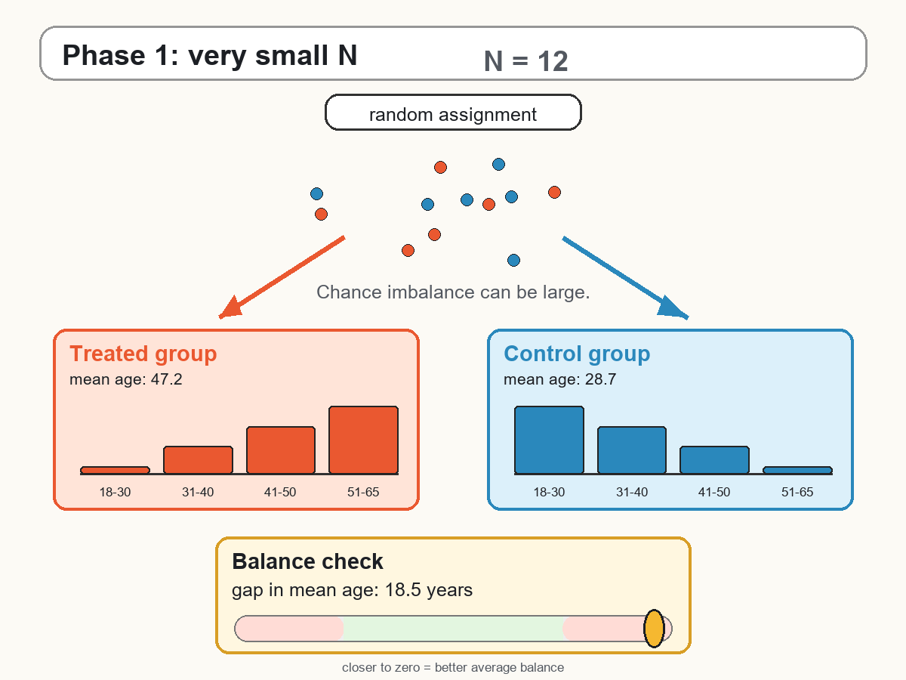
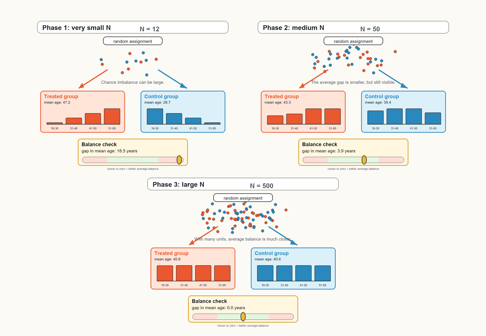

## Randomized Controlled Trials

::: {.content-visible when-format="html"}

:::

::: {.content-visible when-format="pdf"}

:::

## What is an RCT?

A **randomized controlled trial (RCT)** is the benchmark research design for causal inference. It is so central to the logic of causal analysis that we have already briefly discussed it in each of the previous chapters. Its logic is simple: if treatment is assigned randomly, treated and untreated units should be comparable on average before the intervention. Therefore, any systematic difference in outcomes after the intervention can be attributed to the treatment rather than to pre-existing differences between the two groups.

In the potential outcomes framework, each unit $i$ has two potential outcomes:

$$
Y_i(1)
\quad \text{and} \quad
Y_i(0),
$$

where $Y_i(1)$ is the outcome under treatment and $Y_i(0)$ is the outcome without treatment. The individual treatment effect is

$$
\Delta_i = Y_i(1)-Y_i(0).
$$

As discussed earlier, we cannot observe both potential outcomes for the same unit. Randomized experiments solve this problem statistically: they create a treated group and a control group that are comparable in expectation.

::: {.callout-note appearance="simple"}
### Key idea

An RCT creates a credible counterfactual by random assignment.  
The control group tells us what would have happened to the treated group, on average, in the absence of treatment.
:::

### Random Assignment

Let $D_i$ be the treatment indicator:

$$
D_i =
\begin{cases}
1 & \text{if unit } i \text{ is assigned to treatment},\\
0 & \text{if unit } i \text{ is assigned to control}.
\end{cases}
$$

In a randomized experiment, $D_i$ is assigned by chance. Conceptually, this is like flipping a coin: before assignment, each eligible unit has a known probability (in most cases 50%) of being allocated to the treatment or control group. In practice, randomization is usually implemented through more structured procedures, such as computer-generated random numbers, stratified randomization, or block randomization. The key point, however, is the same: treatment assignment is governed by a known random process, rather than by the choices or characteristics of the units. This implies that treatment status is independent of the potential outcomes:

$$
(Y_i(1),Y_i(0)) \perp D_i.
$$

This condition is crucial. It means that treated and control units do not differ systematically in terms of the outcomes they would have had under treatment or under control. Any difference between the two groups is due only to random sampling variation.

As a result,

$$
E[Y_i(0)\mid D_i=1] = E[Y_i(0)\mid D_i=0],
$$

and

$$
E[Y_i(1)\mid D_i=1] = E[Y_i(1)\mid D_i=0].
$$

The control group can therefore be used to estimate the missing counterfactual outcome for the treated group.

### Estimating the Treatment Effect

In the simplest randomized experiment, the treatment effect can be estimated using a difference in mean outcomes:

$$
\widehat{\tau}_{RCT}
=
\overline{Y}^{obs}_{D=1}
-
\overline{Y}^{obs}_{D=0}.
$$

That is, we compare the average observed post-treatment outcome among treated units with the average observed post-treatment outcome among control units.

Because treatment is randomly assigned,

$$
E[Y_i^{obs}\mid D_i=1] = E[Y_i(1)],
$$

and

$$
E[Y_i^{obs}\mid D_i=0] = E[Y_i(0)].
$$

Therefore,

$$
E[\widehat{\tau}_{RCT}]
=
E[Y_i(1)] - E[Y_i(0)]
=
ATE.
$$

This is the central strength of randomized experiments: a simple comparison of means identifies the ATE, provided that the experiment is properly implemented.

::: {.callout-note appearance="simple"}
### Why randomization matters

Without randomization, treated and untreated units may differ for many reasons other than the treatment.  
With randomization, these differences are balanced on average, so the control group provides a credible counterfactual.
:::

### Randomization and Selection Bias

In observational studies, treated and untreated units often differ before the treatment. This creates selection bias. A simple difference in means can be written as

$$
DIM =
E[Y_i^{obs}\mid D_i=1]
-
E[Y_i^{obs}\mid D_i=0].
$$

In general,

$$
DIM = ATT + Bias,
$$

where

$$
Bias =
E[Y_i(0)\mid D_i=1]
-
E[Y_i(0)\mid D_i=0].
$$

In a randomized experiment, random assignment implies

$$
E[Y_i(0)\mid D_i=1]
=
E[Y_i(0)\mid D_i=0].
$$

Therefore,

$$
Bias = 0.
$$

This is why randomized controlled trials are often described as the **gold standard** of causal inference: they remove selection bias by design.

### Treatment and Control Groups

An RCT requires at least two groups:

- a **treatment group**, which receives the intervention;
- a **control group**, which does not receive the intervention.

The control group is not a secondary detail. It is what allows us to approximate the counterfactual outcome: what would have happened to the treated units if they had not received the treatment.

For example, suppose we want to evaluate whether sending households personalized feedback on their energy consumption reduces electricity use. We randomly assign eligible households either to receive the feedback messages or not to receive them. After the intervention, we compare electricity consumption across the two groups. If randomization was successful, the difference in consumption can be interpreted as the causal effect of the feedback intervention.

### Why Experiments Are Powerful

Randomized experiments are powerful because treatment assignment is under the researcher’s control. Units are assigned to treatment and control groups according to a known procedure. This avoids the main problem of many observational studies: units self-select into treatment or are selected by policymakers in ways that may be related to the outcome.

For instance, people who choose to attend a training course may be more motivated than those who do not. Firms that apply for subsidies may have better growth prospects than firms that do not apply. Neighborhoods receiving a new nursery school may already differ from other neighborhoods in income, demographics, or demand for childcare.

Randomization breaks this link between treatment assignment and potential outcomes because units are assigned to treatment or control before the treatment takes place. It creates treated and untreated groups that are comparable before the treatment, at least in expectation.

::: {.callout-note appearance="simple"}
## The Project STAR experiment

One of the largest and most influential RCTs in education is **Project STAR** (*Student/Teacher Achievement Ratio*), conducted in Tennessee in the 1980s.

The experiment randomly assigned students and teachers to different classroom types: small classes, regular-size classes, and regular-size classes with a teacher aide. Because assignment was randomized, differences in later outcomes across these groups can be interpreted as causal effects of class size, under the usual assumptions of the randomized design.

Project STAR is especially important because it studied a policy question of direct relevance for education policy: whether reducing class size improves student achievement. The results showed that students assigned to smaller classes performed better on standardized tests, especially in the early grades. Later research also found that the benefits of small classes persisted over time, affecting outcomes such as test scores, college attendance, and earnings.

This example illustrates the strength of RCTs. Randomization creates comparable groups before treatment, so the control group provides a credible estimate of what would have happened to students assigned to small classes if they had instead attended regular-size classes.

At the same time, Project STAR also shows that even large RCTs require careful interpretation. Researchers must consider issues such as compliance, attrition, implementation quality, and whether the results can be generalized to other schools, states, or education systems.
:::

## Historical Intuition

The logic of randomization was developed first in the context of experimental statistics. Fisher’s work on agricultural experiments showed how random assignment could be used to separate the effect of a treatment from background variation in the environment [@fisher1935]. Neyman’s earlier work on potential outcomes also provided a formal way to think about causal effects as comparisons between different possible outcomes for the same unit [@neyman1990].

The idea later became central in medicine. A landmark example is the 1948 randomized trial of streptomycin for pulmonary tuberculosis, conducted by the Medical Research Council in the United Kingdom [@medicalresearchcouncil1948]. Patients were allocated to treatment or control groups using randomization, and outcomes were compared across groups. This design helped establish the randomized controlled trial as a benchmark for evaluating whether a treatment works.

::: {.callout-note}
## How RCTs transformed medicine

RCTs revolutionized the medical sector because they changed how evidence on treatments is produced. Before RCTs became standard, medical practice often relied on clinical experience, expert judgment, biological reasoning, or uncontrolled comparisons. These sources of knowledge can be valuable, but they can also be misleading when patients receiving a treatment differ systematically from those who do not.

Randomization made it possible to compare treatments in a more credible way. If patients are randomly assigned to a new therapy or to a control condition, differences in health outcomes can be attributed more convincingly to the treatment rather than to pre-existing differences in disease severity, age, lifestyle, or physician choices.

This logic became the foundation of evidence-based medicine. Modern drug approval, clinical guidelines, and many public health recommendations rely heavily on randomized evidence. RCTs also made clear that plausible treatments can fail, and that some treatments believed to be effective may have little benefit or even cause harm.

The broader lesson for impact evaluation is the same: a credible evaluation requires a credible counterfactual. Medicine adopted RCTs because they provide the cleanest ways to construct that counterfactual.
:::

## A/B tests

An **A/B test** is a simple form of randomized experiment, commonly used in digital platforms, marketing, and product design.

Users are randomly assigned to one of two versions of an intervention. In practice, this randomization is usually implemented automatically by the digital platform: when a user visits the website or opens the app, an algorithm assigns the user to one version or the other, often using a random number generator linked to the user ID.

- **Group A** sees the original version;
- **Group B** sees a modified version.

For example, an online platform may randomly show two versions of a webpage. Version A has the original layout, while version B changes the color or position of a button. The outcome may be the click rate, conversion rate, purchase probability, or time spent on the page.

Because users are randomly assigned to A or B, the difference in average outcomes can be interpreted causally:

$$
\widehat{\tau}_{AB}
=
\overline{Y}^{obs}_{B}
-
\overline{Y}^{obs}_{A}.
$$

The key point is that the two groups should be comparable before seeing the webpage. Therefore, if version B produces a higher conversion rate, the difference can be attributed to the change being tested, rather than to pre-existing differences between users.

## Threats to Internal Validity

::: {.callout-warning appearance="simple"}
### RCTs are not magic

Randomization removes selection bias by design, but the experiment can still be threatened by failed randomization, non-compliance, attrition, behavioral responses, or small samples.
:::

Although randomized experiments are the gold standard in causal inference, random assignment alone does not automatically guarantee a valid causal estimate. Several problems can threaten the internal validity of an RCT, meaning the credibility of the claim that the estimated effect for the study population is caused by the treatment itself.

i) **Failure of Randomization**. Randomization may fail if assignment is not truly random or if the randomization procedure is poorly implemented. For example, assigning units based on surname initials may appear unrelated to the outcome, but it can create imbalances if surname initials are correlated with ethnicity, geography, or socioeconomic status.
A first diagnostic step is therefore to check whether pre-treatment characteristics are balanced across treatment and control groups. More generally, in an RCT treatment status should be assigned through a genuine random procedure, rather than through informal, discretionary, or ad hoc allocation rules.

ii) **Non-compliance**. A second problem is **non-compliance**. Some units assigned to treatment may not actually receive the treatment, while some units assigned to control may gain access to it.
In this case, we must distinguish between:
- assignment to treatment;
- actual treatment received.
The effect of assignment is often called the **intention-to-treat effect**:

$$
ITT =
E[Y_i^{obs}\mid W_i=1]
-
E[Y_i^{obs}\mid W_i=0],
$$

  where $W_i$ denotes assignment to treatment. The ITT measures the effect of being offered or assigned the treatment, regardless of whether units actually comply. This can be highly relevant for policy, because real-world programs often face imperfect take-up.

iii) **Attrition**. Attrition occurs when some units leave the study before outcomes are measured. Attrition is especially problematic if it is related to treatment status or potential outcomes.
For example, if the weakest students are more likely to drop out of a schooling experiment, the final sample may no longer be comparable across treatment and control groups. In that case, the estimated effect may reflect both the treatment and selective dropout.

iv) **Behavioral Responses**. Participants may change their behavior simply because they know they are part of an experiment. This is often called a **Hawthorne effect**. The term comes from a series of studies conducted at the Hawthorne Works factory in Cicero (Illinois), where researchers observed that workers’ behavior and productivity changed partly because they were being studied. Similarly, researchers or administrators may behave differently toward treated and control units if they know who receives the treatment.
In medical trials, double-blind placebo designs are often used to reduce these problems.

v) **Small Samples**. Randomization balances treated and control groups on average. However, in small samples, random imbalance can still occur. Treated and control units may differ by chance in important pre-treatment characteristics.
For this reason, even in randomized experiments, researchers usually report balance checks and may adjust for pre-treatment covariates to improve precision.

## Threats to External Validity

RCTs are strong on internal validity, but they do not automatically answer every policy question. An experiment may identify the causal effect for a particular population, period, and implementation setting. The effect may differ elsewhere.

For example, a recycling campaign tested in one city may not have the same effect in another city with different waste-collection infrastructure or different social norms around recycling. An energy-saving intervention tested among households with smart meters may work less well when scaled up to areas where households do not receive real-time feedback on their electricity consumption.

This is the issue of **external validity**: whether the estimated effect generalizes beyond the experimental setting.

External validity is especially important when RCT evidence is used to guide policy at scale. A trial may be implemented by highly motivated researchers, with careful monitoring, well-trained staff, and selected participants. Once the same intervention is implemented by ordinary institutions, with larger and more heterogeneous populations, the effect may change. For this reason, policymakers should ask not only whether the intervention worked in the experiment, but also whether the mechanisms, incentives, constraints, and implementation capacity are similar in the setting where the policy will be applied.

::: {.callout-warning}
## External validity in medical RCTs

External validity is a central issue in medical RCTs. A drug may be shown to be effective and safe for the population included in a trial, but this does not automatically imply that the same conclusion applies to all patients.

Clinical trials often restrict eligibility. They may exclude children, pregnant women, older patients, people with multiple health conditions, or patients taking other medications. These restrictions can improve internal validity and patient safety during the trial, but they also limit the population to which the results directly apply.

This is one reason why some drugs are not recommended, or are not authorized, for children below a certain age. The problem is not necessarily that the drug is known to be ineffective or harmful for those children. Rather, it may be that the drug has not been adequately tested in that age group. Since children differ from adults in body weight, metabolism, development, and possible side effects, evidence from adult trials cannot always be extrapolated safely.
:::

## Summary

RCTs provide the cleanest design for estimating causal effects. By randomly assigning units to treatment and control groups, they make treatment status independent of potential outcomes:

$$
(Y_i(1),Y_i(0)) \perp D_i.
$$

This allows the researcher to estimate the ATE using a simple difference in mean outcomes:

$$
\widehat{\tau}_{RCT}
=
\overline{Y}^{obs}_{D=1}
-
\overline{Y}^{obs}_{D=0}.
$$

The strength of RCTs is that they solve the selection problem by design. The limitation is that they can be difficult to implement in social science and policy settings, and they remain vulnerable to practical threats such as non-compliance, attrition, behavioral responses, and limited external validity.
