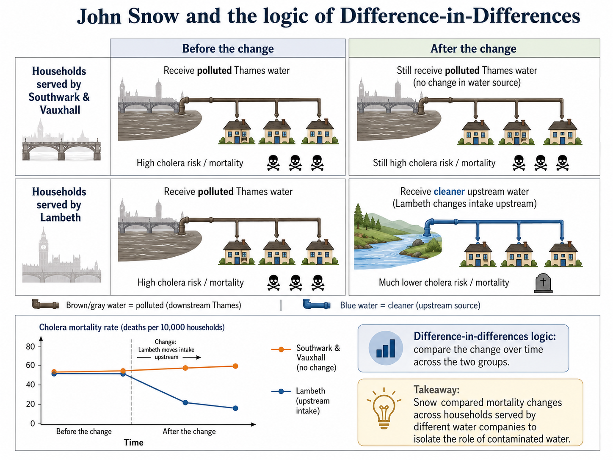

# Difference-in-Differences

::: {.callout-note}
## Difference-in-differences in a figure

:::

Difference-in-differences (DiD) is one of the most widely used research designs in impact evaluation. It is useful when a policy affects one group of units but not another, and when we observe both groups before and after the treatment.

The basic idea is simple. We compare the change in outcomes for the treated group with the change in outcomes for a comparison group over the same period. The first difference removes time-invariant differences between treated and control units. The second difference removes shocks that are common to both groups.

## The Evaluation Problem

Suppose there are two groups: a treated group and a control group. We observe both groups in two periods:

- a pre-treatment period, before the policy starts;
- a post-treatment period, after the policy starts.

Let $D_i=1$ for units in the treated group and $D_i=0$ for units in the control group. Let $Post_t=1$ in the post-treatment period and $Post_t=0$ in the pre-treatment period.

The target parameter is usually the **average treatment effect on the treated** in the post-treatment period:

$$
ATT = E[Y_{i,post}(1)-Y_{i,post}(0)\mid D_i=1].
$$

The problem is familiar: for treated units after the policy, we observe $Y_{i,post}(1)$, but we do not observe $Y_{i,post}(0)$. We need to estimate what would have happened to the treated group in the absence of treatment.

DiD uses the change observed in the control group as an estimate of the counterfactual change that the treated group would have experienced without treatment.

::: {.callout-note appearance="simple"}
### Key idea

DiD does not require treated and control units to have the same outcome levels before treatment. It requires them to have comparable trends in the absence of treatment.
:::

## Historical Intuition

An early example of DiD logic can be found in John Snow's analysis of cholera in nineteenth-century London [@snow1855]. At the time, cholera was often explained by the dominant miasma theory, according to which disease spread through “bad air.” Snow instead argued that cholera was transmitted through contaminated water.

The empirical setting was unusually informative. In parts of London, households were served by different water companies. Before the relevant change, both the Lambeth Company and the Southwark & Vauxhall Company drew water from polluted sections of the River Thames. Later, Lambeth moved its water intake upstream, to a cleaner part of the river, while Southwark & Vauxhall continued to draw water from a more contaminated downstream source.

This created a comparison across two dimensions: **before versus after** the change in water supply, and **households served by Lambeth versus households served by Southwark & Vauxhall**. If cholera mortality declined more among households served by Lambeth than among households served by Southwark & Vauxhall, this difference could be interpreted as evidence that cleaner water reduced cholera mortality.

{width=85%}

The logic is that of the traditional DiD design. The Southwark & Vauxhall households provide a comparison group, because they remained exposed to polluted water. The Lambeth households provide the treated group, because their water source changed. The key comparison is not simply whether cholera mortality was lower among Lambeth households after the change. Instead, the question is whether mortality declined **more** for Lambeth households than for households whose water supply did not change.

In economics, classic applications include Card's study of the Mariel Boatlift and the Miami labor market [@card1990], and Card and Krueger's study of the employment effects of the 1992 minimum wage increase in New Jersey relative to Pennsylvania [@card1994].

## The Basic DiD Estimator

With two groups and two periods, the DiD estimator is

$$
\widehat{\tau}_{\text{DiD}}
=
\left(\bar{Y}_{1,\text{post}}-\bar{Y}_{1,\text{pre}}\right)
-
\left(\bar{Y}_{0,\text{post}}-\bar{Y}_{0,\text{pre}}\right).
$$

where $\bar{Y}_{1,post}$ is the average post-treatment outcome for the treated group, $\bar{Y}_{1,pre}$ is the average pre-treatment outcome for the treated group, and similarly for the control group.

This can also be written as

$$
\widehat{\tau}_{\text{DiD}}
=
\left(\bar{Y}_{1,post}-\bar{Y}_{0,post}\right)
-
\left(\bar{Y}_{1,pre}-\bar{Y}_{0,pre}\right).
$$

These two expressions are algebraically equivalent. The first emphasizes changes over time within each group. The second emphasizes how the treated-control gap changes after treatment.

## Parallel Trends

The central identifying assumption is the **parallel-trends assumption**. It states that, in the absence of treatment, the treated and control groups would have experienced the same average change in outcomes.

Formally,

$$
E[Y_{i,post}(0)-Y_{i,pre}(0)\mid D_i=1]
=
E[Y_{i,post}(0)-Y_{i,pre}(0)\mid D_i=0].
$$

This assumption allows the control-group trend to stand in for the missing untreated trend of the treated group.

Under parallel trends,

$$
E[Y_{i,post}(0)\mid D_i=1]
=
E[Y_{i,pre}(0)\mid D_i=1]
+
E[Y_{i,post}(0)-Y_{i,pre}(0)\mid D_i=0].
$$

In words, the counterfactual post-treatment outcome for the treated group is obtained by taking its pre-treatment outcome and adding the change observed in the control group.

<!--Importantly, the parallel trends assumption cannot be fully tested. We cannot observe how treated units would have evolved after the intervention in the absence of treatment. What we can check is whether treated and untreated units followed similar trends before the intervention, using pre-treatment outcomes as indirect evidence in support of the assumption.
-->
::: {.callout-warning}
### Parallel trends is about counterfactual trends

The assumption is not that treated and control groups have the same outcome levels. The assumption is that, without treatment, their outcomes would have moved in parallel.
:::

## Regression Form

The two-period DiD estimator can also be obtained from the following regression:

$$
Y_{it} = \alpha + \beta Treat_i + \gamma Post_t + \tau_{\text{DiD}} (Treat_i \times Post_t) + \varepsilon_{it}.
$$

The coefficient $\tau_{\text{DiD}}$ provides the ATT estimate. In the simple two-group, two-period case, this regression coefficient is numerically equivalent to the traditional DiD formula:

$$
\widehat{\tau}_{DiD}
=
\left(\bar{Y}_{T,post}-\bar{Y}_{T,pre}\right)
-
\left(\bar{Y}_{C,post}-\bar{Y}_{C,pre}\right).
$$

The regression terms have a simple interpretation:

- $\alpha$ captures the average outcome of the control group before the policy;
- $\beta$ captures baseline differences between treated and control units;
- $\gamma$ captures the common change from the pre-treatment to the post-treatment period;
- $\tau_{\text{DiD}}$ captures the additional change experienced by the treated group after the policy, namely the ATT.

Why use a regression if the coefficient is equivalent to a simple difference between four means? The main reason is that the regression framework also provides an estimate of uncertainty around the DiD estimate. It allows us to compute standard errors and confidence intervals for $\widehat{\tau}_{\text{DiD}}$, and to test hypotheses about the underlying causal parameter $\tau_{\text{DiD}}$.

Moreover, the regression formulation is easy to extend as shown in the following section.

<!--With panel data and more than two periods, a common extension is

$$
Y_{it}
=
\alpha_i
+
\lambda_t
+
\gamma D_{it}
+
X_{it}'\beta
+
u_{it},
$$

where $\alpha_i$ are unit fixed effects and $\lambda_t$ are time fixed effects. This is the **two-way fixed effects (TWFE)** specification.

In the simple two-group, two-period case, the TWFE coefficient coincides with the basic DiD estimator. In more complex settings, especially with staggered treatment adoption, this equivalence no longer guarantees a clean causal interpretation.-->

## Covariates and Conditional Parallel Trends

The DiD regression model can be estimated with additional covariates. Covariates may improve precision and help make the parallel-trends assumption more credible.

The relevant assumption then becomes **conditional parallel trends**: after conditioning on pre-treatment characteristics, the treated and control groups would have followed the same average trend in the absence of treatment.

Covariates should be handled with care. They should typically be measured before treatment or otherwise be unaffected by treatment. Including post-treatment variables can introduce severe sources of bias.

::: {.callout-note appearance="simple"}
### Good covariates

Covariates in DiD are most convincing when they measure pre-treatment characteristics that help explain different outcome trends.
:::

## Functional Form Limitation

Parallel trends can depend on the scale of the outcome. Parallel trends in levels do not automatically imply parallel trends in logs, and parallel trends in logs do not automatically imply parallel trends in levels.

For example, suppose the outcome is wages. If wages grow by the same absolute amount in treated and control groups, trends may be parallel in levels. If wages grow by the same percentage amount, trends may be parallel in logs. These are different assumptions and imply different causal estimands.

This is why the choice between levels, logs, rates, and other transformations should be substantive rather than mechanical.

## Diagnostics and Validity Checks

The parallel-trends assumption is fundamentally about an unobserved counterfactual, so it cannot be tested directly. However, if at least two pre-treatment periods are available, its plausibility can be assessed indirectly by examining whether treated and control units followed similar trends before the treatment. If treated and control groups move very differently before treatment, the parallel-trends assumption becomes less credible.

With several pre-treatment periods, researchers can estimate placebo DiD effects using periods before the treatment actually occurred. If the method finds large "effects" before the policy, this suggests that the design may be capturing pre-existing trend differences rather than treatment effects.

Other useful checks include:

- plotting average outcomes for treated and control groups over time;
- testing for differential pre-treatment trends;
- checking sensitivity to alternative comparison groups;
- checking whether the estimated effect changes when adding pre-treatment covariates;
- examining whether other policies or shocks occurred at the same time.

::: {.callout-caution appearance="simple"}
### Pre-trends are informative, not definitive

Similar pre-treatment trends support the credibility of the DiD design, but they do not prove that counterfactual trends would have been parallel after treatment. Conversely, different pre-treatment trends should be considered as a strong warning sign.
:::

## Worked Example

Suppose a public subsidy for workplace safety is introduced in one region but not in a neighboring region. The policy starts in 2024 and aims to reduce workplace accidents.

A DiD evaluation would compare:

- the change in accident rates in the treated region before and after 2024;
- the change in accident rates in the control region over the same period.

The estimator is

$$
\widehat{DiD}
=
\left(\bar{Y}_{treated,after}-\bar{Y}_{treated,before}\right)
-
\left(\bar{Y}_{control,after}-\bar{Y}_{control,before}\right).
$$

If workplace accidents fall by 5 per 1,000 workers in the treated region and by 1 per 1,000 workers in the control region, the DiD estimate is

$$
-5 - (-1) = -4.
$$

The interpretation is that the subsidy reduced accidents by 4 per 1,000 workers, provided that the treated and control regions would have followed parallel trends in the absence of the policy.

**A note of caution.** This interpretation would be less credible if accidents were already declining faster in the treated region before the policy, or if another safety regulation was introduced only in the treated region at the same time.

## Ashenfelter's Dip

A classic threat to DiD is **Ashenfelter's dip** [@ashenfelter1978]. This occurs when units select into treatment after experiencing a temporary negative shock.

Suppose workers enter a training program after a sudden fall in earnings. Even without the program, their earnings might partially recover. A DiD estimator comparing these workers with non-participants may mistakenly attribute the natural rebound to the training program.

The problem is that treatment timing is related to a temporary shock in the untreated potential outcome. A simple DiD design differences out time-invariant unobserved heterogeneity, not temporary shocks that affect treatment participation.

Longer panels can help diagnose the problem. If outcomes fall sharply just before treatment and then recover, the design may be capturing mean reversion rather than a causal effect.

## A DiD extension: The Triple Differences Estimator

The **triple difference** estimator, or DDD, extends DiD by adding a third comparison dimension [@olden2022].

Suppose a parental leave reform is introduced in some states but not others, and applies mainly to mothers rather than fathers. A DiD comparing mothers in treated and control states may be biased if mothers in treated states were already on a different trend. A second DiD for fathers can help capture state-specific changes that are not specific to mothers.

The triple difference is the difference between two DiD estimators:

$$
DDD = DiD_{mothers} - DiD_{fathers}.
$$

The intuition is that if the bias is common to both comparisons, subtracting the second DiD removes it.

Triple differences do not remove the need for assumptions. They replace the standard parallel-trends assumption with a stronger structure: the remaining difference between the two DiD comparisons must identify the policy-specific effect.

## Matching Difference-in-Differences

Matching DiD combines the logic of matching with the logic of DiD. It is useful when treated and control units differ in observed characteristics, but panel or repeated cross-sectional data are available.

The matching step makes treated and control units more comparable in terms of observed pre-treatment covariates. The DiD step then differences out time-invariant unobserved heterogeneity.

A key contribution to this literature is Heckman, Ichimura, and Todd [@heckman1997].

For the two-period case, a matching DiD estimator for the ATT can be written as

$$
\widehat{ATT}_{MDID}
=
\frac{1}{N_T}
\sum_{i:D_i=1}
\left[
(Y_{i,post}-Y_{i,pre})
-
\sum_{j:D_j=0}w_{ij}(Y_{j,post}-Y_{j,pre})
\right],
$$

where $w_{ij}$ is the weight given to control unit $j$ when constructing the counterfactual trend for treated unit $i$.

Matching DiD relies on two main conditions:

- **conditional parallel trends**: after conditioning on covariates, treated and matched control units would have followed the same untreated trend;
- **common support**: for each treated unit, at least 1 comparable untreated unit must exist.

Importantly, matching is not automatically an improvement. If the matching variables are poorly chosen, if they are affected by treatment anticipation, or if matching discards many informative control units, the resulting DiD estimate may become less precise or even more biased. Matching can also worsen balance on pre-treatment outcome trends if it focuses only on baseline covariates. For this reason, matching DiD should be assessed empirically by checking common support, covariate balance, and especially the similarity of pre-treatment trends after matching.

::: {.callout-note appearance="simple"}
### Matching DiD

Matching DiD controls for observed differences through matching and for time-invariant unobserved differences through differencing.
:::

## TWFE With Staggered Adoption

In the canonical DiD setting, there are two groups and two periods: one group becomes treated, the other remains untreated, and the DiD estimand compares the change in outcomes for the treated group with the change in outcomes for the control group. In that simple setting, the DiD parameter has a transparent interpretation: it estimates the ATT under the parallel-trends assumption.

Many empirical applications are more complex. Units may adopt the treatment at different times: some are treated early, others later, and some may never be treated. This setting is known as **staggered adoption**. In this case, the causal effects of interest are often **group-time average treatment effects**, usually denoted as $ATT(g,t)$. These parameters measure the average effect of the treatment at time $t$ for the group of units first treated in period $g$.

For example, $ATT(g,t)$ asks: among units first treated in period $g$, what is the average difference at time $t$ between their observed outcome under treatment and the outcome they would have experienced if they had not yet been treated?

For many years, the standard empirical approach in staggered-adoption settings was to estimate a **two-way fixed effects (TWFE)** model:

$$
Y_{it}
=
\alpha_i
+
\lambda_t
+
\tau D_{it}
+
X_{it}'\beta
+
u_{it}.
$$

Here, $\alpha_i$ are unit fixed effects, which absorb time-invariant differences across units. The terms $\lambda_t$ are time fixed effects, which absorb shocks common to all units in a given period. The variable $D_{it}$ indicates whether unit $i$ is treated at time $t$. The coefficient $\tau$ is often interpreted as the ATT.

::: {.callout-warning}
### Why TWFE needs caution

With staggered treatment timing and heterogeneous effects, a TWFE coefficient may not estimate the policy-relevant ATT.
:::

However, in staggered-adoption designs, $\tau$ does not generally estimate a single traditional DiD effect. It is instead a weighted average of many underlying comparisons across groups and time periods. Some of these comparisons use not-yet-treated units as controls, which is often natural. Others may use already-treated units as controls for newly treated units, which can be problematic when treatment effects evolve over time.

Therefore, the TWFE coefficient $\tau$ should not be interpreted mechanically as the DiD estimand from the simple two-group, two-period design. When treatment effects are heterogeneous across groups or over time, $\tau$ may combine different $ATT(g,t)$ parameters with non-transparent weights, and in some cases even with negative weights. This can make the estimate difficult to interpret and potentially misleading [@dechaisemartin2020; @goodmanbacon2021; @callaway2021; @sun2021; @imai2021].

::: {.callout-warning}
## Forbidden comparisons

In staggered-adoption DiD designs, not all comparisons are equally credible. A particularly important problem arises when **already-treated units are used as controls** for units that are treated later.

Suppose one group is treated in period $g$ and another group is treated in a later period $g'$. Before period $g'$, the later-treated group can still serve as a comparison group for the earlier-treated group, because it has not yet received the treatment. This is a **not-yet-treated comparison** and is often useful.

The problem appears after both groups have been treated. Once the earlier-treated group has already been exposed to the policy, its outcomes may include treatment effects. Using this group as a control for the later-treated group means comparing treated units with other treated units, rather than comparing treated units with an untreated counterfactual. These comparisons are often called **forbidden comparisons**. They are problematic because they may subtract part of the treatment effect from the estimate, especially when treatment effects grow, fade, or otherwise evolve over time. In that case, the comparison no longer isolates the untreated potential outcome trend.
:::

In recent years, several estimators have been proposed as alternatives to the standard TWFE model, especially in settings with staggered treatment adoption and heterogeneous treatment effects. These approaches are often discussed within the broader **event-study** literature, because they estimate how treatment effects evolve before and after treatment adoption while avoiding some of the problematic comparisons embedded in TWFE regressions. We will discuss these methods in the next ([chapter.](../chapters/07-event-studies.qmd))

<!--## PanelMatch

PanelMatch is a non-parametric generalization of matching DiD for time-series cross-sectional data [@imai2023].

The method constructs matched sets for treated observations using the treatment, outcome, and covariate histories observed before treatment. The basic logic is:

1. Identify treated unit-periods.
2. Find control unit-periods with similar pre-treatment histories.
3. Weight the control observations using matching or weighting methods.
4. Estimate the counterfactual outcome for treated observations.
5. Average the resulting treatment effects over treated observations and horizons.

PanelMatch is especially useful when units can switch treatment status over time or when treatment effects may evolve dynamically. It also makes diagnostics more transparent because the researcher can inspect balance in lagged outcomes and covariates.

The method still requires assumptions: limited carryover, no interference, and conditional parallel trends after conditioning on treatment, outcome, and covariate histories.

An example is the study by Acemoglu, Naidu, Restrepo, and Robinson on the effect of democracy on economic growth, which uses panel methods including matching DiD-style comparisons [@acemoglu2019].
-->

## Summary

DiD estimates the ATT by comparing changes over time in treated and control groups.

Its main strength is that it removes time-invariant differences between groups and common shocks affecting both groups over time. Its main weakness is that it relies on the parallel-trends assumption, which cannot be tested directly: in the absence of treatment, treated and control groups should have followed the same average trend.

In the simple two-group, two-period case, DiD is transparent and powerful. In richer panel settings with staggered adoption and heterogeneous treatment effects, researchers must be more careful as detailed in the next chapter.

::: {.callout-note appearance="simple"}
## Software packages

Basic DiD can be implemented using standard regression tools. In the simplest two-group, two-period case, this usually means estimating a linear regression with a treatment indicator, a post-treatment indicator, and their interaction.

- **R**
  - [`lm`](https://stat.ethz.ch/R-manual/R-devel/library/stats/help/lm.html): the base R function for estimating linear regression models, including simple DiD specifications.
  - [`fixest`](https://cran.r-project.org/package=fixest): a fast package for linear models with fixed effects, useful for DiD specifications with unit and time fixed effects.

- **Python**
  - [`statsmodels`](https://www.statsmodels.org/): a general statistical modeling library that can estimate DiD regressions using OLS and formula syntax.
  - [`linearmodels`](https://bashtage.github.io/linearmodels/): a package for panel-data models, including fixed-effects regressions useful for standard DiD applications.

- **Stata**
  - [`regress`](https://www.stata.com/manuals/rregress.pdf) (`reg`): the standard OLS command, which can be used for simple DiD regressions.
  - [`xtreg, fe`](https://www.stata.com/manuals/xtxtreg.pdf): Stata's fixed-effects panel regression command.
  - [`reghdfe`](https://scorreia.com/help/reghdfe.html): a widely used user-written command for regressions with multiple fixed effects and clustered standard errors.
:::
