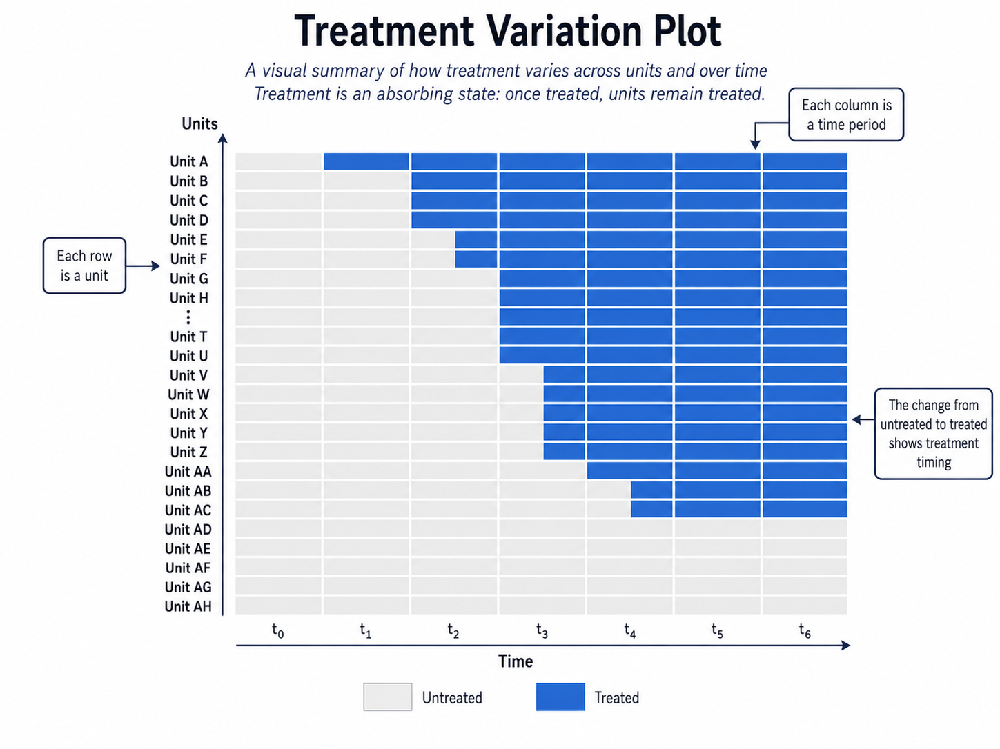

# Event Studies

The basic DiD design compares treated and control units before and after a policy. In the simplest case, there are two groups and two periods. But many real policy settings are richer. Units may be treated at different times, treatment effects may evolve gradually, and researchers may want to know not only whether a policy had an effect, but also **when** the effect appeared and how it changed over time.

This is the main motivation for **event-study designs**. In this chapter, the term event study refers to modern DiD-based approaches that estimate treatment effects relative to the timing of an event, such as the adoption of a reform, the introduction of a policy, or the occurrence of a shock.

::: {.callout-note appearance="simple"}
### Key idea

Event studies organize estimates in event time: periods before and after the treatment starts.
:::

Event studies are especially useful when treatment adoption is **staggered**. Some units receive treatment early, others later, and some may never be treated. Instead of estimating a single average treatment effect, event-study methods estimate dynamic effects at different horizons relative to treatment.

{width="90%"}

Recent econometric work has shown that standard TWFE event-study regressions can be misleading when treatment effects are heterogeneous across groups or over time. This chapter focuses on the logic of modern DiD event-study estimators, drawing on recent guides to the literature [@baker2026didguide; @dechaisemartin2026book; @roth2023].

## The Evaluation Problem

Suppose we observe units $i=1,\ldots,N$ over periods $t=1,\ldots,T$. Some units become treated at different times. Once treated, they remain treated in all later periods. This is the common case of **staggered adoption**.

Let $G_i$ denote the first period in which unit $i$ is treated. For never-treated units, $G_i=\infty$. Let $t$ denote calendar time. The treatment indicator is

$$
D_{it}=\mathbb{1}\{t\geq G_i\}.
$$

Let $\mathcal{G}$ denote the set of observed treatment cohorts, excluding never-treated units. Under consistency, the observed outcome is

$$
Y_{it}^{obs}=Y_{it}(G_i).
$$

For brevity, the superscript $obs$ is omitted below and the observed outcome is written simply as $Y_{it}$.

The central object is often a **group-time average treatment effect**:

$$
ATT(g,t)
=
E\left[Y_{it}(g)-Y_{it}(\infty)\mid G_i=g\right],
\qquad t\geq g.
$$

Here, $G_i=g$ means that unit $i$ first receives the treatment in period $g$. The term $Y_{it}(g)$ is the potential outcome of unit $i$ at time $t$ if it first received the treatment in period $g$, while $Y_{it}(\infty)$ is the potential outcome at time $t$ under the never-treated regime. The parameter $ATT(g,t)$ therefore measures the average effect, at time $t$, for the group of units first treated in period $g$.

Once we have group-time effects, we can aggregate them in different ways:

- by treatment cohort;
- by calendar period;
- by event time;
- into an overall average treatment effect on the treated.

The key point is that the estimand must be explicit. A single coefficient can hide many different treatment effects.

## Event Time

For an ever-treated unit, event time measures the distance from its treatment date:

$$
\ell_{it}=t-G_i.
$$

For units belonging to cohort $g$, this becomes

$$
\ell=t-g.
$$

When $\ell=0$, the unit is in its first treated period. When $\ell=1$, it is one period after treatment. When $\ell=-1$, it is one period before treatment.

Event time is not defined for never-treated units because they do not have a treatment date. These units may nevertheless contribute as controls when cohort-specific effects are estimated.

Throughout this chapter, $ATT^{ES}(\ell)$ denotes an aggregated post-treatment effect at event time $\ell\geq0$, where the superscript $ES$ stands for **event study**. Pre-treatment estimates are denoted separately by $\pi_{\ell}$ for $\ell<0$, because they are diagnostic placebo contrasts rather than treatment effects. Their sample estimates are written as $\widehat{ATT}^{ES}(\ell)$ and $\widehat{\pi}_{\ell}$, respectively.

The pre-treatment estimates are useful diagnostics. If treatment has not yet occurred, they should usually be close to zero, unless there is anticipation or treated units were already on different trends.

The post-treatment estimates describe treatment dynamics. The effect may appear immediately, grow over time, fade out, or change sign.

::: {.callout-note appearance="simple"}
### Event-time plot

An event-study plot shows pre-treatment diagnostic estimates and post-treatment dynamic effects, usually with confidence intervals and a vertical line at the treatment date.
:::

## Why Not Just Use TWFE?

A traditional event-study regression is often written as

$$
Y_{it}
=
\alpha_i+\lambda_t
+
\sum_{\substack{\ell\in\mathcal{L}\\ \ell\neq -1}}
\beta_{\ell}
\mathbb{1}\{G_i<\infty,\ t-G_i=\ell\}
+
u_{it}.
$$

Here, $\mathcal{L}$ is the set of event-time horizons included in the regression, $\alpha_i$ are unit fixed effects, $\lambda_t$ are time fixed effects, and the period just before treatment, $\ell=-1$, is omitted as the reference period. The coefficients $\beta_{\ell}$ describe outcome differences at each event-time horizon relative to the omitted period. They should not be confused with the modern event-time aggregates $ATT^{ES}(\ell)$ defined below. Under staggered adoption and heterogeneous effects, $\beta_{\ell}$ need not identify a clean weighted average of causal effects.

This specification is intuitive, but it can be problematic under staggered adoption as we have already seen at the end of [Chapter 6](../chapters/06-difference-in-differences.qmd). To avoid such identification issues, modern event-study methods construct comparisons more carefully.

## Clean Comparisons

The safest comparisons are usually those between newly treated units and units that are still untreated at the same calendar time, either because they will be treated later or because they are never treated in the analysis sample.

Suppose one group is first treated in period $g$. To estimate its effect at time $t\geq g$, we compare the change in outcomes for this group with the change in outcomes for units that are valid controls for cohort $g$ at time $t$.

The identifying idea is a version of parallel trends:

$$
E\left[Y_{it}(\infty)-Y_{i,g-1}(\infty)\mid G_i=g\right]
=
E\left[Y_{it}(\infty)-Y_{i,g-1}(\infty)\mid C_i(g,t)=1\right],
$$

where $C_i(g,t)=1$ denotes units that form a valid comparison group for cohort $g$ at time $t$, such as never-treated units or not-yet-treated units.

In words, absent treatment, the treated cohort and its comparison units would have experienced the same outcome change between the baseline period and time $t$.

When not-yet-treated units are used as controls, a no-anticipation assumption is also needed. It ensures that, before their own treatment begins, their observed outcomes coincide with the outcomes they would experience under the never-treated regime.

$$
Y_{it}(g)=Y_{it}(\infty)
\qquad \text{for } t<g.
$$

This logic underlies several modern DiD estimators.

## Weighted Difference-in-Differences

Callaway and Sant'Anna propose a framework that estimates group-time treatment effects and then aggregates them [@callaway2021]. The first step is to estimate $ATT(g,t)$ for each treatment cohort $g$ and post-treatment period $t\geq g$. The second step is to combine these effects using transparent weights.

This approach makes clear which treated group is being compared with which control group, and how the final estimate is constructed.

The comparison group can be defined in two main ways:

- **never-treated units**, namely units that are never exposed to the treatment during the observation period;
- **not-yet-treated units**, namely units that have not yet received the treatment at time $t$, even if they will receive it later.

::: {.callout-note appearance="simple"}
### Using not-yet-treated units as controls

In staggered-adoption designs, **not-yet-treated units** can be attractive comparison units because they are scheduled to receive the treatment later. This often makes them more comparable to already-treated units than never-treated units, both in observed characteristics and in unobserved factors related to treatment adoption.

However, not-yet-treated units can serve as “clean” controls only up to the point at which they receive treatment. After that, their outcomes may reflect treatment effects, and using them as controls can bias ATT estimates in later periods by design.

There is therefore a subtle trade-off. Eventually treated units can be used as controls only while they remain untreated; using their observations after treatment would contaminate the comparison group. Restricting the comparison group to never-treated units avoids this problem, but defines controls using their full treatment path and may leave a smaller or less comparable group. This is not, by itself, a violation of the potential outcomes framework. It changes the comparison being made and may affect the target population and the plausibility of parallel trends. Modern staggered-adoption applications should therefore state clearly which units serve as controls at each time and when they stop contributing.
:::

In both cases, the comparison can also be adjusted for observed covariates. This means that treated units in cohort $g$ are compared with control units that are similar in terms of pre-treatment characteristics, rather than being compared mechanically with all available untreated units.

Once the group-time effects have been estimated, they can be aggregated into event-time effects. This produces the event-study plot, but without relying on TWFE comparisons that may be contaminated by already-treated units.

::: {.callout-note}
### Weighted DiD

Estimate treatment effects separately by cohort and period, then aggregate them using explicit weights. In the Callaway and Sant'Anna framework, these weights are transparent and are typically linked to the number of treated units contributing to each group-time effect. This makes the final estimate easier to interpret than a single TWFE coefficient, because we can see which cohorts and time periods contribute to the aggregate effect, and how much they contribute.
:::

## Multiple Difference-in-Differences

de Chaisemartin and D'Haultfoeuille develop related estimators that also avoid problematic TWFE comparisons [@dechaisemartin2020; @dechaisemartin2026book].

The broad idea is to build treatment-effect estimates from clean DiD comparisons. Rather than allowing the regression to implicitly choose comparisons and weights, the method constructs comparisons between units whose treatment status changes and appropriate control units whose treatment status does not change over the relevant interval.

This family of estimators is useful because it emphasizes a practical lesson: with staggered adoption, the researcher should know which comparisons identify the effect.

In applications, these estimators often report dynamic effects, showing how the outcome changes in the periods following treatment.

::: {.callout-note appearance="simple"}
### Weighted DiD versus multiple DiD

Both approaches address the same problem: with staggered adoption and heterogeneous treatment effects, TWFE regressions may use problematic comparisons, especially comparisons involving already-treated units.

The **Callaway and Sant'Anna** approach is organized around **group-time treatment effects**, $ATT(g,t)$. Units are grouped by the period in which they first receive treatment, and the effect is estimated for each cohort $g$ and post-treatment period $t\geq g$, using never-treated or not-yet-treated units as controls. These $ATT(g,t)$ parameters can then be aggregated into overall effects or event-study effects using explicit weights.

The **de Chaisemartin and D'Haultfoeuille** approach is organized more directly around **clean DiD comparisons**. The key idea is to compare units whose treatment status changes, called switchers, with units whose treatment status does not change over the same interval. This perspective is especially useful for understanding which comparisons identify the effect and for extending DiD logic beyond the simplest staggered binary-treatment setting.

In short, Callaway and Sant'Anna start from cohort-time causal parameters and then aggregate them. de Chaisemartin and D'Haultfoeuille start from valid treatment-status changes and build the estimator from those clean comparisons.
:::

## Matching DiD for Panel Data

Another approach is to combine matching and DiD. The basic matching DiD estimator controls for observed differences through matching and for time-invariant unobserved differences through differencing [@heckman1997].

Imai, Kim, and Wang extend this logic to time-series cross-sectional data through **PanelMatch** [@imai2023]. The method constructs matched sets for treated observations using their pre-treatment histories.

The procedure can be summarized in four steps:

1. Identify treated unit-periods.
2. Match treated observations to control observations with similar pre-treatment histories.
3. Use the matched controls to construct counterfactual outcomes.
4. Estimate dynamic treatment effects over future horizons.

This approach is attractive because it makes the construction of the control group transparent. It also allows researchers to inspect balance not only in baseline covariates, but also in lagged outcomes and covariate histories.

::: {.callout-note appearance="simple"}

### PanelMatch intuition

PanelMatch asks: for each unit at the moment it becomes treated, can we find units that are still untreated and have a similar recent history in terms of treatment status, pre-treatment outcomes, and covariates?
:::

## Dynamic Treatment Effects

Event studies are valuable because treatment effects may not be instantaneous.

For example, a reform allowing election-day registration may affect turnout immediately. A labor-market shock may reduce employment quickly but generate longer-run adjustment. A mass layoff may affect local employment for many years. A democratization episode may affect economic growth gradually.

For post-treatment horizons, dynamic treatment effects can be summarized by event-time effects:

$$
ATT^{ES}(\ell)
=
\sum_{g\in\mathcal{G}_{\ell}}
\omega_{g\ell}ATT(g,g+\ell),
\qquad \ell\geq0,
$$

where $\mathcal{G}_{\ell}$ is the set of cohorts for which calendar time $g+\ell$ is observed and a valid comparison group is available. The aggregation weights satisfy

$$
\omega_{g\ell}\geq0
\quad\text{and}\quad
\sum_{g\in\mathcal{G}_{\ell}}\omega_{g\ell}=1.
$$

The weights determine how much each contributing cohort matters for the event-time effect. They may, for example, be proportional to cohort size. The corresponding sample estimate is denoted by $\widehat{ATT}^{ES}(\ell)$.

The event-study plot then becomes a compact visual summary of both pre-treatment diagnostics and post-treatment dynamics.

## Pre-Trends and Anticipation

For $\ell<0$, let $\pi_{\ell}$ denote an aggregated pre-treatment placebo contrast. Its exact construction depends on the estimator, but it compares the pre-treatment evolution of future-treated cohorts with that of their comparison units. These quantities are not ATT parameters because treatment has not yet begun.

Pre-treatment event-time estimates are often interpreted as tests of the parallel-trends assumption. This interpretation should be cautious.

If estimates before treatment are far from zero, this is a warning sign. Treated units may have been on different trends, or the policy may have been anticipated before formal implementation.

If pre-treatment estimates are close to zero, this supports the design, but it does not prove parallel trends. The counterfactual post-treatment trend remains unobserved.

Anticipation is especially important in event studies. If units change behavior before the treatment date because they expect the policy, then periods just before treatment are no longer untreated in a substantive sense.

::: {.callout-warning}
### The limits of pre-trend evidence

Flat pre-treatment estimates make the design more credible, but they do not guarantee that post-treatment counterfactual trends are parallel.
:::

## Choosing the Baseline Period

Regression-based event studies require a reference period. A common choice is the period just before treatment, $\ell=-1$. In group-time DiD estimators, period $g-1$ similarly often serves as the baseline from which outcome changes are measured, although it is not itself an event-time treatment effect.

This choice is natural, but not automatic. If there is anticipation, the period immediately before treatment may already be affected. In that case, using $\ell=-1$ as the baseline can understate or distort treatment effects.

Researchers should report the reference period clearly and explain why it is appropriate.

## Aggregation

Modern DiD event-study methods often begin with many building blocks: effects by cohort, calendar time, and event time. The final estimate depends on how these building blocks are aggregated.

Aggregation is not a purely technical detail. Different weights answer different questions.

For example:

- equal weights across cohorts answer a cohort-balanced question;
- weights proportional to cohort size answer a population-weighted question;
- event-time weights describe the average effect at a given horizon after treatment;
- calendar-time weights describe the average effect in a given period.

Baker et al. emphasize that applied researchers should be explicit about the target parameter and the weights used to construct it [@baker2026didguide].

## How event-study plots are computed

In staggered-adoption designs, event-study plots are not based on a single comparison between one treated group and one control group. They are built from many smaller cohort-time comparisons. Post-treatment comparisons identify causal effects under the assumptions discussed above; pre-treatment comparisons are diagnostic placebo checks.

The post-treatment building blocks are the group-time treatment effects, denoted by $ATT(g,t)$. Each $ATT(g,t)$ measures the average effect at calendar time $t\geq g$ for the cohort of units first treated in period $g$. Pre-treatment points are constructed from the corresponding placebo contrasts rather than from ATT parameters.

Once these effects are estimated, they can be reorganized in **event time**, where event time is defined as

$$
\ell = t-g.
$$

For example, $\ell=0$ is the first treated period, $\ell=1$ is one period after treatment, and $\ell=-1$ is one period before treatment. For $\ell\geq0$, the event-study plot reports $\widehat{ATT}^{ES}(\ell)$, obtained by aggregating the available $ATT(g,g+\ell)$ values as defined above. For $\ell<0$, it reports the diagnostic estimate $\widehat{\pi}_{\ell}$.

This construction is useful because it summarizes many cohort-specific comparisons in a single graph. Instead of reporting a separate estimate for every cohort and calendar period, the event-study plot shows pre-treatment diagnostics and how treatment effects evolve after treatment.

However, this convenience comes with an important caveat: the set of cohorts contributing to the plot may change across event-time horizons. Early pre-treatment periods are observed only for cohorts treated sufficiently late, while long post-treatment horizons are observed only for cohorts treated sufficiently early.

For example, suppose the panel begins in period 1, one cohort is first treated in period 3, and another is first treated in period 4. At event time $\ell=-3$, the cohort treated in period 3 cannot contribute because this would require an observation in period 0. The cohort treated in period 4 can contribute because $4-3=1$, which is observed. Similarly, long-run post-treatment effects may be based only on early-treated cohorts.

This changing composition matters. If cohorts differ systematically, changes in the event-study profile may reflect not only dynamic treatment effects, but also changes in which cohorts are included at each horizon. A rising or falling event-study line can therefore partly reflect treatment dynamics and partly reflect sample-composition changes.

For this reason, event-study plots should be interpreted with care. Researchers should report which cohorts contribute to each event-time estimate, whether the sample changes across horizons, and whether results are robust to using a balanced event window. A balanced event window restricts the analysis to cohorts observed for the same set of pre- and post-treatment periods. This improves comparability across event time, but it may discard many cohorts and reduce precision.

![This figure illustrates how event-study estimates are constructed under staggered treatment adoption. The left panel shows that cohorts receive the treatment in different periods and may differ in the number of treated units. The upper-right panel maps these cohorts into event time: at each post-treatment value of $\ell$, the event-study estimate aggregates the available cohort-specific treatment effects, with weights proportional to cohort size. Pre-treatment points are diagnostic placebo estimates. A key point is that event-time estimates are not always based on the same set of cohorts. In the central part of the event-study window, all cohorts contribute to the aggregate estimate. At the extremes, only some cohorts are observed. As shown in the lower panel, estimates for early leads and late lags are therefore based on fewer treated units and may be less precise, as reflected in wider confidence intervals. The figure also highlights an additional issue: when treatment effects are heterogeneous across cohorts, changes in the estimated event-study profile may reflect both true effect dynamics and changes in composition. For example, the steeper increase from period $+3$ onward may partly depend on the fact that the composition of contributing cohorts changes once Cohort 4 drops out. As an alternative, researchers may restrict event-study plots to the pre- and post-treatment periods in which all cohorts are observed. In this example, this would limit the event-study window to periods from $-2$ to $+2$.](../images/event-study-building-blocks-aggregation_v4.png)

## Empirical Example

A classic application of event-study methods is Wolfers' analysis of unilateral divorce laws in the United States [@wolfers2006]. The empirical question is whether making divorce easier by allowing unilateral divorce changed divorce rates. The setting is well suited to an event-study design because U.S. states adopted unilateral divorce laws in different years. Some states changed their divorce laws early, others later, and some did not adopt them during the same period.

This staggered timing makes it possible to compare the evolution of divorce rates before and after adoption across different groups of states. The event-study framework is especially useful because the effect of the reform need not be immediate or constant over time. Divorce rates may respond gradually after the law changes, and the effect may increase, decline, or disappear several years after adoption.

The application also illustrates why modern DiD methods are needed in staggered-adoption settings. If treatment effects vary across cohorts or over time, a simple TWFE event-study regression may combine comparisons that are difficult to interpret, including comparisons between newly treated states and states that were already treated. Modern estimators instead make the comparison more explicit: they compare states adopting the reform at a given time with states that are not yet treated or never treated, and then aggregate the resulting cohort-time effects using transparent weights.

This example is useful pedagogically because it shows the core purpose of event-study analysis: not only estimating whether a policy had an effect, but also examining pre-treatment diagnostics and tracing how the effect evolves after treatment adoption.

## Diagnostics and Validity Checks

A credible event-study analysis should report:

- the timing of treatment adoption across units;
- which units are used as controls at each horizon;
- whether never-treated or not-yet-treated units are used;
- event-time plots with confidence intervals;
- whether treatment is absorbing or can turn on and off;
- whether anticipation or carryover effects are plausible;
- how group-time effects are aggregated.

The treatment variation plot is often useful. It shows when units become treated and whether enough untreated or not-yet-treated units remain available as controls at each point in time.

## Worked Example

Suppose some regions introduce a new active labor-market policy in different years. Once introduced, the policy remains in place. We observe employment rates for all regions over time.

A simple TWFE regression would compare all treated and untreated observations while absorbing region and year fixed effects. But if early-treated regions are later used as controls for late-treated regions, and if the policy effect evolves over time, the estimate may be misleading.

A modern event-study approach would instead proceed as follows:

1. Group regions by the year in which they first adopt the policy.
2. For each treated cohort and each post-treatment year, compare the cohort with regions not yet treated or never treated.
3. Estimate cohort-time effects.
4. Aggregate these effects by event time.
5. Plot pre-treatment diagnostics and post-treatment dynamic effects.

If the pre-treatment estimates are close to zero and the post-treatment estimates rise gradually, the evidence would be consistent with a delayed positive employment effect. If pre-treatment estimates are already rising before adoption, the design would be less credible.

::: {.callout-warning}
### A reassuring event-study plot may still be misleading

In a 2025 LinkedIn post titled *Event Studies Madness*, I construct a deliberately implausible event study. The performance of eight Italian Serie A teams qualifying for European competitions is compared with that of eight successful Serie B teams. The two groups display remarkably similar pre-treatment trends in points, while their outcomes diverge after European competitions begin. Taken mechanically, the resulting event-study plot would suggest that participation in European competitions increases domestic-league performance.

The conclusion is clearly not credible. Serie A and Serie B teams differ substantially in budgets, player quality, competitive environment, and many other characteristics. Similar outcome trends over a short pre-treatment period do not make these teams valid counterfactuals for one another.

The example illustrates an important limitation of event-study diagnostics: pre-treatment estimates close to zero do not prove that the **parallel-trends assumption** is valid. They show only that treated and control units followed similar trends before treatment, whereas the key assumption concerns the counterfactual post-treatment period, namely how treated outcomes would have evolved relative to control outcomes *after treatment, in the absence of treatment*. Pre-treatment estimates are therefore useful diagnostic evidence, but they cannot replace a substantive justification of the comparison group. Researchers should explain why treated and control units are exposed to comparable underlying dynamics, examine differences in relevant pre-treatment characteristics, and discuss institutional reasons why their untreated outcomes should have evolved similarly.
:::

## Summary

Event studies extend DiD by organizing effects around the timing of treatment. They are especially useful for staggered adoption and dynamic treatment effects.

The modern lesson is that event-study plots should not be produced mechanically with TWFE regressions. When treatment effects are heterogeneous, TWFE may use problematic comparisons and implicit weights.

Modern event-study estimators instead build effects from clearer comparisons, such as treated cohorts versus not-yet-treated or never-treated units, and then aggregate group-time effects transparently. The central questions are always: what is the comparison group, what is the target estimand, and how are the dynamic effects aggregated?

::: {.callout-note appearance="simple"}
## Software packages

Several software packages can be used to implement DiD and event study designs.

- **R**
  - [`did`](https://bcallaway11.github.io/did/): implementation of Callaway and Sant'Anna-type DiD estimators for multiple periods and staggered treatment adoption.
  - [`DIDmultiplegtDYN`](https://cran.r-project.org/package=DIDmultiplegtDYN): implementation of de Chaisemartin and D'Haultfoeuille-type DiD estimators for dynamic and potentially complex treatment designs.
  - [`HonestDiD`](https://github.com/asheshrambachan/HonestDiD): sensitivity analysis for violations of parallel trends.
  - [`PanelMatch`](https://cran.r-project.org/package=PanelMatch): tools for non-parametric DiD with comparison groups constructed on the basis of treatment histories and pre-treatment outcomes [@imai2023].

- **Python**
  - [`pyfixest`](https://py-econometrics.github.io/pyfixest/): Python implementation inspired by `fixest`, useful for fixed-effects and event-study specifications.
  - [`differences`](https://pypi.org/project/differences/): Python package implementing DiD estimators for multiple periods and staggered treatment adoption.
  - [`diff-diff`](https://pypi.org/project/diff-diff/): Python library for difference-in-differences, event-study, and related DiD designs.

- **Stata**
  - [`csdid`](https://ideas.repec.org/c/boc/bocode/s458976.html): Stata command implementing Callaway and Sant'Anna-type DiD estimators for multiple periods.
  - [`did_multiplegt_dyn`](https://ideas.repec.org/c/boc/bocode/s459222.html): Stata command implementing de Chaisemartin and D'Haultfoeuille-type dynamic DiD estimators.
  - [`eventstudyinteract`](https://ideas.repec.org/c/boc/bocode/s458978.html): implements interaction-weighted event-study estimators.
  
For a more detailed overview of available DiD software packages, see Asjad Naqvi’s online guide: https://asjadnaqvi.github.io/DiD/.
:::
