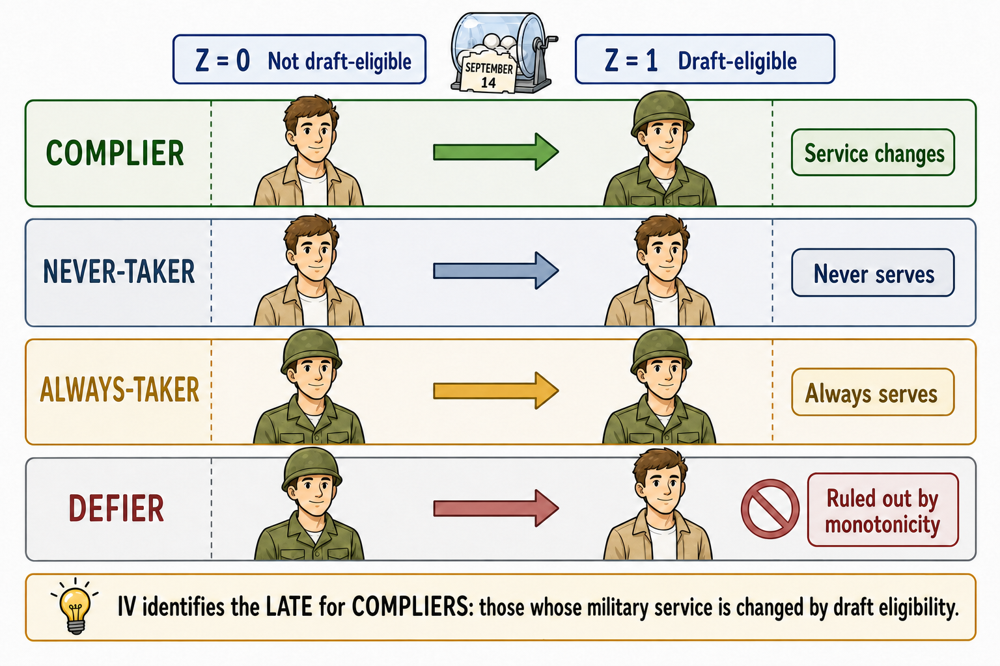

# Instrumental Variables

::: {.callout-note}
**IV in a figure**

:::

In observational studies, treated and untreated units often differ in ways that are not fully observed by the researcher. If these unobserved factors affect both treatment participation and the outcome, a simple regression of the outcome on the treatment does not identify a causal effect.

Suppose we want to estimate the effect of a treatment $D_i$ on a post-treatment outcome $Y_i$ using the linear model

$$
Y_i = \alpha + \tau D_i + X_i'\beta + u_i,
$$

where $X_i$ is a vector of observed covariates and $u_i$ contains all unobserved determinants of the outcome.

The problem is that, in many applications,

$$
\operatorname{Cov}(D_i,u_i) \neq 0.
$$

This means that treatment status is correlated with unobserved determinants of the outcome. In that case, ordinary least squares does not recover the causal effect of $D_i$ on $Y_i$.

For example, suppose we want to estimate the effect of education on wages. More educated individuals tend to earn more, but they may also differ in unobserved ability, motivation, family background, or local opportunities. If these factors affect both schooling and wages, then the estimated relationship between schooling and wages combines the causal effect of education with selection bias.

Instrumental variables (IV) provide a way to isolate a source of variation in treatment that is plausibly unrelated to these unobserved determinants of the outcome.

::: {.callout-note}
### IV in one sentence

An instrumental variable is a variable that shifts treatment status but affects the outcome only through the treatment. In other words, it should not have any direct effect on the outcome.
:::

## Historical Intuition

An early and influential example of IV logic appears in Philip G. Wright's analysis of supply and demand in agricultural commodity markets [@wright1928]. Wright studied the problem of estimating demand and supply relationships when price and quantity are jointly determined in equilibrium. A simple regression of quantity on price would not recover a demand curve, because observed prices and quantities reflect both demand shifts and supply shifts at the same time.

The key insight was that some variables shift one side of the market without directly shifting the other. For example, weather conditions may affect supply by changing agricultural output, but they need not directly affect consumers' demand. Such variables create movements in price and quantity that can be used to trace out the demand curve. In modern language, weather-related supply shifters can serve as **instruments** for price.

The Wright example captures the core logic of IV well. When the treatment is not randomly assigned, ordinary comparisons are misleading. An instrument provides a source of variation that moves the treatment but is otherwise unrelated to the outcome, except through the treatment. IV then uses only this externally induced variation to estimate a causal effect.

## Example: College Proximity and Returns to Schooling

A classic example is Card's study of the returns to schooling [@card1993]. The question is: how much does an additional year of education increase future wages?

A simple comparison between more educated and less educated individuals may be biased because education is correlated with unobserved ability and family background. Card uses geographic proximity to college as an instrument for schooling.

The argument is that individuals who grow up closer to a college face lower costs of attending college and are therefore more likely to obtain more schooling. At the same time, distance to college should affect wages only through schooling, not through other direct channels.

In this setting:

- $Z_i$ is proximity to college;
- $D_i$ is years of schooling;
- $Y_i$ is wages.

The instrument isolates variation in schooling that comes from geographic access to college rather than from unobserved ability.

## The Basic IV Logic and the Key Assumptions

An instrument is usually denoted by $Z_i$. The core IV idea is that $Z_i$ shifts treatment status $D_i$, and this instrument-induced variation in treatment is then used to learn about the effect of $D_i$ on the outcome $Y_i$:

$$
Z_i \rightarrow D_i \rightarrow Y_i.
$$

For this logic to identify a causal effect, the instrument must satisfy two conditions at the same time.

1. The instrument must affect the treatment. This is the **relevance condition**. After controlling for observed covariates $X_i$, the instrument must still be correlated with treatment status:

$$
\operatorname{Cov}(Z_i,D_i\mid X_i) \neq 0.
$$

    In practice, this means that changes in the instrument should generate changes in the probability of receiving the treatment, in the case of a binary treatment. Relevance is empirically assessable: we can estimate the first-stage relationship between $D_i$ and $Z_i$ and check whether the instrument significantly predicts treatment.

2. The instrument must affect the outcome only through the treatment. This is the **exclusion restriction**. Conditional on covariates, the instrument should not be correlated with the unobserved determinants of the outcome:

$$
\operatorname{Cov}(Z_i,u_i\mid X_i)=0.
$$

    This condition rules out any direct causal path from $Z_i$ to $Y_i$ that bypasses $D_i$. Unlike relevance, the exclusion restriction is not directly testable. The credibility of an IV strategy therefore depends heavily on whether the researcher can argue, using institutional knowledge, theory, or a credible natural experiment, that the instrument is as good as randomly assigned with respect to the outcome, except through treatment.

::: {.callout-caution}
### The exclusion restriction

The exclusion restriction is usually the most demanding IV assumption. A strong first stage is not enough: if the instrument affects the outcome through channels other than the treatment, the IV estimate is not causal.
:::

## Two-Stage Least Squares and the IV Ratio

The most common IV estimator is **two-stage least squares**, or **2SLS**. The name reflects the way the estimator isolates the part of treatment variation that is generated by the instrument.

In the first stage, the treatment is regressed on the instrument and the control variables:

$$
D_i =
\pi_0
+
\pi_1 Z_i
+
X_i'\pi
+
v_i.
$$

The coefficient $\pi_1$ captures the effect of the instrument on treatment. This is the empirical counterpart of the relevance condition. The fitted values from this regression, $\widehat D_i,$ represent the component of treatment status that is predicted by the instrument and the covariates.

In the second stage, the outcome is regressed on the predicted treatment and the control variables:

$$
Y_i =
\alpha
+
\tau_{\text{2SLS}} \widehat D_i
+
X_i'\beta
+
\varepsilon_i.
$$

The estimated coefficient $\widehat{\tau}_{\text{2SLS}}$ is the IV estimate obtained by 2SLS. The intuition is simple: instead of using all variation in treatment, 2SLS uses only the variation in treatment that is generated by the instrument. If the instrument is valid, this variation can be interpreted as exogenous and used to estimate a causal effect.

::: {.callout-note appearance="simple"}
### Why two stages?

1. The first stage isolates the part of treatment explained by the instrument.  
2. The second stage relates the outcome to this instrument-induced variation in treatment.
:::

With a single instrument and a single treatment, the same idea can also be expressed as a ratio. The first stage measures how much the instrument changes the treatment, while the **reduced form** measures how much the instrument changes the outcome:

$$
Y_i
=
\rho_0
+
\rho_1 Z_i
+
X_i'\rho
+
e_i.
$$

Here, $\rho_1$ captures the effect of the instrument on the outcome. The IV estimate is the ratio between the reduced-form effect and the first-stage effect:

$$
\widehat{\tau}_{\text{IV}}
=
\frac{\widehat{\rho}_1}{\widehat{\pi}_1}.
$$

This ratio asks: how much does the outcome change per unit of treatment variation generated by the instrument?

::: {.callout-warning appearance="simple"}
### Correct estimation of the standard errors

In practice, 2SLS should be estimated using an IV routine. It is not correct to manually run the two regressions and treat $\widehat D_i$ as if it were an ordinary observed variable, because standard errors must account for the generated regressor.
:::

## Example: Quarter of Birth and Education

Another famous example is Angrist and Krueger's study of compulsory schooling laws [@angrist1991]. They use quarter of birth as an instrument for years of schooling.

The argument is based on school-entry rules and compulsory attendance laws in the United States. Children born early in the year enter school at a slightly older age. Since students are allowed to leave school when they reach a certain age, those born later in the year may end up with slightly more schooling.

In this setting:

- $Z_i$ is quarter of birth;
- $D_i$ is years of schooling;
- $Y_i$ is wages.

The relevance condition requires that quarter of birth affects years of schooling. This can be tested in the first stage. For example, individuals born in the last quarter of the year may have slightly more education than those born earlier.

The exclusion restriction requires that quarter of birth affects wages only through schooling. This is a stronger assumption. It requires that quarter of birth is not related to ability, family background, health, parental characteristics, or other factors that directly affect wages.

The IV estimate can be interpreted by comparing the effect of quarter of birth on wages with the effect of quarter of birth on schooling. If being born in the last quarter increases schooling by about 0.10 years and increases wages by about 0.86 percent, the implied IV estimate is approximately

$$
\frac{0.0086}{0.10} \approx 0.086.
$$

This suggests that an additional year of schooling increases wages by about 8.6% for the units whose schooling is affected by the instrument.

## Weak Instruments

A major practical concern in IV estimation is the problem of **weak instruments**. An instrument is weak when it is only weakly correlated with the treatment.

Weak instruments are problematic because 2SLS uses the variation in treatment predicted by the instrument. If the instrument barely moves the treatment, then the predicted treatment contains little useful variation. The IV estimator becomes unstable and can have poor finite-sample properties.

Work by Bound, Jaeger, and Baker [-@bound1995] showed that weak instruments can make IV estimates and standard errors misleading, even in large samples. When instruments are weak:

- 2SLS estimates can be biased toward OLS in finite samples;
- confidence intervals may be unreliable;
- conventional t-tests may reject too often;
- small violations of the exclusion restriction can be amplified.

::: {.callout-caution}
### Weak instruments

A valid but weak instrument is not enough.  
If the instrument barely shifts treatment, IV estimates may be imprecise, biased, and misleading.
:::

A standard diagnostic is the first-stage F-statistic. A low first-stage F-statistic is a warning sign that the instrument may be weak. However, recent work emphasizes that conventional diagnostics can be misleading if standard errors are not adjusted correctly for heteroskedasticity, clustering, or serial correlation.

## Binary Instruments and LATE

When the instrument is binary, IV estimates are often interpreted as **local average treatment effect (LATE)** estimates.

Suppose $Z_i$ takes two values: $Z_i=1$ and $Z_i=0$. To describe the LATE interpretation, it is useful to define two potential treatment statuses:

$$
D_i(1)
\quad \text{and} \quad
D_i(0),
$$

where $D_i(1)$ is the treatment status that unit $i$ would have if exposed to the instrument, $Z_i=1$, and $D_i(0)$ is the treatment status that the same unit would have if not exposed to the instrument, $Z_i=0$. Units can then be classified according to how their treatment status responds to the instrument.

There are four types of units (see @angrist1996iv):

| Type | $D_i(0)$ | $D_i(1)$ | Interpretation |
|---|:---:|:---:|---|
| **Compliers** | 0 | 1 | They take the treatment only when exposed to the instrument. |
| **Never-takers** | 0 | 0 | They do not take the treatment, regardless of the instrument. |
| **Always-takers** | 1 | 1 | They take the treatment, regardless of the instrument. |
| **Defiers** | 1 | 0 | They move in the opposite direction of the instrument. |

Under the "LATE assumptions", IV identifies the causal effect for compliers. These are the units whose treatment status is actually changed by the instrument.

This is important because IV does not generally identify the ATT. It identifies the effect for the subpopulation moved by the instrument.

If treatment effects are heterogeneous, different valid instruments can produce different estimates because they identify effects for different complier groups.

::: {.callout-note}
### Who are the compliers?

Compliers are the units whose treatment status changes because of the instrument.  
Different instruments may move different groups of units, and therefore identify different LATEs.
:::

### The Identification Assumptions with a binary instrument

For a binary instrument, the LATE interpretation requires four main assumptions.

1. The instrument must be as good as randomly assigned, possibly after conditioning on pre-treatment covariates. In other words, the instrument should not be systematically related to the units' potential outcomes or potential treatment statuses.

2. The instrument must satisfy the exclusion restriction. It should affect potential outcomes only through treatment.

3. The instrument must be relevant: even after conditioning on pre-treatment covariates, variation in the instrument must generate variation in treatment status for at least some units.

4. The instrument must satisfy **monotonicity**. This means that the instrument should push treatment in the same direction for all units. In other words, there should be no defiers.

Under these assumptions, the LATE can be written as

$$
LATE
=
E[Y_i(1)-Y_i(0)\mid D_i(1)>D_i(0)]
=
\frac{
E[Y_i^{obs}\mid Z_i=1] - E[Y_i^{obs}\mid Z_i=0]
}{
E[D_i\mid Z_i=1] - E[D_i\mid Z_i=0]
}.
$$

The numerator is the reduced-form effect of the instrument on the outcome. The denominator is the first-stage effect of the instrument on treatment.

### Example: Vietnam Draft Lottery

A classic LATE example is Angrist's study of the effect of military service on later earnings [@angrist1990]. During the Vietnam War, the United States used a draft lottery to determine who was at risk of being drafted.

The draft lottery can be interpreted as an instrument for military service:

- $Z_i$ is draft eligibility;
- $D_i$ is military service;
- $Y_i$ is later earnings.

Not everyone who was draft-eligible served in the military, and some individuals who were not draft-eligible may still have served. The draft lottery therefore generated variation in military service, but did not perfectly determine it. As a result, the design includes compliers, always-takers, and never-takers.

The IV estimate identifies the effect of military service for compliers: individuals whose military service status was changed by draft eligibility. In this context, Angrist finds that military service reduced later earnings by approximately 15% for white veterans. This interpretation relies on the assumptions that there are no defiers, that is, no individuals who would serve if not draft-eligible but would avoid service if draft-eligible, and that draft eligibility affects later earnings only through military service.

::: {.callout-note}

### Binary and continuous instruments: what changes?

When using proximity to college as an instrument for years of education, as in the Card [-@card1993] example, college proximity is often introduced as a binary instrument: individuals are classified as living near or far from a college. In this case, the instrument defines two groups. Units with $Z_i=1$ are exposed to the encouragement generated by proximity to college, while units with $Z_i=0$ are not. The IV estimate is then interpreted as the effect of schooling for the compliers whose education decisions are changed by this discrete shift in college access.

If the instrument is continuous, for example distance from the closest university measured in kilometers, the simple treated-versus-control distinction disappears. Units are no longer simply “encouraged” or “not encouraged.” Instead, each unit receives a different intensity of encouragement, depending on how far it lives from the closest university.

This may describe the real assignment mechanism more accurately, but it also creates an interpretation problem. With a binary instrument, the IV estimate can be interpreted as the effect of education for compliers induced to study more by the discrete change from being far from college to being near college. With a continuous instrument, the relevant group of compliers is less clear. The individuals whose education changes when distance increases from 5 to 10 kilometers need not be the same as those affected by a change from 50 to 55 kilometers. As a result, the estimated causal effect may combine responses from different margins of the instrument, making it less transparent whose return to education is being estimated.
:::

## Interpreting IV Estimates

Interpreting IV estimates requires care. The estimate depends on the instrument, because the instrument determines which units are shifted into treatment.

For example, college proximity may identify the return to schooling for individuals whose education decisions are affected by geographic access to college. Quarter of birth may identify the return to schooling for individuals whose schooling is affected by compulsory schooling laws. These are not necessarily the same people.

This means that IV estimates should not automatically be interpreted as average effects for everyone. They are often local effects for the units affected by the instrument.

A limitation of the IV interpretation is that we usually do not know exactly **for whom** the causal effect is being estimated. The IV estimate identifies the effect for compliers, but individual complier status is not directly observed: we do not know which specific units would change their treatment status in response to the instrument. As a result, the LATE refers to a latent subpopulation whose members cannot be precisely identified. In some applications, researchers can describe compliers on average, for example by studying whether they are more likely to come from particular socioeconomic backgrounds or locations, but this does not remove the basic limitation: the estimated causal effect applies to a group that is only indirectly observed.

::: {.callout-warning}
### Multiple instruments and interpretation

Using more than one instrument can improve predictive power, but it can also make the causal parameter harder to interpret. Each instrument may shift treatment for a different group of compliers. If treatment effects are heterogeneous, the IV estimate obtained with multiple instruments may combine several local effects, each attached to a different source of treatment variation.

For this reason, a stronger first stage is not the only criterion for a good IV design. Researchers should also ask which instruments are doing the identifying work, which units are likely to be moved by each instrument, and whether the resulting weighted average has a clear policy interpretation.
:::

## Practical Concerns in Applied IV Work

Recent replication evidence raises concerns about how IV is used in practice. Lal et al. [-@lal2024] replicate a set of recent political science papers using IV strategies and identify several recurring problems.

1. Some applications overstate instrument strength because first-stage diagnostics do not properly adjust standard errors for heteroskedasticity, serial correlation, or clustering.

2 Conventional t-tests based on 2SLS standard errors may understate uncertainty when instruments are weak.

3. IV estimates are often much larger than OLS estimates, especially when the first stage is weak. This pattern can be a warning sign of weak instruments, violations of the exclusion restriction, or both.

Another concern is interpretability under treatment-effect heterogeneity. Mogstad and Torgovitsky [-@mogstad2024iv] emphasize that IV applications often face **unobserved heterogeneity in treatment effects**. In that case, linear IV estimators may still be useful, but their interpretation is no longer the effect of treatment for a generic unit. The estimate may instead correspond to a local or weighted average effect for the units whose treatment status is shifted by the instrument.

These concerns do not imply that IV should not be used. Rather, they reinforce the need for careful design, transparent reporting, and sensitivity analysis. Applied IV work should report instrument strength, use inference procedures that are robust to weak instruments when needed, justify the exclusion restriction, and be explicit about the population and causal parameter to which the IV estimate refers.

::: {.callout-note appearance="simple"}
### Shift-share instruments

A common IV strategy is based on **shift-share variation**, also known as a **Bartik instrument**. The idea is to combine pre-existing local exposure shares with aggregate shocks that are plausibly external to the local unit.

For example, suppose we want to estimate the effect of immigration on local wages. A shift-share instrument may predict immigration inflows into a city by combining the city’s historical immigrant composition with national inflows from each origin country. Cities that historically hosted more immigrants from countries experiencing larger national inflows are predicted to receive more immigrants.

The IV logic is that the predicted treatment variation comes from two components: predetermined local shares and external shocks. If the shocks are plausibly exogenous, and if the historical shares affect the outcome only through the treatment channel of interest, the shift-share variable can be used as an instrument.

However, the strategy requires care. Historical shares may be related to long-run local trends, and aggregate shocks may affect outcomes through channels other than the treatment. As in any IV design, the key questions are: what generates the variation in the instrument, why is it relevant, and why should it affect the outcome only through the treatment?
:::

## Summary

Instrumental variables estimate causal effects by isolating variation in treatment that is induced by an external source of variation. A valid instrument must shift the treatment and affect the outcome only through that treatment.

The 2SLS estimator implements this logic in two steps: first, predict treatment using the instrument; second, estimate the effect of the predicted treatment on the outcome.

With binary instruments, IV identifies the LATE for compliers. This makes IV powerful but also subtle: the estimate depends on who is moved by the instrument.

Let me conclude by stressing that a valid instrument must satisfy the **exclusion restriction**: it must affect the outcome only through the treatment. In practice, this condition is often difficult to justify convincingly. Many variables that shift treatment status may also affect the outcome through other channels, making the IV interpretation fragile and potentially misleading.

::: {.callout-note appearance="simple"}
## Software packages

Several software packages can be used to estimate instrumental-variables models, usually through two-stage least squares (2SLS), limited-information maximum likelihood (LIML), or related GMM estimators.

- **R**
  - [`ivreg`](https://cran.r-project.org/package=ivreg): a dedicated package for instrumental-variables regression, with 2SLS estimation and diagnostic tools.
  - [`fixest`](https://lrberge.github.io/fixest/reference/feols.html): supports IV estimation with high-dimensional fixed effects through `feols()`.
  - [`estimatr`](https://search.r-project.org/CRAN/refmans/estimatr/help/iv_robust.html): provides `iv_robust()` for 2SLS with robust and clustered standard errors.

- **Python**
  - [`linearmodels`](https://bashtage.github.io/linearmodels/iv/iv/linearmodels.iv.model.IV2SLS.html): includes IV estimators such as 2SLS, LIML, GMM, and continuously updated GMM.
  - [`pyfixest`](https://pyfixest.org/quickstart.html): supports IV estimation with syntax inspired by the R package `fixest`.

- **Stata**
  - [`ivregress`](https://www.stata.com/manuals/rivregress.pdf): official Stata command for single-equation IV regression, including 2SLS, LIML, and GMM.
  - [`ivreg2`](https://ideas.repec.org/c/boc/bocode/s425401.html): widely used user-written command with extensive diagnostics for IV estimation.
  - [`weakiv`](https://ideas.repec.org/c/boc/bocode/s457684.html): weak-instrument-robust tests for IV models.
:::
