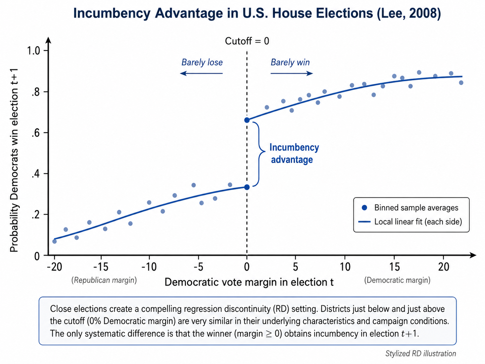
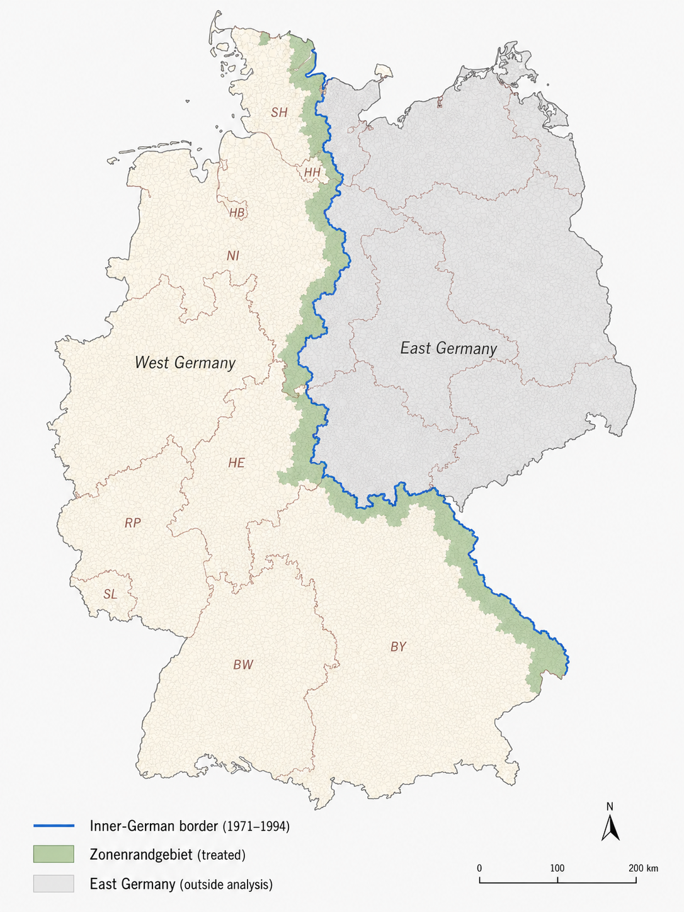

## Regression Discontinuity Design

::: {.callout-note}
## RD design in a figure

:::

A **regression discontinuity (RD)** design is used when treatment assignment depends on whether an observed pre-treatment variable crosses a known threshold. This variable is usually called the **running variable**, **forcing variable**, or **score**.

The key idea is intuitive. Units just below and just above the threshold are likely to be very similar, except that units on one side receive the treatment while units on the other side do not. If this is true, a discontinuous jump in the post-treatment outcome at the threshold can be interpreted as the causal effect of the treatment.

For example, a public subsidy may be assigned only to firms whose eligibility score exceeds a given cutoff. Firms just above and just below the cutoff may be very similar in terms of size, productivity, sector, and investment plans. However, firms just above the cutoff receive the subsidy, while firms just below do not. The RD design compares these two groups locally around the cutoff.

::: {.callout-note appearance="simple"}
### RD design in one sentence

RD estimates causal effects by comparing the post-treatment outcomes of units that are very close to a treatment threshold but fall on opposite sides of it.
:::

## Historical Intuition

The RD design was introduced by Thistlethwaite and Campbell in their study of merit awards and subsequent academic outcomes [@thistlethwaite1960]. The key institutional feature was that students received an award if their test score crossed a known cutoff. Students just above the cutoff received the award, while students just below the cutoff did not.

The intuition is that students very close to the cutoff are likely to be similar in both observed and unobserved characteristics. A student barely above the threshold and a student barely below it may differ only because one happened to fall on the treated side of the rule. Therefore, any discontinuous jump in later outcomes at the cutoff can be interpreted as evidence of the causal effect of receiving the award.

The Thistlethwaite and Campbell example captures the core logic of RD well. A simple comparison between all award recipients and all non-recipients would be misleading, because students with higher test scores are likely to differ systematically from students with lower scores. RD avoids this broad comparison and focuses only on units near the threshold, where treatment assignment changes sharply but underlying characteristics are expected to evolve smoothly.

## The Basic Setup

Let $S_i$ denote the running variable for unit $i$, and let $c$ denote the cutoff. Treatment status is denoted by $D_i$. In a **sharp RD**, treatment assignment is completely determined by the running variable:

$$
D_i =
\begin{cases}
1 & \text{if } S_i \ge c,\\
0 & \text{if } S_i < c.
\end{cases}
$$

In this case, crossing the threshold changes treatment status from 0 to 1 with probability one.

The parameter of interest is the treatment effect at the cutoff:

$$
\tau_{sharpRD}
=
\lim_{s \downarrow c} E[Y_i \mid S_i=s]
-
\lim_{s \uparrow c} E[Y_i \mid S_i=s].
$$

$\tau_{sharpRD}$ identifies the average causal effect for units at, or very close to, the cutoff.

::: {.callout-important}
### Credible, but local

RD estimates are often highly credible near the cutoff.
The price of this credibility is that the estimated effect may not generalize to units far from the threshold.
:::

## Identification

The central identifying assumption in RD is that potential outcomes are continuous at the cutoff. In the absence of treatment, the expected outcome should not jump exactly at the threshold.

Formally, the functions

$$
E[Y_i(0)\mid S_i=s]
\quad \text{and} \quad
E[Y_i(1)\mid S_i=s]
$$

should be continuous at $s=c$.

If this condition holds, any discontinuity in the observed post-treatment outcome at the cutoff can be attributed to the discontinuous change in treatment status.

A second key assumption is that units cannot precisely manipulate the running variable around the cutoff. If units can sort just above or below the threshold, then units on the two sides may no longer be comparable.

<!--::: {.callout-warning appearance="simple"}
### The key threat

RD design is credible only if units just below and just above the cutoff are comparable.  
If units can precisely manipulate the running variable, this local comparison may fail.
:::
-->
::: {.callout-warning}
## The manipulation threat

The concern in RD is not that units respond to incentives in general. The problem arises when units or decision-makers can **precisely manipulate the running variable** in order to place units on the preferred side of the cutoff.

For example, in the Italian university system, students usually pass an exam with a grade of at least 18 out of 30. Suppose that passing the exam is the cutoff that determines access to a subsequent opportunity. Manipulation would be a concern if professors systematically adjusted borderline grades, giving many students an 18 and almost no students a 17. In this case, students just below and just above the cutoff may no longer be comparable. The cutoff would not separate students who are almost identical except for treatment status; it would separate students whose position around the threshold may have been affected by precise manipulation of the running variable.

RD design is therefore credible only if units cannot precisely control, or have their position precisely controlled, around the cutoff.
:::

## Why RD Is Local

RD does not compare all treated and untreated units. It compares units near the cutoff.

This is important because units far from the cutoff may be very different. A student who obtains a very high exam grade may not be comparable to a student who clearly fails the exam. For example, a student receiving 28 out of 30 is likely to differ substantially from a student receiving 10 out of 30 in terms of preparation, ability, or effort.

Thus, the RD effect is usually interpreted as a **local average treatment effect (LATE)** at the cutoff:

$$
\tau_{sharpRD}(c).
$$

The term **local** is essential. The estimate tells us the effect for marginal units whose treatment status changes because they are just above rather than just below the threshold.

## Estimation

RD can be estimated using parametric or non-parametric methods.

A simple **parametric** specification is

$$
Y_i
=
\alpha
+
\tau_{sharpRD} D_i
+
f(S_i-c)
+
D_i g(S_i-c)
+
u_i,
$$

where $f(\cdot)$ and $g(\cdot)$ are parametric functions of the running variable on the two sides of the cutoff. This model allows the relationship between the running variable and the outcome to differ below and above the threshold.

In modern applications, however, **non-parametric** local polynomial methods are usually preferred. These methods focus on observations close to the cutoff and give greater weight to those nearest to it, so that identification comes from local comparisons around the threshold.

A common local linear specification estimates separate lines on the two sides of the cutoff within a selected bandwidth:

$$
|S_i-c| \le h.
$$

The bandwidth $h$ determines how close units must be to the cutoff to be included in the estimation.

The choice of bandwidth is therefore central. Nowadays, RD practice often relies on robust bias-corrected methods and data-driven bandwidth selection, such as the approach proposed by Calonico, Cattaneo, and Titiunik [-@calonico2014].

Local RD estimators also require a **kernel**, which determines how observations are weighted within the bandwidth.

Observations closer to the cutoff typically receive more weight, while observations farther away receive less weight. Common choices include triangular, uniform, and Epanechnikov kernels.

The triangular kernel is often used in applied work because it gives the largest weight to observations closest to the cutoff.

::: {.callout-note}
### Bandwidth and kernel

A small bandwidth compares units very close to the cutoff, reducing bias but increasing variance.  
A large bandwidth uses more observations, increasing precision but potentially comparing less similar units.

The kernel determines how observations within the bandwidth are weighted. A common choice is the triangular kernel, which gives the highest weight to observations at the cutoff and then decreases the weight linearly as observations move farther away, reaching zero at the edge of the bandwidth.

Together, the bandwidth and the kernel define the local comparison used to estimate the LATE.
:::

## Validity Checks

RD is visually intuitive, but it requires careful diagnostic checks.

::: {.callout-tip}
### Good RD practice

A credible RD design should report the main estimate, graphical evidence, bandwidth sensitivity, density checks, and covariate balance around the cutoff.
:::

### No Manipulation of the Running Variable

Researchers should check whether units appear to manipulate the running variable around the cutoff. If many units bunch just above or just below the threshold, this may indicate sorting.

A standard diagnostic is a density test around the cutoff. If the density of the running variable jumps at the cutoff, the design may be invalid.

### Covariate Balance

Pre-treatment covariates should be smooth at the cutoff. If predetermined characteristics jump at the threshold, treated and untreated units near the cutoff may not be comparable.

The same RD logic can therefore be applied to covariates:

$$
X_i
\quad \text{should not jump at } c.
$$

### Placebo Cutoffs

Researchers can also test for discontinuities at placebo thresholds, where no treatment change occurs. If outcome jumps appear at arbitrary cutoffs, the estimated discontinuity at the true cutoff may not be causal.

### Sensitivity to Bandwidth

Results should be checked using alternative bandwidths. If the estimate changes dramatically when the bandwidth changes, the conclusions may be fragile.

::: {.callout-note}
###  Graphical Evidence

RD is often presented using a figure that plots the outcome against the running variable. The graph usually shows:

* binned averages of the outcome, used to improve visual clarity. Binning means grouping observations into small intervals of the running variable and plotting the average outcome within each interval. For example, in a close-election RD design, the running variable may be the margin of victory in a mayoral election. The graph may show the average outcome for municipalities where the winning margin was between -1 and -0.5 percentage points, -0.5 and 0, 0 and 0.5, 0.5 and 1, and so on;
* the cutoff that determines treatment assignment;
* fitted curves or lines estimated separately on each side of the cutoff;
* the estimated jump in the outcome at the threshold.

The visual evidence is not a substitute for formal estimation, but it is important. A convincing RD should show a clear discontinuity in the outcome at the cutoff, without similar discontinuities in pre-treatment covariates.
:::

## Empirical Example: Incumbency Advantage

A classic application is Lee’s study of incumbency advantage in U.S. House elections [@lee2008]. The running variable is the Democratic vote margin in an election. The cutoff is zero: candidates who barely win become incumbents, while candidates who barely lose do not.

{width=80%}

Close elections provide a compelling RD setting. A party that barely wins and a party that barely loses are likely to be similar, but only the winner receives incumbency status.

Lee estimates the effect of party incumbency on the probability of winning the district in the next election. The study finds a substantial incumbency advantage: barely winning an election increases the party’s probability of winning the district again.

## Fuzzy RD design

The discussion so far has focused on the simplest version of the design, known as **sharp RD**. In a sharp RD, treatment status changes deterministically at the cutoff: all units on one side of the threshold are treated, while all units on the other side are untreated. However, sharp RD is not the only possible version of the design. In many applications, crossing the cutoff changes the **probability** of receiving the treatment, but does not determine treatment status perfectly. This is known as **fuzzy RD**.

Formally, in a fuzzy RD,

$$
\lim_{s \downarrow c} P(D_i=1 \mid S_i=s)
-
\lim_{s \uparrow c} P(D_i=1 \mid S_i=s)
\neq 0,
$$

but this discontinuity is smaller than one.

The fuzzy RD estimand is a ratio of two discontinuities:

$$
\tau_{fuzzyRD}
=
\frac{
\lim_{s \downarrow c} E[Y_i \mid S_i=s]
-
\lim_{s \uparrow c} E[Y_i \mid S_i=s]
}{
\lim_{s \downarrow c} E[D_i \mid S_i=s]
-
\lim_{s \uparrow c} E[D_i \mid S_i=s]
}.
$$

The numerator measures the jump in the outcome at the cutoff. The denominator measures the jump in the probability of treatment at the cutoff. The fuzzy RD estimand is therefore a ratio: it scales the discontinuity in the outcome by the discontinuity in treatment receipt.

For this reason, **fuzzy RD is closely related to instrumental variables**. In a fuzzy RD design, crossing the cutoff does not perfectly determine treatment status, but it changes the probability of receiving the treatment. The indicator for being above the cutoff can therefore be used as an instrument for actual treatment receipt. The logic is the same as in an IV design. The cutoff generates a source of exogenous variation in treatment: units just below and just above the threshold are assumed to be comparable, but those just above the cutoff are more likely to receive the treatment. Under the usual RD continuity assumptions, and under the IV assumptions of relevance, exclusion, and monotonicity, the fuzzy RD estimand identifies a **LATE** for units close to the cutoff whose treatment status is changed by crossing the threshold.

In other words, fuzzy RD estimates the treatment effect for **compliers near the cutoff**: units who receive the treatment because they are on the eligible side of the threshold, and who would not have received it otherwise.

## Spatial RD design

When treatment assignment is based on a geographic discontinuity, the same logic gives rise to a **spatial RD** design. In this case, treatment status changes discontinuously at a border, and units located close to that border are compared: treated units on one side and untreated units on the other.

For example, a place-based policy may apply only to municipalities on one side of an administrative boundary. If locations near the boundary are similar in geography, climate, transport access, and local economic conditions, then differences in outcomes across the boundary can be attributed to the policy.

In spatial RD, the running variable may be:

- distance to the boundary;
- latitude and longitude;
- distance to the nearest border point;
- travel distance to the boundary.

Spatial RD is attractive because nearby locations often share many unobserved characteristics. However, it has additional challenges.

First, several policies may change at the same boundary. If many institutional rules differ across the border, the estimated discontinuity may not isolate the effect of the policy of interest. This is sometimes called a **compound treatment** problem.

Second, the no-interference assumption may be more fragile in spatial RD designs than in traditional RD designs. Units located on opposite sides of a geographic boundary are often close to one another and may interact through local labor markets, housing markets, commuting flows, or social networks. As a result, the treatment assigned on one side of the border may affect outcomes on the other side as well.

## Empirical Example: The West-German *Zonenrandgebiet*

A useful example of a **spatial RD** design is the study by von Ehrlich and Seidel [-@vonehrlich2018] on the long-run effects of place-based policy in the West-German *Zonenrandgebiet*.

The policy targeted municipalities located within a certain distance of the inner-German border. This generated a geographic discontinuity in treatment assignment: municipalities just inside the eligible border zone received support, while nearby municipalities just outside did not. The key idea of the design is therefore simple. Municipalities located very close to the same boundary are likely to be similar in many respects, except for their eligibility status. This makes it possible to compare units on opposite sides of the border and interpret discontinuous differences in outcomes as evidence of a treatment effect.

The figure below illustrates the geographic discontinuity exploited in the study.

{width=80%}

## Summary

RD design exploits a discontinuous treatment rule. If units cannot precisely manipulate the running variable and potential outcomes are smooth at the cutoff, units just below and just above the threshold provide a credible comparison.

In a sharp RD, treatment changes deterministically at the cutoff. In a fuzzy RD, the cutoff changes the probability of treatment, and the design is interpreted similarly to an instrumental variables strategy.

RD is best understood as a design that estimates the causal effect for units close to the threshold.

::: {.callout-note appearance="simple"}
## Software packages

Several software packages can be used to implement regression discontinuity designs, including estimation, bandwidth selection, RD plots, manipulation tests, and power analysis.

- **R**
  - [`rdrobust`](https://cran.r-project.org/package=rdrobust): the main package for sharp, fuzzy, and kink RD designs, with local-polynomial estimation, robust bias-corrected inference, bandwidth selection, and RD plots.
  - [`rddensity`](https://cran.r-project.org/package=rddensity): implements density discontinuity tests to assess possible manipulation or sorting around the cutoff.

- **Python**
  - [`rdrobust`](https://pypi.org/project/rdrobust/): Python implementation of the `rdrobust` tools for RD estimation, inference, bandwidth selection, and plotting.
  - [`rddensity`](https://pypi.org/project/rddensity/): density discontinuity testing for manipulation around the cutoff.

- **Stata**
  - [`rdrobust`](https://ideas.repec.org/a/tsj/stataj/v17y2017i2p372-404.html): widely used Stata package for local-polynomial RD estimation, robust inference, bandwidth selection, and RD plots.
  - [`rddensity`](https://github.com/rdpackages/rddensity): manipulation testing based on density discontinuities around the cutoff.
:::
