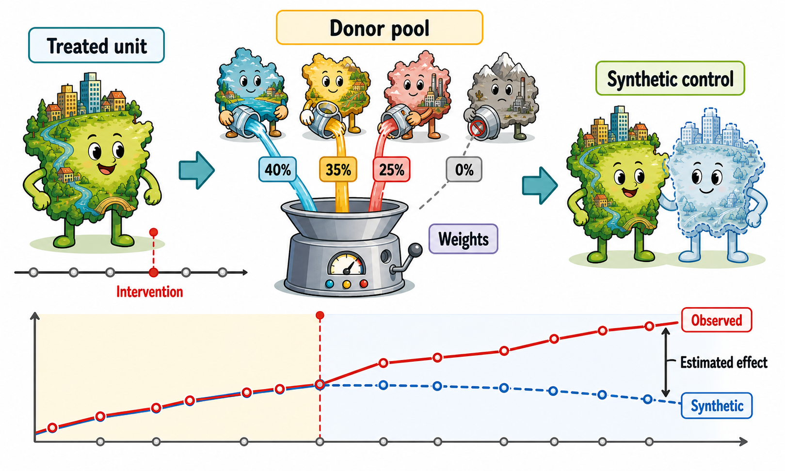

# Synthetic Control Method

When a policy affects only one unit, or a small number of aggregate units, constructing a credible counterfactual becomes especially challenging. Most impact evaluation methods rely on comparisons between many treated and untreated units. This logic is harder to apply when treatment is assigned to a single country, region, city, or municipality. In such settings, no individual untreated unit is likely to provide a fully convincing representation of what would have happened to the treated unit in the absence of the intervention. The **synthetic control method (SCM)** addresses this problem by constructing the counterfactual as a weighted combination of untreated units.

::: {.callout-note}
## SCM in a figure

:::

::: {.callout-note}
## SCM in a figure (alternative version)

{width="80%"}
:::

## The basic intuition

The idea is simple. Instead of comparing the treated unit with one untreated unit, SCM compares it with a **weighted combination of untreated units**.

The untreated units used to build this weighted combination are called the **donor pool**. Each unit in the donor pool receives a weight. In general, units that look more similar to the treated unit before the treatment receive larger weights, while units that are less useful for reproducing the treated unit receive smaller weights or no weight at all. The resulting weighted average is the **synthetic control unit**.

The goal is to construct a synthetic unit that closely reproduces the treated unit before the intervention. If the treated unit and the synthetic control follow similar trajectories before treatment, especially in terms of the key outcome variable, then the synthetic control can be interpreted as a credible approximation of what would have happened to the treated unit’s outcome in the absence of the intervention.

After the treatment occurs, the causal effect is estimated by comparing the observed outcome of the treated unit with the outcome of its synthetic counterpart.

::: {.callout-note appearance="simple"}
## Key idea

SCM is based on a very transparent idea: **the counterfactual is constructed as a weighted average of untreated units.**

The key question is whether this weighted average reproduces the treated unit well before the treatment. If it does, any post-treatment divergence between the treated unit and the synthetic control can be interpreted as evidence of a treatment effect.
:::

## Why not use a single untreated unit or a simple average of untreated units?

A natural alternative would be to compare the treated unit with one untreated unit that looks reasonably similar. However, in many applications, no single unit provides a convincing counterfactual. One country, region, or city may resemble the treated unit in some respects, but differ in others. Relying on a single comparison unit can therefore make the estimate highly dependent on that specific choice.

Another possibility would be to compare the treated unit with the simple average of all untreated units. This is also often problematic. Untreated units may differ substantially from the treated unit in terms of economic structure, demographic characteristics, institutional setting, or pre-treatment outcome trends. A simple average may therefore provide a poor approximation of what would have happened to the treated unit in the absence of the treatment.

SCM offers an intermediate solution. It does not rely on a single untreated unit, nor does it give the same importance to all untreated units. Instead, it constructs a **weighted average** of untreated units, giving more weight to those that help reproduce the treated unit before the intervention and little or no weight to those that do not.

In practice, the synthetic control is constructed in a **data-driven** way. The researcher starts from a pool of untreated units and defines the pre-treatment information that should be matched, typically including past values of the outcome variable and, when relevant, other predictors of the outcome. The weights assigned to the untreated units are then determined by an optimization procedure that searches for the weighted combination that best reproduces the treated unit before the intervention. Units that improve the pre-treatment fit receive positive weights, while units that do not contribute to reproducing the treated unit receive zero or very small weights. The resulting synthetic unit is therefore not selected subjectively, but built from the data to mimic the treated unit before treatment.

## The donor pool

The choice of the donor pool is crucial. The donor pool should include untreated units that are potentially comparable to the treated unit.

Including units that are very different from the treated unit can be problematic, even if they help improve the pre-treatment fit. With a very broad or poorly selected donor pool, the algorithm may find a combination of unrelated units that reproduces the treated unit before the intervention only by chance. This is a form of **overfitting**: the synthetic control may look good in the pre-treatment period, but it may not represent a credible counterfactual after the treatment.

For this reason, the donor pool should not be chosen mechanically. It should be restricted to units that, based on substantive knowledge of the empirical setting, could plausibly have followed a similar trajectory to the treated unit in the absence of the intervention. The goal is not simply to obtain the best possible pre-treatment fit, but to construct a counterfactual that is both empirically accurate and substantively credible.

::: {.callout-warning}
## Common pitfall

**A large donor pool is not always better**. Adding many untreated units may improve the pre-treatment fit, but if some units are not genuinely comparable, the synthetic control may simply overfit pre-treatment patterns.

The donor pool should include credible comparison units, not every untreated unit available in the data.
:::

## Pre-treatment fit

The credibility of SCM depends heavily on the quality of the **pre-treatment fit**.

Before the intervention, the treated unit and the synthetic control should display similar values of the outcome and relevant predictors. If the synthetic control cannot reproduce the treated unit before the treatment, it is difficult to trust it as a counterfactual after the treatment.

This is one of the strengths of SCM: the quality of the counterfactual can be visually inspected. Researchers usually show a graph comparing the treated unit and the synthetic control over time. If the two lines are close before the treatment and diverge only after the treatment, the result is easier to interpret. In addition, researchers can report a balance table, similar to those commonly used in matching applications, to assess whether the treated unit and its synthetic counterpart are similar before the intervention in terms of the outcome and other relevant predictors.

::: {.callout-note}
## Transparency

SCM is based on a data-driven algorithm, and the optimization procedure may not be fully transparent at first sight. However, the method produces two outputs that are highly informative:

1. the weights assigned to each untreated unit;
2. the graph comparing the treated unit with its synthetic counterpart.

These outputs make it possible to see **which untreated units contributed to the counterfactual**, how much they contributed, and whether the synthetic control provides a credible pre-treatment fit.
:::

## Estimating the effect

Once the synthetic control has been constructed, the treatment effect is obtained by comparing the treated unit with its synthetic counterpart after the intervention.

If the treated unit and the synthetic control were very similar before the treatment, but diverge after the treatment, this divergence can be interpreted as the estimated effect of the intervention.

The estimated effect can vary over time. This is particularly useful when the impact of a policy is not immediate, but gradually emerges in the post-treatment period.

## The peculiarity of analyzing a single treated unit

Estimating a causal effect is especially challenging when there is only **one treated unit**. In this setting, the estimate may be highly sensitive to the specific way in which the counterfactual is constructed, because there is no averaging across many treated units that can smooth out unit-specific shocks or idiosyncratic patterns.

For this reason, SCM applications require particular care. Having many pre-treatment periods can help reduce this volatility, because it allows the researcher to assess whether the synthetic control consistently reproduces the treated unit before the intervention. A long and informative pre-treatment period does not solve all problems, but it makes the comparison more credible and the post-treatment divergence easier to interpret.

Statistical inference also differs from more conventional evaluation settings. Since SCM is often applied to one treated unit, traditional large-sample inference cannot be used to assess whether the estimated effect is statistically significant. A common solution is to rely on permutation or placebo tests. The same procedure is applied as if each untreated unit had been treated, generating a distribution of placebo effects. The effect estimated for the actual treated unit can then be compared with this distribution: if it is unusually large relative to the placebo effects, the evidence in favor of a genuine treatment effect is stronger.

## The key assumptions behind SCM

SCM is credible only if the synthetic control provides a convincing approximation of what would have happened to the treated unit in the absence of the treatment. This requires several conditions.

First, the treated unit should be comparable to the units in the donor pool. If the treated unit is very different from all available untreated units, no weighted average of them is likely to provide a credible counterfactual.

Second, the synthetic control should reproduce the treated unit well before the intervention. A good **pre-treatment fit** is essential: if the synthetic unit does not behave like the treated unit before the treatment, it is difficult to believe that it represents what would have happened after the treatment.

Third, the pre-treatment period should be sufficiently informative. SCM works best when we observe the treated and untreated units for several periods before the intervention, so that the algorithm has enough information to construct a credible synthetic counterpart.

Finally, the donor pool should be chosen carefully. The goal is not only to find a combination of units that fits the treated unit before the intervention, but to build a counterfactual that is also substantively plausible.

## When SCM is useful

SCM is especially useful for evaluating aggregate interventions affecting one or a small number of aggregate units, such as countries, regions, cities, or municipalities.

It is most appropriate when:

- there is one treated unit, or a small number of treated units;
- a credible donor pool of untreated units is available;
- data are available for several periods before treatment, so that the credibility of the synthetic unit as a valid counterfactual can be assessed;
- data are available for several periods after treatment, so that the impact of the treatment can be evaluated some time after its onset;
- the synthetic control reproduces the treated unit well before the intervention.

SCM is less convincing when the treated unit is too different from all units in the donor pool, when the pre-treatment period is very short, or when the synthetic control fails to closely approximate the treated unit before treatment.

<!--As with all methods based on untreated units, one should also be careful about anticipation effects and spillovers. If untreated units are indirectly affected by the treatment, they may no longer provide a valid counterfactual.-->

::: {.callout-important}
## Practical implication

SCM should only be used when the synthetic control provides a credible approximation of the treated unit before the intervention.

If the pre-treatment fit is poor, the post-treatment gap is difficult to interpret as a causal effect.
:::

## Example: The Economic Effects of German Reunification

A well-known application of SCM studies the economic effects of **German reunification** on West Germany [@abadie2015comparative].

The treatment is German reunification, which took place in 1990. The treated unit is West Germany. The outcome of interest is GDP per capita. The goal is to estimate what would have happened to West German GDP per capita if reunification had not occurred.

The counterfactual cannot be observed directly. We observe West Germany after reunification, but we do not observe West Germany in a world where reunification did not take place. SCM addresses this problem by constructing a **synthetic West Germany** from a weighted combination of other OECD countries.

The donor pool initially consists of OECD countries that did not experience any reunification. However, not all countries are equally suitable for comparison. Some countries are excluded because they are too small, structurally different, or affected by major shocks during the sample period. The idea is to retain only countries that can plausibly help construct a credible counterfactual for West Germany.

The synthetic control is then built by assigning weights to countries in the donor pool. In this application, synthetic West Germany is mainly constructed from a combination of Austria, the United States, Japan, Switzerland, and the Netherlands.

The key diagnostic is the pre-treatment fit.

{#fig-germany-scm width="85%"}

A simple average of OECD countries does not reproduce West Germany well before the treatment. By contrast, the synthetic control provides a much closer pre-treatment fit.

This matters because the post-treatment comparison is credible only if the synthetic control behaves like West Germany before reunification. Once this condition is satisfied, the divergence between actual West Germany and synthetic West Germany after reunification can be interpreted as the estimated effect of reunification.

The results suggest that German reunification did not have a large effect on West German GDP per capita in the first two years after reunification. However, from 1992 onward, the two trajectories diverge substantially. Over the period 1990--2003, West German GDP per capita was estimated to be lower than its synthetic counterfactual. By 2003, GDP per capita in synthetic West Germany was about 12% higher than observed GDP per capita in West Germany.

## Recent developments

The synthetic control literature has evolved substantially in recent years. One important development is the **synthetic difference-in-differences design (SDiD)**, which combines features of synthetic control methods and difference-in-differences [@arkhangelsky2021synthetic]. Like SCM, it uses data-driven weighting to make treated and untreated units more comparable before the intervention. Like DiD, it relies on the idea that causal effects can be estimated by comparing changes over time between treated and untreated units. The key difference is that, rather than assuming parallel trends directly in the original data, SDiD uses weights to make pre-treatment trends more parallel, thereby improving the credibility of the DiD comparison.

::: {.callout-note appearance="simple"}
## SCM vs. SDiD in a figure

![This figure provides a stylized comparison between SCM and SDiD. In **SCM**, the synthetic control should closely match the treated unit before treatment, both in levels and in trends. The post-treatment gap is then interpreted as the treatment effect. In **SDiD**, the requirement is less demanding. The synthetic control may remain at a different level, as long as it follows an approximately parallel pre-treatment trend. The level gap is then differenced out using the DiD logic. In many applications, SCM produces sparse weights, concentrating most of the weight on a small number of donor units, while SDiD weights are often more dispersed. Time weights also play an important role in SDiD, but they are not discussed here in order to keep the presentation non-technical.](../images/scm_vs_sdid_same_treated_unit.png)
:::

Moreover, the most recent extensions to SCM extend the synthetic control logic beyond the canonical case of a single treated unit. Recent synthetic-control-based estimators can accommodate **multiple treated units**, including settings in which treatment adoption is **staggered**, meaning that different units may become treated at different points in time [@cattaneo2025uncertainty]. This makes synthetic-control-inspired methods applicable to a broader range of policy evaluation settings, where several regions, municipalities, firms, or individuals may be exposed to the treatment either simultaneously or sequentially. The basic logic, however, remains the same: the goal is to construct credible counterfactual trajectories against which the observed post-treatment outcomes of treated units can be compared. In this sense, the event-study and synthetic-control literatures are increasingly converging toward a unified framework for estimating dynamic treatment effects in panel data settings.

## Summing up

SCM is a powerful way to make counterfactual construction explicit. It is particularly useful when the treatment affects one aggregate unit and no single untreated unit provides a convincing comparison.

Its main strengths are that, among CBCMs, it is the only method in the evaluator’s toolkit that is suitable for estimating causal effects when there is a single treated unit, and that it constructs the synthetic counterfactual in a transparent manner. SCM shows which untreated units contribute to the counterfactual, how much weight they receive, and how well the resulting synthetic unit reproduces the treated unit before the intervention.

At the same time, SCM is not a magic formula. Its credibility depends on the quality of the donor pool, the length and informativeness of the pre-treatment period, the absence of spillovers (as for all control-based counterfactual methods), and the ability of the synthetic control to reproduce the treated unit before the treatment.

::: {.callout-note appearance="simple" title="Key SCM formulae"}

Let unit $i=1$ be the treated unit, and let units $i=2,\ldots,J+1$ be untreated donors.
Units are observed for periods $t=1,\ldots,T$. The intervention starts after period $T_0$, so that $t=1,\ldots,T_0$ are pre-treatment periods and $t=T_0+1,\ldots,T$ are post-treatment periods.

Let $X_1$ denote the vector of pre-treatment predictors for the treated unit, and let $X_0$ denote the matrix collecting the same predictors for the donor units. These predictors may include pre-treatment outcomes and other relevant pre-treatment covariates. The matrix $V$ assigns relative importance to these predictors when measuring the distance between the treated unit and the synthetic control. This is needed because not all predictors are equally informative about the untreated outcome path. Some variables may be highly predictive of future outcomes, while others may be noisy, redundant, or less relevant. The role of $V$ is therefore to make the matching criterion focus more on the predictors that matter most for constructing a credible counterfactual.

SCM chooses weights $\widehat W=(\widehat w_2,\ldots,\widehat w_{J+1})'$ by solving

$$
\widehat W
=
\underset{W}{\arg\min}\;
(X_1 - X_0 W)^\top V (X_1 - X_0 W).
$$

subject to

$$
w_j \ge 0
\quad \text{for } j=2,\ldots,J+1,
\qquad
\sum_{j=2}^{J+1} w_j = 1.
$$

The synthetic control outcome, interpreted as the estimated untreated potential outcome for unit 1, is

$$
\widehat{Y}_{1t}^{N}
=
\sum_{j=2}^{J+1} \widehat{w}_j Y_{jt}.
$$

For each post-treatment period $t>T_0$, the estimated treatment effect is

$$
\widehat \tau_{1t}
=
Y_{1t}
-
\sum_{j=2}^{J+1} \widehat w_j Y_{jt}.
$$

The average post-treatment effect for the treated unit is

$$
\widehat{\tau}_{1,\text{post}}
=
\frac{1}{T-T_0}
\sum_{t=T_0+1}^{T}
\widehat{\tau}_{1t}.
$$

This quantity summarizes the estimated treatment effect for the treated unit over the post-treatment period.
:::

::: {.callout-note appearance="simple"}
## Software packages

Several software packages can be used to implement synthetic control methods.

- **R**
  - [`Synth`](https://cran.r-project.org/package=Synth): the classical R implementation of the synthetic control method.
  - [`scpi`](https://cran.r-project.org/package=scpi): tools for estimation, inference, and uncertainty quantification in synthetic control designs.
  - [`synthdid`](https://synth-inference.github.io/synthdid/): implementation of the synthetic difference-in-differences estimator.

- **Python**
  - [`pysyncon`](https://sdfordham.github.io/pysyncon/): a Python package for synthetic control and related extensions.
  - [`scpi_pkg`](https://pypi.org/project/scpi-pkg/): Python implementation of the `scpi` framework for synthetic control estimation and inference.
  - [`synthdid`](https://pypi.org/project/synthdid/): Python implementation of synthetic difference-in-differences estimation.

- **Stata**
  - [`synth`](https://ideas.repec.org/c/boc/bocode/s457334.html): the standard Stata module for implementing synthetic control methods.
  - [`allsynth`](https://ideas.repec.org/c/boc/bocode/s459076.html): Stata utilities that extend `synth`, including bias-correction and placebo-related tools.
  - [`sdid`](https://ideas.repec.org/c/boc/bocode/s459058.html): Stata command for synthetic difference-in-differences estimation.
:::