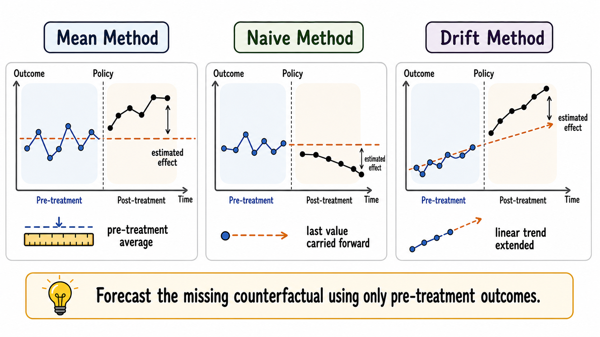
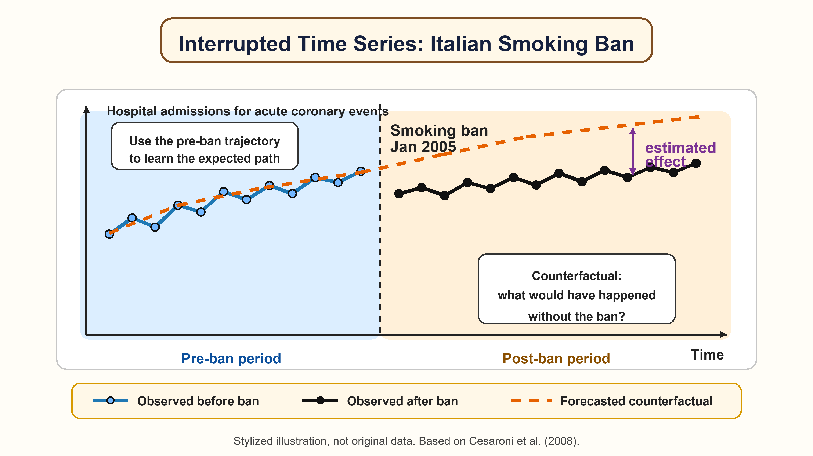

# Forecast-Based Counterfactual Methods 

The methods discussed so far rely on the availability of untreated units that can be used to construct a credible counterfactual. However, in many policy settings, such units may not be available or may not provide a credible comparison group. For instance:

i) **The treatment affects all units at the same time.** This may happen in the case of nationwide reforms, macroeconomic shocks, pandemics, or policies implemented everywhere simultaneously. In these settings, there may be no untreated units left in the data.

ii) **Untreated units are indirectly affected by the treatment.** This may happen when a policy changes labor-market conditions, prices, commuting flows, local competition, or social interactions. In such cases, untreated units no longer represent what would have happened to treated units in the absence of the policy, because they are themselves affected by it. This violates the no-interference assumption [@cox1958].

In these cases, control-based evaluation strategies cannot be leveraged to recover the causal effects of interest. To overcome such a limitation, a possible solution would be to use evaluation strategies that do not rely on the post-treatment values of the untreated units to recover the causal estimands of interest. In particular, in this chapter, we will focus on **forecast-based counterfactual methods (FBCMs), namely methods that leverage pre-treatment information to forecast the counterfactual scenario of each treated unit**.

The logic is simple: if no credible control group is available, we can use the pre-treatment information of the treated units themselves to forecast the missing counterfactual.

::: {.callout-note appearance="simple"}
### Key idea

FBCMs estimate what would have happened after the intervention by projecting the pre-treatment behavior of the treated units into the post-treatment period.
:::

This approach estimates causal effects by comparing the observed post-treatment outcomes of the treated units with the outcomes forecasted for the same units in the absence of the treatment, using only their pre-treatment data. The counterfactual is therefore constructed through a forecasting model rather than through a comparison with untreated units.

## The Evaluation Problem

For simplicity, we focus on the case of a single treated unit, but the same reasoning extends to settings with multiple treated units. Consider a unit observed over time. Let $t=1,\ldots,T_0$ denote the pre-treatment period and $t=T_0+1,\ldots,T$ denote the post-treatment period. The intervention starts after $T_0$.

For each post-treatment period, the observed outcome is

$$
Y_t^{obs}=Y_t(1),
$$

while the missing counterfactual is $Y_t(0)$.

The individual treatment effect (ITE) at time $t$ is

$$
\tau_t = Y_t(1) - Y_t(0), \qquad t > T_0.
$$

Since $Y_t(0)$ is not observed after the intervention, FBCMs replace it with a prediction:

$$
\widehat{\tau}_t = Y_t^{obs}-\widehat{Y}_t(0).
$$

The crucial step is therefore the construction of $\widehat{Y}_t(0)$.

## Counterfactual Forecasting

The construction of the counterfactual can be seen as a prediction problem [@varian2014; @varian2016]. FBCMs use pre-treatment information to predict what the post-treatment outcome would have been in the absence of treatment.

In its most compact form, a forecast-based estimator can be written as

$$
\widehat{Y}_t(0)=\widehat{f}(\mathcal{H}_{T_0}),
$$

where $\mathcal{H}_{T_0}$ is the information available before treatment. This information may include past values of the outcome, lagged covariates, seasonal patterns, trends, and other pre-treatment predictors.

The treatment effect is then the gap between the observed post-treatment outcome and the predicted untreated path.

This logic is intuitive. Suppose employment in a region was increasing steadily before a reform. If, after the reform, employment rises substantially more than predicted by its pre-treatment trend, the additional increase may be interpreted as evidence of a treatment effect.

The same reasoning applies to excess mortality. If, during a pandemic, mortality in a municipality is much higher than its expected baseline---estimated using only pre-pandemic values---the difference can be interpreted as excess mortality.

However, this difference can be interpreted causally only if the forecasted counterfactual is credible.

::: {.callout-warning}
### No control does not mean no assumptions

FBCMs replace cross-sectional comparison with time-series prediction. This avoids the need for untreated units, but it requires a set of different assumptions about the stability and predictability of the untreated outcome path.
:::

## Simple Forecasting Methods

A first family of methods uses very simple forecasting methods. These methods are useful because they make the core intuition of FBCMs transparent.

::: {.callout-tip appearance="simple"}
### Why start with simple forecasting methods?

Simple forecasting rules are rarely enough for a final evaluation, but they are useful benchmarks. A more sophisticated method should usually improve on them in pre-treatment placebo forecasting exercises.
:::

### Mean Method

The mean method uses the average pre-treatment outcome as the counterfactual forecast:

$$
\widehat{Y}_{T_0+h}(0)=\frac{1}{T_0}\sum_{t=1}^{T_0}Y_t.
$$

This approach is reasonable only if the untreated outcome is approximately stable over time. It is often too crude when there are trends, cycles, or seasonality.

::: {.callout-note}
### Application: excess mortality during the first Covid-19 wave

The report by the Italian National Social Security Institute [@inps2020mortalita] on mortality during the Covid-19 epidemic provides a useful example of a **mean-method** counterfactual. To assess excess mortality in early 2020, the report compares observed deaths with a baseline given by the average number of deaths in the same calendar period of previous years.

This approach is credible in this application because all-cause mortality is relatively stable over short periods once seasonality is taken into account. Excess mortality is then estimated as the difference between observed deaths in 2020 and this historical mean baseline.
:::

### Naive Method

The naive method uses the last pre-treatment observation as the forecast:

$$
\widehat{Y}_{T_0+h}(0)=Y_{T_0}.
$$

This can be useful when the best short-run prediction is the most recent value. But it fails when outcomes were already trending before the intervention.

### Drift Method

The drift method extends the pre-treatment trend linearly:

$$
\widehat{Y}_{T_0+h}(0)=Y_{T_0}+h\frac{Y_{T_0}-Y_1}{T_0-1}.
$$

This method allows for a linear trend, but it remains simplistic. If the untreated outcome follows nonlinear dynamics, seasonal patterns, or sudden changes unrelated to the policy, the forecast may be inaccurate.

::: {.callout-note}
## Simple FBCMs

:::

## From Forecast Error to Treatment Effect

Once a counterfactual forecast is available, several causal parameters can be constructed.

The point effect at post-treatment time $t$ is

$$
\widehat{\tau}_t=Y_t^{obs}-\widehat{Y}_t(0).
$$

The cumulative effect up to period $t$ is

$$
\widehat{\Delta}_t=\sum_{s=T_0+1}^{t}\widehat{\tau}_s.
$$

The temporal average effect is

$$
\widehat{\bar{\tau}}_t=
\frac{1}{t-T_0}\sum_{s=T_0+1}^{t}\widehat{\tau}_s.
$$

With several treated units, the researcher can also average across units:

$$
\widehat{ATT}_t=
\frac{1}{N}\sum_{i=1}^{N}
\left(Y_{it}^{obs}-\widehat{Y}_{it}(0)\right).
$$

The same logic can be used to study heterogeneity, by comparing estimated effects across units or groups of units.

## Interrupted Time-Series Design

::: {.callout-note}
### Interrupted time series

An interrupted time-series design compares the observed post-intervention outcome with the continuation of the pre-intervention time-series pattern.
:::

The interrupted time-series (ITS) design is probably the most common FBCM when a long pre-treatment time series is available. The idea is to model the pre-treatment dynamics of the outcome and then extrapolate them into the post-treatment period.

A simple ITS model can be written as

$$
Y_t=\alpha+\beta t+\gamma Post_t+\delta(t-T_0)Post_t+u_t,
$$

where $Post_t$ equals one after the intervention. In this specification, $\gamma$ captures an immediate level change and $\delta$ captures a change in trend after the intervention.

This representation is useful pedagogically, but real applications often require more careful modeling. Outcomes may be autocorrelated, seasonal, volatile, or affected by calendar effects. For this reason, interrupted time-series analysis is often combined with time-series models such as ARIMA.

The counterfactual is the predicted path that would have occurred after $T_0$ if the pre-treatment dynamics had continued without the intervention.

::: {.callout-note}
## Application: the Italian smoking ban

In January 2005, Italy introduced a regulation banning smoking in indoor public places. Suppose we want to study whether this policy reduced hospital admissions for acute coronary events, as in @cesaroni2008. Importantly, the smoking ban was introduced nationally, and all Italian regions were exposed to the policy at the same time.

This makes the use of control-based methods difficult. Since all units in Italy were treated simultaneously, there is no obvious untreated group within the country that can be used to construct the counterfactual. One possibility would be to use similar data from other countries that did not introduce the same policy at the same time. However, this strategy would require other countries to provide a credible counterfactual for Italy, as well as almost identical data collection practices.

For this reason, an ITS design offers a natural alternative. Instead of relying on untreated units, this approach uses a model that exploits the pre-policy trajectory of hospital admissions in Italy to forecast what would have happened after January 2005 in the absence of the smoking ban.

If post-ban admissions fall below what would have been expected from the pre-ban trend (as in the figure above), this difference can be interpreted as evidence consistent with a positive policy effect, provided that the forecasted counterfactual is credible and that no other simultaneous event explains the change.
:::

The ITS design works best when the number of pre-treatment periods is large. With few pre-treatment observations, it is difficult to learn the untreated dynamics, distinguish signal from noise, and assess whether the post-treatment deviation reflects a genuine treatment effect rather than random fluctuations.

::: {.callout-note}
## Causal ARIMA

Causal ARIMA extends the ITS logic by explicitly anchoring ARIMA models in the potential outcomes framework [@menchetti2023]. It is designed for settings in which no control series is available and the researcher has a sufficiently long pre-treatment time series.

The key contribution is not simply the use of ARIMA. The important point is that the method defines causal estimands in a potential outcomes framework, clarifies the assumptions required to attribute deviations from the forecast to the intervention, and provides a way to conduct inference.

The basic idea is:
i) estimate the untreated time-series process using pre-treatment data;
ii) forecast the untreated post-treatment path;
iii) compare the observed post-treatment path with the forecast;
iv) quantify uncertainty around the estimated effects.

For example, Causal ARIMA has been used by [@menchetti2023] to estimate the effect of a permanent price reduction in a retail store when only the treated product series is available. The treatment effect is the difference between actual post-treatment sales and the sales that would have been predicted under the no-policy scenario.
:::

## Machine Learning Control Method

The Machine Learning Control Method (MLCM) generalizes the forecast-based logic to richer panel settings with many treated units and no credible control group [@cerqua2024mlcm].

The central idea is to use supervised machine learning algorithms, such as LASSO, random forests, and gradient boosting, to learn how outcomes evolve in the absence of treatment using only pre-treatment information. The model is then used to predict post-treatment counterfactual outcomes for treated units.

In this framework, a generic counterfactual forecast can be written as

$$
\widehat{Y}_{it}(0)=\widehat{f}(X_i,\mathcal{H}_{i,T_0},t),
$$

where $X_i$ denotes pre-treatment characteristics and $\mathcal{H}_{i,T_0}$ denotes the pre-treatment history of unit $i$.

Compared with simple time-series methods, MLCM can exploit many predictors and flexible nonlinear relationships. It is particularly useful when the researcher observes many treated units, such as municipalities, firms, or schools, but cannot rely on untreated units as controls.

::: {.callout-note}
### MLCM Application: COVID-19 and standardized math scores

Cerqua, Letta, and Menchetti [-@cerqua2024mlcm] apply the MLCM to study the impact of the COVID-19 shock on educational achievement in Italy. This is a natural setting for the MLCM because the shock affected the whole country at the same time: there is no obvious untreated Italian control group that can be used to construct the counterfactual.

The units of analysis are Italian **Local Labor Markets**. The outcome is the standardized **INVALSI mathematics test score** of fifth-grade students. The authors use a rich set of pre-COVID predictors, including past INVALSI scores, local socioeconomic conditions, demographic characteristics, labor-market indicators, and territorial features, to forecast what each local area’s math score would have been in the absence of the pandemic. The difference between the observed post-shock score and the machine-learning forecast gives the estimated local treatment effect.

The results show a large negative effect of the COVID-19 shock on learning outcomes, averaging about **-0.76 standard deviations** relative to the forecasted counterfactual. Losses are uneven across space and are larger in already fragile areas, especially those with higher unemployment, higher inequality, and lower educational attainment.
:::

## Identification Assumptions

FBCMs require a set of assumptions that is almost completely different from those used in control-group designs.

1) **No anticipation**. Units should not change behavior before the official start of the intervention because they expect the treatment to occur. Anticipation contaminates the pre-treatment period and makes the estimated untreated trajectory unreliable. This assumption also underlies also most CBCMs.

2) **Stability of the untreated outcome process**. In the absence of treatment, the relationship learned from pre-treatment data should continue to hold in the post-treatment period. If the data-generating process changes for reasons unrelated to the policy, the forecast error may capture those changes rather than the treatment effect.

3) **Absence of other simultaneous shocks**. If another event occurs at the same time as the treatment, it may be impossible to distinguish the effect of the treatment from the effect of the other event.

4) **Sufficient pre-treatment information**. Forecasting requires enough historical data to learn the relevant pattern.

::: {.callout-warning}
### Machine learning and time-series models do not remove the causal problem

Machine learning, time-series models, or a combination of the two can improve prediction, but causal interpretation still depends on assumptions. Even a highly accurate forecasting model may produce a misleading causal estimate if the post-treatment period contains other shocks unrelated to the treatment.
:::

## Diagnostics and Validation

Because these methods rely heavily on prediction, validation is central.

A useful diagnostic is a pre-treatment forecasting exercise. The researcher can pretend that treatment occurred earlier, estimate the model using only data before that placebo date, and test how well the method predicts the held-out pre-treatment observations.

::: {.callout-tip appearance="simple"}
### A practical rule

Before interpreting a post-treatment gap as a causal effect, ask whether the method would have predicted the pre-treatment path reasonably well.
:::

If the model cannot predict the pre-treatment period, it is difficult to trust its post-treatment counterfactual forecast.

Other useful checks include:

- comparing the main method with simple benchmarks such as the mean, naive, and drift methods;
- inspecting forecast errors in the pre-treatment period;
- checking whether results depend on a few influential periods
- examining whether other shocks occurred around the intervention date.

::: {.callout-note}
### Tabular foundation models: a new frontier for FBCMs?

A promising recent development is the emergence of **tabular foundation models**, such as TabPFN and TabFM. Unlike conventional forecasting algorithms, these models are pretrained across millions of synthetic datasets and can transfer what they have learned to a new prediction problem through **in-context learning**, often without task-specific training or extensive hyperparameter tuning.

This feature is particularly relevant when the available dataset is not large. TabPFN has shown strong predictive performance on small and medium-sized tabular datasets, including regression problems with relatively few observations ([Hollmann et al. 2025](https://doi.org/10.1038/s41586-024-08328-6)). TabPFN-TS extends this approach to forecasting by transforming time-series information into a tabular regression problem. Recent evidence indicates that it can produce competitive forecasts even without time-series-specific pretraining ([Hoo et al. 2026](https://arxiv.org/abs/2501.02945)). Newer models such as [TabFM](https://research.google/blog/introducing-tabfm-a-zero-shot-foundation-model-for-tabular-data/) further develop this zero-shot approach for tabular regression and classification.

These advances could represent an important step forward for **FBCMs**. Policy evaluations often have only a limited number of pre-treatment periods or observations, but may contain many informative predictors. A pretrained foundation model could exploit complex relationships among these predictors more effectively than a model trained from scratch on the application dataset.

However, it is important to keep in mind that, although tabular foundation models may substantially strengthen the forecasting component of FBCMs, they do not replace the assumptions required for causal identification.
:::

## Worked Example

Suppose a national reform introduces a new workplace-safety regulation for all firms at the same time. The goal is to reduce workplace accidents. Because the reform is implemented nationwide, there is no contemporaneous untreated group of comparable firms within the country.

For each firm, we observe monthly accident rates for several years before the reform and after the reform. A FBCM would proceed as follows:

1. Use pre-reform accident rates to model the expected accident path in the absence of the new regulation.
2. Forecast the post-reform counterfactual accident rate.
3. Compare observed post-reform accident rates with the predicted no-reform path.
4. Average the estimated firm-level gaps to obtain the average treatment effect, and then compute the associated uncertainty.
5. Examine whether the effect differs by firm size, sector, or baseline accident risk.

If observed accidents fall below the predicted counterfactual path after the reform, this is consistent with a beneficial effect. But the interpretation depends on whether other factors changed at the same time, such as new enforcement rules, reporting requirements, or macroeconomic conditions.

::: {.callout-note}
### Confidence intervals and prediction intervals

A **confidence interval** describes the uncertainty around an estimated parameter, such as an average treatment effect. It asks: how precisely have we estimated the causal effect?

A **prediction interval** describes the uncertainty around a future or counterfactual outcome. It asks: how uncertain is the predicted value itself?

This distinction matters for counterfactual methods. In **control-based counterfactual methods (CBCMs)**, such as DiD or matching, the main object is usually a causal parameter obtained by comparing treated units with observed control units. The uncertainty therefore concerns the estimated treatment effect, so results are typically reported using **confidence intervals**.

In **FBCMs**, the counterfactual is not observed in another group. It is forecasted from the treated unit’s own pre-treatment history. Here, uncertainty comes not only from estimating the model, but also from predicting an unobserved counterfactual path. For this reason, FBCMs naturally rely on **prediction intervals** around the forecasted counterfactual outcome.
:::

## Summary

FBCMs provide a valuable alternative to CBCMs, especially when no credible control group exists. Instead of comparing treated and untreated units, they compare observed post-treatment outcomes with predicted untreated outcomes.

The simplest versions use mean, naive, or drift forecasts. More sophisticated approaches include interrupted time-series designs, Causal ARIMA, and the MLCM.

The strength of these methods is that they can be applied in settings where standard comparison-based methods fail, especially when no credible untreated group is available. Their weakness is that causal interpretation relies heavily on the credibility of the forecasted counterfactual. The key question is therefore whether the model can accurately learn the untreated outcome dynamics from pre-treatment data and extrapolate them into the post-treatment period.
