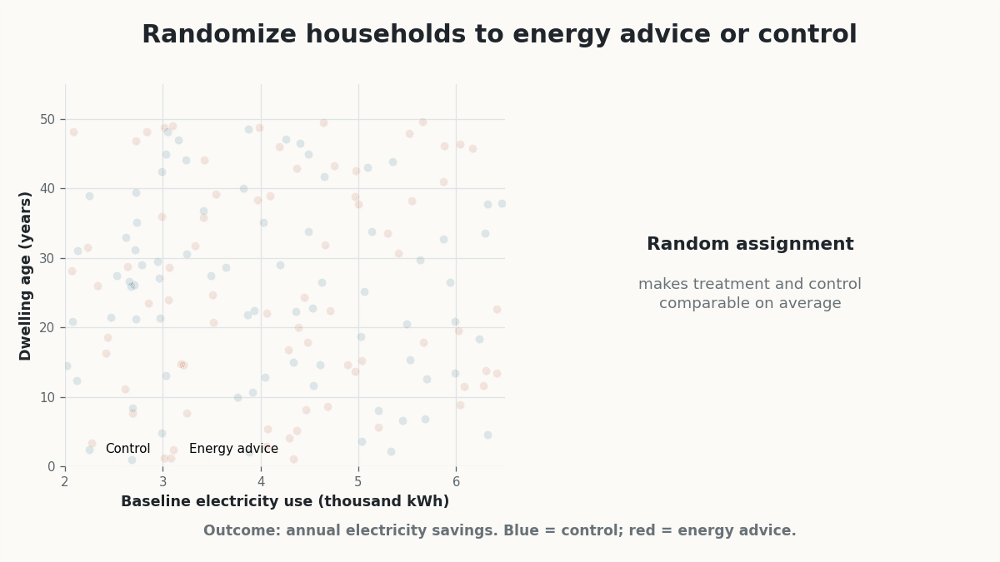

## Heterogeneous Treatment Effects

Most impact evaluation methods are introduced by focusing on average effects. We often ask whether a policy works **on average**, and summarize its impact using parameters such as the ATT, or the LATE.

This is a natural starting point. Because of the fundamental problem of causal inference, we cannot observe both potential outcomes for the same unit [@holland1986; @rubin1974]. We therefore usually move from individual-level causal effects to average causal effects.

However, average effects may conceal substantial heterogeneity. A policy may be highly effective for some units, have little or no effect for others, and even be harmful for another group. In many policy settings, knowing the average effect is therefore not enough. We also want to understand **for whom** the policy works, **where** it works, and **under which conditions** it is most effective.

::: {.callout-note appearance="simple"}
### Key idea

A policy can work on average and still work very differently across units. Heterogeneous treatment effect (**HTE**) analysis asks who benefits, who does not, and can provide insights into why the same policy may produce different effects for different units.
:::

## From Average Effects to HTEs

Let $Y_i(1)$ and $Y_i(0)$ denote the potential outcomes of unit $i$ under treatment and no treatment. The individual treatment effect is

$$
\tau_i = Y_i(1)-Y_i(0).
$$

If treatment effects were the same for all units, then

$$
\tau_i = \tau
$$

for every unit $i$. In that special case, ATE, ATT, and LATE would all coincide.

In practice, this assumption is often unrealistic. Treatment effects may vary by age, gender, education, income, firm size, local labor-market conditions, political context, baseline risk, or many other pre-treatment characteristics.

For example, a job-search assistance program may be more effective for workers with intermediate skills than for workers who are either very highly skilled or very weakly attached to the labor market. A subsidy to firms may have larger effects among small liquidity-constrained firms than among large firms. A drug may help some patients but harm others.

The object of interest is often the **conditional average treatment effect**, or **CATE**:

$$
CATE(x) =
E[Y_i(1)-Y_i(0)\mid X_i=x].
$$

The CATE measures the average treatment effect for units with characteristics $X_i=x$.

::: {.callout-note}
### The Conditional Average Treatment Effect (CATE)

The **CATE** answers the question:  
**What is the average treatment effect for units with a given set of pre-treatment characteristics?**
:::

Sometimes researchers focus on a single characteristic, such as gender, age group, or firm size. In other cases, they are interested in richer combinations of covariates. The main challenge is that heterogeneity may be multidimensional and nonlinear.

## Why Heterogeneity Matters

HTEs matter for several reasons:

1. **They improve interpretability.** An average effect close to zero does not necessarily imply that the policy had no effect. Positive effects for some units may simply be offset by negative effects for others.

2. **They matter for targeting**. Policymakers often need to decide who should receive a program in the future. If the policy is costly, it may be useful to target it toward the units that benefit most.

3. **Heterogeneity can reveal causal mechanisms**. If effects are larger for some groups than for others, this may help us understand why the policy works.

4. **Heterogeneity is important for equity**. A policy that improves average outcomes may still increase inequality if its benefits are concentrated among already advantaged groups.

::: {.callout-important}
### Policy relevance

A policy evaluation should not only ask whether a program works on average.  
It should also ask whether the program works better or worse for different types of units.
:::

## The Most Common Approach for Estimating HTEs

Although there are several ways to study HTEs, subgroup analysis is by far the most widely used. This generally consists of estimating treatment effects separately across relevant subgroups, or examining whether an estimated average effect differs across them. For example, researchers may estimate separate effects by gender, age, education, income, region, or firm size. This is a **top-down** approach: the researcher chooses the relevant subgroups based on theory, institutional knowledge, or prior evidence. For example, in a study of the electoral effects of refugee reception centers, one may ask whether the effect differs across areas with different income levels, political histories, or demographic structures.

The advantage of this approach is that it is easy to understand and communicate. Its main limitation is that the estimation process can easily become arbitrary and vulnerable to cherry-picking: researchers may try many subgroup definitions and report only those that produce statistically significant differences. This creates risks of multiple testing, selective reporting, and p-hacking [@brand2021].^[**Multiple testing** occurs when many hypotheses are tested simultaneously. Even if all null hypotheses are true, testing more hypotheses increases the probability of finding at least one statistically significant result purely by chance.]

::: {.callout-warning}
### The risk of subgroup fishing

Subgroup analysis is most credible when the relevant groups are motivated before looking at the results.  
If many subgroups are explored and only significant findings are reported, inference becomes unreliable.

This is also a **multiple testing** problem: the more subgroup comparisons we try, the more likely it is that some statistically significant differences will appear simply by chance.
:::

A second limitation is that one-variable-at-a-time subgroup analysis may miss more complex patterns of treatment-effect heterogeneity. Treatment effects may depend not on individual characteristics considered separately, but on particular combinations of characteristics.

::: {.callout-note}

### A bottom-up approach to heterogeneity

An alternative approach is to estimate treatment effects at a very disaggregated level and then study which characteristics are associated with larger or smaller effects. This is a more **bottom-up** strategy: instead of starting from pre-defined subgroups, the researcher estimates individual treatment effects, for example by applying SCM separately to several treated units, and then investigates which observed covariates are associated with variation in these effects.

```{=latex}
\smallskip
```

This approach can be useful when rich data are available and when the relevant dimensions of heterogeneity are not fully known in advance. However, these estimates should be interpreted with caution. Individual treatment effects are often noisy and should not be considered precisely estimated individual causal effects. A practical consequence is that researchers may end up overinterpreting random variation as meaningful heterogeneity, identifying apparent “winners” and “losers” of the treatment even when these differences are largely driven by estimation noise.
:::

## Data-driven estimation of HTEs

A more recent approach estimates treatment effects and their heterogeneity at the same time. This is the logic behind methods such as **causal trees** and **causal forests**.

These methods are designed to discover subgroups with different treatment effects in a data-driven way. They are especially useful when the researcher has many potential moderators and does not know in advance which combinations of covariates define the most responsive groups.

Compared with traditional subgroup analysis, these methods can reduce researcher discretion and help detect nonlinear interactions. However, they also require careful implementation and strong identifying assumptions, especially in observational studies.

### Decision Trees and Random Forests

Causal trees and causal forests build on machine learning methods originally designed for prediction.

A **decision tree** partitions the covariate space into regions. A widely used approach is **CART**^[**CART** stands for *Classification and Regression Trees*. In regression problems, CART recursively splits the data by choosing the covariate and cutoff that produce the largest improvement in predictive fit, typically by reducing the sum of squared errors within the resulting groups.]. In a regression tree, the goal is to predict an outcome $Y_i$. The algorithm repeatedly searches for splits of the covariates that create groups with increasingly similar outcome values.

For example, a regression tree predicting whether an unemployed worker finds a job within six months may first split individuals by previous employment duration, then split one branch by age and another by education. Each final leaf contains individuals with similar characteristics and similar predicted employment outcomes.

Decision trees are attractive because they are easy to interpret. However, they can be unstable: small changes in the data may generate a different tree.

A **random forest** addresses this instability by estimating many trees—often hundreds or thousands—and averaging their predictions. Each tree is typically estimated on a bootstrap sample^[A **bootstrap sample** is created by drawing observations randomly from the original dataset with replacement until a new sample of the same size is obtained. Because sampling is with replacement, some observations may appear multiple times while others may not appear at all.] and considers only a random subset of covariates at each split. This usually improves predictive accuracy, but the resulting model is less interpretable than a single tree.

### Why Standard Machine Learning Is Not Enough

Standard decision trees and random forests are designed to predict outcomes. But causal inference has a different goal: estimating treatment effects.

A method that predicts $Y_i$ very well does not necessarily estimate causal effects accurately. **Prediction and causal estimation are fundamentally different tasks.**

For this reason, standard machine learning methods should not be applied directly to causal-effect estimation. They must first be adapted to the causal problem so that the objective is to estimate treatment effects rather than simply predict outcomes.

::: {.callout-important}
### Prediction is not causation

A model can predict outcomes accurately and still fail to estimate causal effects.  

```{=latex}
\smallskip
```

Causal trees and causal forests modify tree-based methods so that they target treatment effect heterogeneity rather than outcome prediction.
:::

### Causal Trees

**Causal trees**, introduced by Athey and Imbens, adapt decision trees to estimate HTEs [@athey2016].

Instead of splitting the data to improve prediction of $Y_i$, causal trees search for groups of units with different treatment effects. The goal is to partition the data into leaves characterized by different average treatment effects.

The key challenge is that the individual treatment effect, $\tau_i=Y_i(1)-Y_i(0)$, is never observed. The algorithm therefore cannot directly use individual treatment effects to determine where to split the data. Instead, it estimates treatment effects by comparing treated and untreated units within candidate subgroups. For example, in a randomized experiment^[In a randomized experiment, treatment assignment makes treated and untreated units comparable within a leaf in expectation.], the treatment effect in leaf $L$ can be estimated as

$$
\widehat{\tau}(L)
=
\overline{Y}_{D=1,L}
-
\overline{Y}_{D=0,L}.
$$

The tree then searches for splits that generate sufficiently large differences in estimated treatment effects across the resulting subgroups. Each terminal leaf therefore contains an estimated average treatment effect for units with the characteristics defining that leaf.

For example, a causal tree may find that a training program has a large effect for young workers with low previous earnings, a smaller effect for older workers, and little or no effect for workers with high baseline employment probabilities.

### Honest Estimation

A central idea in causal trees is that of **honesty**. The data are split into two parts:

* one part is used to build the tree;
* the other part is used to estimate treatment effects within the leaves.

This separation helps prevent the algorithm from finding spurious treatment-effect heterogeneity that happens to fit the particular sample used to construct the tree. If the same data are used both to choose the subgroups and to estimate their effects, the estimated heterogeneity may be exaggerated. Honest estimation therefore separates **discovery** from **estimation**, reducing overfitting and facilitating valid inference on the treatment effects within the resulting leaves.

::: {.callout-note}

### Honest trees

Honest causal trees use one part of the data to determine the tree structure and another part to estimate treatment effects within the resulting leaves.
:::

The price is that each task uses less data. This can reduce precision, especially in small samples.

### Worked example: who benefits most from energy advice?

::: {.content-visible when-format="html"}

:::

Suppose that 1,600 households are randomly assigned either to receive personalized energy-saving advice or to a control group. The outcome is annual electricity savings, while baseline electricity use and dwelling age are observed before treatment.

An honest causal tree divides the sample into two parts. The **discovery sample** is used to identify subgroups with different treatment effects. The tree first separates households according to baseline electricity use and then divides high-use households according to dwelling age. A separate **estimation sample** is used to estimate the treatment effect within each resulting leaf.

In this stylized example, estimated electricity savings are relatively small among low-use households, larger among high-use households in newer homes, and largest among high-use households in older homes. These estimates are **leaf-specific average treatment effects**, not individual causal effects.

The example also illustrates the division of labor between research design and machine learning. Random assignment makes the within-leaf treatment-control comparisons causally interpretable, while the causal tree helps discover systematic treatment-effect heterogeneity.

### Causal Trees in Observational Studies

In randomized experiments, treatment assignment is independent of potential outcomes by design. In observational studies, this is not true. Causal trees must therefore rely on identifying assumptions, typically **unconfoundedness** and **overlap**.

The idea behind unconfoundedness is that, after conditioning on observed covariates, treatment assignment is as good as random. Overlap additionally requires that units with similar covariates have a positive probability of receiving either treatment status. If these assumptions are credible, causal trees can be combined with methods such as propensity score adjustment or inverse probability weighting to account for differences in treatment assignment.

The important point is that causal trees do not automatically solve confounding. They help discover treatment effect heterogeneity **conditional on the assumptions that make causal identification possible**.

### Causal Forests

A single causal tree is interpretable but may be unstable. A **causal forest** extends the logic of random forests to treatment effect estimation.

Instead of growing one causal tree, a causal forest grows many causal trees and combines their predictions to estimate conditional treatment effects [@wager2018].

Causal forests are less visually transparent than a single tree, but they are usually more stable and flexible. They can accommodate many covariates and complex interactions and provide useful summaries of treatment effect heterogeneity.

Common outputs include:

* estimated CATEs evaluated at different covariate profiles;
* tests for the presence of treatment effect heterogeneity;
* variable importance measures;
* subgroup summaries based on predicted treatment effects.

For example, a causal forest can reveal substantial heterogeneity in the earnings effects of job displacement across workers and establishments, as well as systematic differences related to industries and local labor markets [@athey2026].

### Interpreting Causal Forests

Causal forests can be powerful, but they require careful interpretation.

First, their estimates are not individual treatment effects observed in the data. They are estimates of **CATE** based on the characteristics of each unit. Units with similar covariate profiles may therefore receive similar predicted treatment effects.

Second, the results remain conditional on the identifying assumptions. If treatment assignment is confounded by unobserved variables, causal forests may detect heterogeneity in selection bias rather than heterogeneity in causal effects.

Third, variable importance measures should not be interpreted mechanically. A variable may appear important because it helps identify differences in treatment effects across units, but understanding why these differences arise still requires substantive interpretation.

::: {.callout-warning}

### Be careful with causal forests

Causal forests can be powerful tools for studying HTEs, but their predictions should not be interpreted as precisely estimated individual causal effects. What they estimate are conditional average treatment effects for units with particular covariate profiles, and these estimates may be less reliable in regions of the covariate space with limited information.

```{=latex}
\smallskip
```

Recent theoretical results highlight an important limitation of the causal trees on which these methods build. Causal trees based on standard CART-type splitting rules can occasionally create highly unbalanced partitions, leaving very few observations in some terminal nodes and generating large local estimation errors. Importantly, average predictive accuracy may still look good even when treatment effect estimates are inaccurate in particular regions of the covariate space [@cattaneo2026accuracy].

```{=latex}
\smallskip
```

These results do not imply that causal forests are generally unreliable. Rather, they highlight the importance of the regularity conditions used in causal forest methods to avoid excessively unbalanced partitions and obtain reliable local estimates.
:::

## Practical Guidance on the estimation of HTEs

A credible analysis of HTEs should report:

- why heterogeneity is substantively important;
- whether subgroup analyses were pre-specified or exploratory;
- which covariates are used to define heterogeneity;
- how multiple testing is handled;
- whether the analysis relies on unconfoundedness, randomization, IV, RD, or another design;
- whether the estimated heterogeneity is statistically meaningful;
- how large the subgroups are;
- whether results are robust across alternative specifications or methods.

When using causal trees or causal forests, it is also useful to report how the data were split, how tuning parameters were chosen, and which covariates are most important in explaining heterogeneity.

::: {.callout-warning}
### Heterogeneity needs design too

Flexible methods can find patterns, but they do not create causal identification by themselves.  
The credibility of HTE analysis still depends on the underlying research design.
:::

## Summary

Average treatment effects are useful, but they may hide important variation. Heterogeneous treatment effect analysis asks whether a policy works differently for different units.

Traditional subgroup analysis is simple and transparent, but it can be vulnerable to multiple testing and selective reporting. More flexible approaches, such as causal trees and causal forests, can discover complex heterogeneity across many covariates, but they require careful implementation and interpretation.

The main message is that heterogeneity analysis should not be treated as a purely technical exercise. It should be connected to theory, policy relevance, and the credibility of the underlying causal design.
