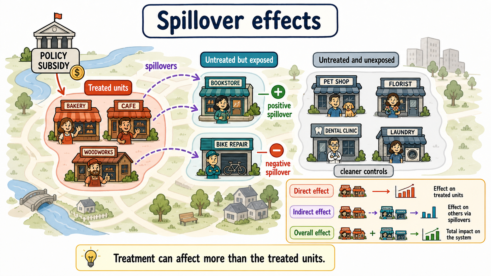

# Spillover Effects

All evaluation methods introduced so far rely on a simple idea: each unit has two potential outcomes, one under treatment and one under no treatment. This is convenient because it allows us to write the causal effect for unit $i$ as the comparison between $Y_i(1)$ and $Y_i(0)$.

This representation depends on the **Stable Unit Treatment Value Assumption (SUTVA)** [@rubin1980]. As discussed in [Chapter 3](../chapters/03-causal-parameters.qmd), SUTVA has two main components. First, there should be no hidden versions of the treatment: units assigned to the same treatment status should receive the same treatment in the relevant sense. Second, there should be no interference between units: the potential outcome of one unit should depend only on that unit's own treatment status, not on the treatment status of other units [@cox1958].

This second part is the **no-interference assumption**. Spillover effects arise precisely when it fails.

::: {.callout-note appearance="simple"}
### Key idea

Spillover effects occur when the treatment of one unit affects the outcomes of other units.
:::

Spillovers are not a technical nuisance only. In many policy settings, they are part of the mechanism through which the policy is expected to work. A regional development program may aim to support treated firms, but also to stimulate local suppliers, competitors, workers, and neighboring areas. A vaccination campaign may directly protect vaccinated individuals, but also indirectly protect unvaccinated individuals by reducing disease transmission.

When these indirect effects exist, treatment effect estimates obtained by comparing treated and untreated units may be biased. They may also fail to capture the indirect effects of the treatment on untreated units.

::: {.callout-note}
## Spillovers in a figure

:::

## Why Spillovers Matter

Suppose a training program improves the job prospects of treated workers. If treated workers obtain jobs that would otherwise have gone to untreated workers, the program generates a **substitution effect**. The treated group benefits, but part of the gain comes at the expense of the untreated group.

In this case, the untreated group no longer represents what would have happened to the treated group in the absence of the treatment. This problem can arise even under random assignment, because the control group is itself affected by the treatment.

Spillovers can also be positive. For example, providing medicine to some children may reduce disease transmission and benefit untreated children as well. If better health improves learning, both treated and untreated children may experience educational gains.

The same logic applies to local economic policies. A subsidy to some firms may increase demand for local suppliers and create positive spillovers. But it may also crowd out competitors, increase input prices, or reallocate workers across firms.

::: {.callout-warning appearance="simple"}
### A contaminated control group

If untreated units are affected by the treatment received by other units, they are no longer pure controls. Comparing treated and untreated units may understate or overstate the average treatment effects.
:::

## Spillovers and SUTVA

Under the no-interference assumption, the potential outcome of unit $i$ depends only on its own treatment status:

$$
Y_i = Y_i(D_i).
$$

With spillovers, this is no longer enough. The potential outcome of unit $i$ may depend on the entire vector of treatment assignments:

$$
Y_i = Y_i(D_1,D_2,\ldots,D_N).
$$

This creates a serious dimensionality problem. With $N$ units and a binary treatment, each unit may have a different potential outcome for each possible treatment allocation in the population. Instead of two potential outcomes per unit, the number of possible exposure states grows extremely quickly.

This is why causal inference with interference requires structure. We need assumptions that reduce the number of relevant potential outcomes and define which forms of exposure matter.

## Direct and Indirect Effects

A useful way to simplify the problem is to distinguish between a unit's own treatment and its exposure to the treatment of others.

Let $D_i$ denote whether unit $i$ is directly treated. Let $G_i$ denote its exposure to the treatment of other units. For example, $G_i$ may indicate whether some neighboring units are treated, or it may measure the share of treated units in the same local area.

Potential outcomes can then be written as

$$
Y_i(d,g),
$$

where $d$ is the unit's own treatment status and $g$ is its exposure to others' treatment.

The **direct effect** compares treated and untreated status while holding exposure fixed:

$$
DE(g)=E[Y_i(1,g)-Y_i(0,g)].
$$

This captures the effect of receiving the treatment directly, for a given level of spillover exposure.

The **indirect effect** compares different exposure levels while holding the unit's own treatment status fixed. For untreated units, it can be written as

$$
IE(0;g_1,g_0)=E[Y_i(0,g_1)-Y_i(0,g_0)].
$$

This captures the spillover effect on units that do not receive the treatment directly.

The **total effect** compares being treated and exposed to a treated environment with being untreated and unexposed:

$$
TE(g_1,g_0)=E[Y_i(1,g_1)-Y_i(0,g_0)].
$$

The **overall effect** summarizes the effect of the policy on the whole population, including both directly treated units and indirectly affected untreated units.

::: {.callout-note appearance="simple"}
### Four effects

With spillovers, the direct effect is only part of the story. A complete evaluation may also need indirect, total, and overall effects.
:::

## Why Control-based Designs Can Retrieve Biased Estimates

Suppose we estimate a simple difference in means:

$$
DIM = E[Y_i^{obs}\mid D_i=1] - E[Y_i^{obs}\mid D_i=0].
$$

Without spillovers, the average outcome of untreated units may help estimate the missing counterfactual outcome for treated units.

With spillovers, however, untreated units may be exposed to the treatment of others. If untreated units benefit from positive spillovers, their observed outcomes are higher than they would have been without the policy. The treated-control difference may then understate the total effect of the program.

If untreated units are harmed by negative spillovers, their observed outcomes are lower than they would have been without the policy. In that case, the treated-control difference may overstate the direct effect.

The bias depends on the type, direction, and intensity of interference.

## Spillovers in Randomized Experiments

Randomization does not automatically solve the problem of spillovers. If treated units affect untreated units, then even a perfectly randomized experiment may not identify the standard treatment effect.

For example, in an experiment on job training, assigning some workers to training may change the labor-market opportunities of untreated workers. In an experiment on vaccination, assigning some individuals to treatment may reduce infection risk for untreated individuals.

Randomization still helps, but the design must be adapted to the relevant estimand. In some cases, the researcher may randomize treatment saturation across groups, so that some groups have many treated units and others have few treated units. This makes it possible to study how outcomes vary with exposure to treatment [@hudgens2008].

## Partial Interference

One common restriction is **partial interference** [@sobel2006]. Units are divided into groups, and interference is assumed to occur within groups but not between groups.

For example, firms may interact within local labor markets but not across distant markets. Students may interact within schools but not across schools. Households may interact within villages but not across villages.

Under partial interference, the potential outcome of unit $i$ in group $c$ may depend on the treatment assignments of units in the same group:

$$
Y_{ic}=Y_{ic}(D_{1c},D_{2c},\ldots,D_{n_c c}),
$$

but not on treatment assignments in other groups.

This assumption greatly simplifies the problem. It allows the researcher to compare groups with different treatment intensities and to estimate direct and spillover effects within a structured framework.

::: {.callout-tip appearance="simple"}
### Partial interference

Partial interference assumes that units can affect each other within groups, but not across groups.
:::

The assumption is useful, but it may be unrealistic in regional policy. Economic interactions often cross administrative boundaries. Firms trade with suppliers outside their municipality, workers commute across local labor markets, and households may respond to opportunities in nearby areas.

## Exposure Mappings

A more flexible approach is to define an **exposure mapping** [@manski2013; @aronow2017]. Instead of allowing every possible treatment allocation to matter separately, the researcher summarizes the treatment environment of each unit using a lower-dimensional exposure variable.

For example:

- $G_i$ may equal one if at least one neighbor of unit $i$ is treated;
- $G_i$ may be the share of treated units in the same cluster;
- $G_i$ may be the number of treated friends in a network;
- $G_i$ may be the distance to the nearest treated unit;
- $G_i$ may be a weighted average of treatment intensity nearby.

The key assumption is that the full treatment vector matters for unit $i$ only through $G_i$:

$$
Y_i(D_1,\ldots,D_N)=Y_i(D_i,G_i).
$$

This assumption is not innocuous. It must be justified by theory, institutional knowledge, or knowledge of the mechanism.

## Spatial Spillovers

In regional and urban policy, spillovers often depend on geography. The treatment assigned to one municipality, region, or firm may affect nearby units more than distant units.

Spatial econometric models formalize this idea by using a spatial weights matrix $W$ [@halleckvega2015]. The element $w_{ij}$ measures the connection between units $i$ and $j$.

Common definitions include:

- binary contiguity, where $w_{ij}=1$ if two areas share a border and $w_{ij}=0$ otherwise;
- inverse distance, where closer units receive larger weights;
- network distance, where connections are based on commuting, trade, supply chains, or social links.

An exposure measure can then be written as

$$
G_i=\sum_{j\neq i}w_{ij}D_j.
$$

This variable measures how much unit $i$ is exposed to treatment among connected units.

A simple spatial lag of $X$ model can be written as

$$
Y_i=\alpha+\tau D_i+\theta \sum_{j\neq i}w_{ij}D_j+X_i'\beta+u_i.
$$

Here, $\tau$ is associated with direct treatment exposure, while $\theta$ is associated with spillover exposure from connected treated units.

## A Caution on Spatial Econometrics

Spatial econometric models can be useful, but they are not automatically causal. The key difficulty is that the spatial weights matrix must represent the true structure of interactions.

If the researcher uses geographic distance but the relevant interactions occur through commuting networks, the exposure measure may be misspecified. If spillovers operate through suppliers, competitors, or social networks, a simple border-contiguity matrix may be misleading.

This is one reason why the use of spatial econometrics for causal policy evaluation has been criticized [@gibbons2012]. The problem is not that spatial methods are useless. The problem is that causal interpretation requires credible identification, not only spatial correlation.

::: {.callout-warning appearance="simple"}
### Spatial correlation is not spillover identification

Nearby units often look similar for many reasons. To interpret spatial dependence as a causal spillover, the researcher must explain why the spatial exposure measure captures the relevant causal channel.
:::

## Empirical Strategies

A credible spillover analysis usually starts from theory. The researcher should ask:

- Which units can plausibly affect each other?
- Through which channel does interference operate?
- Is the spillover expected to be positive or negative?
- Does exposure depend on geography, networks, markets, or institutions?
- Are there units that are untreated and plausibly unexposed?

If some untreated units are plausibly unexposed, they can be used as a control group to estimate direct effects. Treated units can then be compared with unexposed untreated units using familiar methods such as matching, difference-in-differences, regression discontinuity, or synthetic control.

If some untreated units are exposed to spillovers, they can be compared with unexposed untreated units to estimate indirect effects. This is the logic of applications that explicitly distinguish between treated units, neighboring exposed units, and untreated unexposed units [@cerqua2017spillovers].

The general empirical design should therefore classify units into meaningful exposure categories:

- directly treated units;
- untreated units exposed to spillovers;
- untreated units not exposed to spillovers.

The direct effect is estimated by comparing directly treated units with credible counterfactual units. The indirect effect is estimated by comparing exposed untreated units with unexposed untreated units. The total and overall effects combine these components.

## Worked Example

Suppose the government subsidizes a subset of firms in a disadvantaged region. The goal is to increase investment and employment among beneficiary firms, but the policy may also affect other firms.

There may be positive spillovers if beneficiary firms buy more inputs from local suppliers, attract skilled workers to the area, or generate new demand for local services.

There may also be negative spillovers if subsidized firms compete more aggressively, hire workers away from non-beneficiary firms, or increase local wages and rents.

A simple evaluation that compares subsidized firms with non-subsidized firms may therefore be misleading. Some non-subsidized firms may be indirectly affected by the policy. The evaluation should distinguish:

- subsidized firms;
- non-subsidized firms located near subsidized firms or connected to them through supply chains;
- non-subsidized firms that are plausibly unexposed.

The policy may have a positive direct effect on subsidized firms, a positive or negative indirect effect on nearby non-subsidized firms, and an overall effect that depends on the balance between the two.

## Diagnostics and Validity Checks

Several checks are useful in applications with spillovers.

First, report the exposure rule clearly. Readers should understand why a unit is classified as exposed or unexposed.

Second, test sensitivity to alternative exposure definitions. If results change dramatically when using distance thresholds of 10, 20, or 30 kilometers, the interpretation should be cautious.

Third, examine pre-treatment balance and pre-trends across exposure groups. Exposed untreated units may differ systematically from unexposed untreated units.

Fourth, check whether exposure intensity is correlated with other shocks. For example, treated areas may be located in places that were already growing faster.

Fifth, report direct, indirect, total, and overall effects separately when possible. A policy may look successful for treated units while harming untreated units nearby.

## Common Mistakes

The first mistake is to ignore spillovers when they are substantively plausible. This can contaminate the control group and distort the estimated treatment effect.

The second mistake is to treat spillovers as a minor robustness issue. In some policies, spillovers are central to the policy logic.

The third mistake is to define exposure mechanically without a theory of interaction. Distance, borders, and networks are not interchangeable.

The fourth mistake is to report only the direct effect. If the policy affects non-treated units, the direct effect may not describe the social value of the policy.

The fifth mistake is to assume that randomization removes interference. Randomization balances treatment assignment, but it does not prevent treated units from affecting untreated units.

## Summary

Spillover effects occur when the treatment of one unit affects the outcomes of other units. They violate the no-interference part of SUTVA and can make standard treated-control comparisons misleading.

The presence of spillovers changes the evaluation question. The researcher should not ask only whether directly treated units benefited. The broader question is how the policy affected the entire system of treated, indirectly exposed, and unexposed units.

Credible spillover analysis requires a theory of interaction, a clear exposure mapping, and an empirical design that can distinguish direct and indirect effects. Without these ingredients, what looks like a treatment effect may simply be a mixture of direct impacts, spillovers, and spatially correlated confounding.

