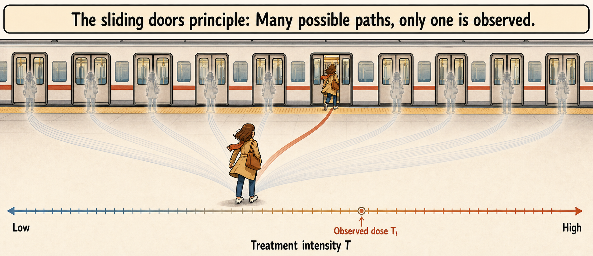
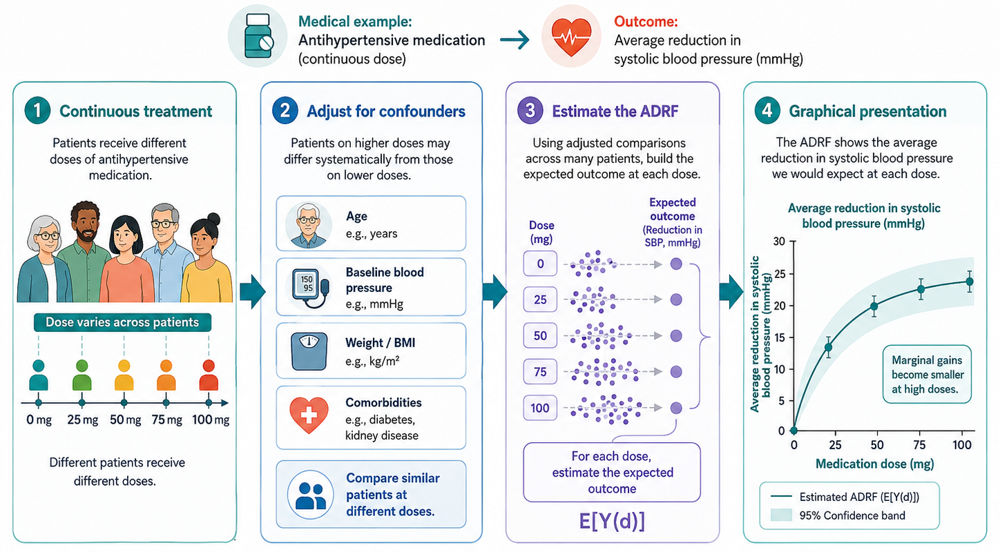

# Continuous Treatments

All methods in this book have been introduced using a binary treatment. A unit is either treated or untreated. A firm either receives a subsidy or does not. A municipality either opens a nursery school or does not. A region either crosses an eligibility threshold or does not.

This binary representation is useful and often realistic. Many policies are indeed organized around access: receiving the program, being eligible for a benefit, or being exposed to a reform. But in many applications, treatment is not simply a yes-or-no variable. Units may receive different **amounts**, **intensities**, or **doses** of the same policy.

For example, firms may receive different subsidy amounts. Regions may receive different amounts of EU Cohesion Policy funds per capita. Schools may receive different numbers of additional teachers. Patients may receive different drug dosages. Municipalities may experience different levels of exposure to an environmental shock.

In these cases, the question is not only whether the policy works. The question is also how the effect changes with the intensity of treatment.

::: {.callout-note appearance="simple"}
### Key idea

With continuous treatments, causal inference studies how outcomes change as the dose or intensity of treatment changes.
:::

## From Binary Treatment to Treatment Intensity

In the binary case, each unit has two potential outcomes:

$$
Y_i(1)
\quad \text{and} \quad
Y_i(0).
$$

With a continuous treatment, the treatment can take many values. Let $T_i$ denote the treatment intensity received by unit $i$. For each possible treatment level $t$ within the relevant support of the treatment, unit $i$ has a potential outcome:

$$
Y_i(t).
$$

The observed outcome is

$$
Y_i^{obs}=Y_i(T_i).
$$

As usual, we observe only one potential outcome for each unit: the one corresponding to the dose actually received. All other potential outcomes are counterfactual.

This is the continuous-treatment version of the fundamental problem of causal inference. The difference is that the missingness problem is now richer. Instead of missing one counterfactual outcome, we are missing the full schedule of potential outcomes over all treatment levels not received.

::: {.callout-warning}
### Support of treatment intensities

The relevant support of the treatment matters because causal effects can be studied only over treatment intensities that are meaningfully represented in the data. Extrapolating to doses that are rarely observed, or not observed at all, requires much stronger assumptions.
:::

## Why Continuous Treatments Matter

Discretizing a continuous treatment into a binary variable can be convenient, but it often throws away important information.

Suppose a policy provides public subsidies to firms. A binary analysis compares subsidized firms with non-subsidized firms. This can answer whether access to the policy matters. But it cannot answer whether larger subsidies produce larger effects, whether the impact flattens after a certain amount, or whether low subsidies are too small to activate meaningful behavioral responses.

The same issue arises in regional policy. For instance, EU Cohesion Policy funds are allocated across regions classified as less developed, transition, and more developed. Yet funding intensity can remain highly heterogeneous even within the same regional category. Treating all supported regions as equally treated ignores potentially large differences in the amount of treatment received [@becker2012; @cerqua2018structural].
<!---
Continuous-treatment analysis is therefore useful when the policy question concerns the intensity of treatment, not only access to treatment.--->

## The Dose-Response Function

The main quantity of interest in continuous-treatment analysis is the **average dose-response function (ADRF)**. It describes how the expected potential outcome changes with treatment intensity.

The ADRF is

$$
\mu(t)=E[Y_i(t)].
$$

For each treatment level $t$, $\mu(t)$ gives the average outcome that would be observed if all units received dose $t$.

::: {.callout-note}
### ADRF

The average dose-response function (ADRF) describes how the average potential outcome would change across different levels of treatment intensity. For each possible treatment level, it gives the average outcome that would be observed if all units were assigned that specific intensity.
:::

The causal effect of increasing treatment from $t_0$ to $t_1$ can be written as

$$
\mu(t_1)-\mu(t_0).
$$

If the treatment is continuous, we are usually also interested in the marginal effect of treatment intensity:

$$
\frac{\partial \mu(t)}{\partial t}.
$$

This derivative describes how the expected outcome changes for a small increase in the dose.

The ADRF may be increasing, decreasing, flat, or nonlinear. For example, subsidies may increase firm employment at low levels of support but have little additional effect after a certain threshold. In that case, the policy may have diminishing returns.

::: {.callout-note}
## ADRF estimation in a figure

:::

## The Policy Question

Continuous treatments shift the policy question from **access** to **intensity**.

With a binary treatment, we usually ask:

> What is the effect of receiving the policy?

With a continuous treatment, we may ask:

> What is the effect of receiving a larger dose of the policy?

or:

> Is there an optimal level of treatment intensity?

This distinction is important for policy design. If the ADRF flattens after a certain point, additional resources may have low marginal returns. If the function is strongly increasing, increasing the dose may be justified. If it is non-monotonic, too much treatment may even reduce effectiveness.

## The Challenge of Comparing Treatment Intensities

Continuous-treatment evaluation is difficult because treatment intensity is generally endogenous.

In many policies, the dose is not randomly assigned. Firms receiving larger subsidies may have larger projects, stronger administrative capacity, better political connections, or more severe constraints. Regions receiving more funds may differ systematically from those receiving less, as in the EU Cohesion Policy example. Patients receiving higher doses may have more severe baseline conditions.

Therefore, units receiving different treatment intensities are usually not directly comparable.

::: {.callout-warning}
### The problem of endogenous intensity

The fact that two units are both treated does not mean they are comparable. Units receiving different doses typically differ in ways that also affect their outcomes.
:::

This is why estimating an ADRF is not simply a matter of plotting outcomes against treatment intensity. A raw regression of $Y_i$ on $T_i$ compares different populations at different treatment levels. As a result, it may reflect selection into dose rather than the causal effect of dose.

## The Generalized Propensity Score

The propensity score was originally introduced for binary treatments [@rosenbaum1983]. Hirano and Imbens extend this idea to continuous treatments through the **generalized propensity score**, or **GPS** [@hirano2004].

In the binary case, the propensity score is the probability of receiving treatment conditional on covariates. In the continuous case, the GPS is the conditional density of the treatment level actually received:

$$
r(t,x)=f_{T\mid X}(t\mid x).
$$

For unit $i$, the GPS evaluated at the observed treatment level is

$$
R_i = r(T_i,X_i).
$$

The GPS summarizes how compatible a given treatment intensity $T_i$ is with the characteristics $X_i$ of a unit, through the conditional density of treatment intensity given covariates.

The key result is that, under weak unconfoundedness (see below), adjusting for the GPS can help remove confounding due to observed covariates when estimating the ADRF.

### Estimating the ADRF with GPS

Importantly, while a naive regression curve compares different units observed at different treatment levels, a GPS-adjusted ADRF aims to compare the same population under alternative treatment intensities. A typical GPS analysis proceeds in two stages.

First, estimate the **treatment model**. This means modeling the distribution of treatment intensity conditional on observed pre-treatment covariates:

$$
T_i \mid X_i.
$$

In practice, this requires specifying a model for how treatment intensity is assigned. A common approach is to assume that, conditional on $X_i$, the treatment follows a normal distribution:

$$
T_i \mid X_i \sim N(m(X_i),\sigma^2),
$$

where $m(X_i)$ is the expected treatment intensity given the covariates. The function $m(X_i)$ can be estimated using a linear regression of $T_i$ on $X_i$, or with more flexible methods if the relationship between treatment intensity and covariates is expected to be non-linear. Once this model has been estimated, the GPS is obtained as the conditional density of the observed treatment level:

$$
\widehat{R}_i=\widehat{r}(T_i,X_i).
$$

Second, estimate the **outcome model**. This means modeling the expected outcome as a function of both treatment intensity and the estimated GPS:

$$
E[Y_i \mid T_i=t, R_i=r].
$$

In practice, this is often done by regressing the outcome on flexible functions of the treatment intensity and the GPS, such as polynomials, splines, or interactions between $T_i$ and $\widehat{R}_i$. For example, one may estimate a model including $T_i$, $T_i^2$, $\widehat{R}_i$, $\widehat{R}_i^2$, and their interaction.

The estimated outcome model is then used to predict potential outcomes at different treatment levels. For each target dose $t$, the researcher computes the GPS that each unit would have at that dose, $\widehat{r}(t,X_i)$, and predicts the corresponding potential outcome:

$$
\widehat{Y}_i(t)
=
\widehat{E}[Y_i \mid T_i=t, R_i=\widehat{r}(t,X_i)].
$$

Averaging these predicted potential outcomes across units gives the estimated average dose-response function:

$$
\widehat{\mu}(t)
=
\frac{1}{N}
\sum_{i=1}^{N}
\widehat{Y}_i(t).
$$

The logic is therefore similar to matching or regression adjustment: the GPS is used to adjust for differences in observed covariates across treatment intensities, and the ADRF is obtained by comparing predicted outcomes for the same population of units at different dose levels.
<!---
A crucial diagnostic step is to check whether the GPS improves balance in covariates across treatment intensities and whether there is sufficient common support. If some dose levels are observed only for units with very different covariate profiles, the estimated ADRF will rely heavily on extrapolation. --->

::: {.callout-note appearance="simple"}
### Two steps of GPS

1. Model treatment intensity using pre-treatment covariates.  
2. Use the GPS to adjust the outcome model and recover the dose-response function.
:::

## Identification Assumptions

The most common identification strategy for continuous treatments extends selection-on-observables methods to the case of many possible treatment levels.

The key assumption is a continuous-treatment version of the Conditional Independence Assumption. For every treatment level $t$, potential outcomes are independent of the actual treatment received after conditioning on observed pre-treatment covariates:

$$
Y_i(t) \perp T_i \mid X_i
\quad \text{for all } t.
$$

This is often called **weak unconfoundedness** [@hirano2004].

The intuition is the same as in matching and propensity score methods. After controlling for observed characteristics, units receiving different treatment intensities should be comparable. In other words, among units with similar covariates, variation in treatment intensity should be as good as random.

This should typically be regarded as a strong assumption. It requires all variables affecting both treatment intensity and potential outcomes to be observed and correctly accounted for.

### Overlap With Continuous Treatments

Continuous treatments also require an overlap condition. For each relevant value of the covariates, there must be enough variation in treatment intensity.

In practical terms, this means that we need similar units receiving different treatment levels. E.g., if all small firms receive low subsidies and all large firms receive high subsidies, it is difficult to separate the effect of subsidy intensity from the effect of firm size.

The overlap problem is often more severe with continuous treatments than with binary treatments. In the binary case, we need comparable treated and untreated units. In the continuous case, we need comparable units across a range of treatment intensities.

When overlap is weak, the estimated dose-response function may rely heavily on extrapolation. This is especially problematic at very low or very high treatment levels, where few comparable units may be available.

::: {.callout-warning}
### Common support with continuous treatment

With continuous treatments, common support means having comparable units observed at different dose levels. For each relevant level of treatment intensity, there must be units with similar pre-treatment characteristics receiving nearby, lower, and higher doses. Without this overlap, the ADRF is identified only by extrapolating across units that are not truly comparable.
:::

### Application: GPS matching with continuous air-pollution exposure

Wu et al. [-@wu2022gps] propose a matching approach for **continuous treatments** based on the **GPS**. This differs from the classical GPS approach of Hirano and Imbens, where the GPS is typically included as an adjustment variable in an outcome model to estimate the ADRF. In Wu et al.'s approach, the GPS is used more directly to construct matched comparisons among units with similar exposure levels and similar GPS values. The goal is to preserve the design-based intuition of matching while extending it beyond the binary treated-versus-control setting.

Their application studies the causal relationship between long-term exposure to fine particulate matter, PM$_{2.5}$, and all-cause mortality among Medicare enrollees in the United States. Here, the treatment is not whether a unit is exposed to pollution, since everyone is exposed to some level of air pollution. The treatment is instead the **intensity of exposure**, measured by annual average PM$_{2.5}$.

The method first estimates the GPS. Units are then matched so that, across different pollution levels, the distribution of observed covariates becomes more comparable. This produces a matched dataset that can be used to estimate an ADRF.

In the empirical application, the authors use data on 68.5 million Medicare enrollees from 2000 to 2016. Matching substantially improves covariate balance. The estimated exposure-response function shows that long-term PM$_{2.5}$ exposure increases mortality, with evidence of adverse effects even at pollution levels below the national standard.

::: {.callout-note}
## Dose-Response Relationship between Pollution and Mortality

:::

## Beyond the Standard GPS

The GPS approach is powerful, but it relies on modeling choices that may be restrictive. Researchers must specify a treatment model and an outcome model. If these models are misspecified, the estimated ADRF may be biased.

Recent work has developed methods that focus more directly on balancing covariates across treatment intensities. One example is entropy balancing for continuous treatments [@tubbicke2022]. Another is the use of independence weights, which aim to make the treatment independent of observed covariates after weighting [@huling2024].

The common idea is to reduce dependence between treatment intensity and pre-treatment covariates without relying entirely on a parametric model for the treatment assignment process.

These approaches are part of a broader movement toward more flexible methods for continuous treatments. However, they do not remove the core identification problem. If important confounders are unobserved, weighting and balancing methods cannot recover the causal dose-response function by themselves.

::: {.callout-note}
## Different approaches for estimating the ADRF

{width="85%"}
:::

## Diagnostics and Validity Checks

A continuous-treatment analysis should report more than the estimated ADRF.

First, the researcher should inspect the distribution of treatment intensity. If most observations are concentrated in a narrow range, the dose-response function outside that range will be weakly supported.

Second, common support should be assessed. The analysis should show whether comparable units exist at different treatment levels.

Third, covariate balance should be checked across the treatment distribution. The goal is to reduce the association between treatment intensity and pre-treatment covariates.

Fourth, the ADRF should be reported with uncertainty bands. The curve may look smooth, but estimates at extreme treatment levels may be very imprecise.

Fifth, researchers should test sensitivity to alternative specifications of the treatment model, outcome model, and dose range.

::: {.callout-tip}
### Practical diagnostic

Before interpreting the shape of the ADRF, check whether the data actually contain comparable units observed at several different levels of treatment intensity.
:::

## Common Mistakes

The first mistake is to convert a continuous treatment into a binary treatment without a substantive reason. This may hide important variation in treatment intensity.

The second mistake is to interpret a raw regression of outcomes on treatment intensity as causal. Units receiving different doses are often selected in different ways.

The third mistake is to estimate the dose-response function in regions with little support. This creates extrapolation disguised as causal inference.

The fourth mistake is to focus only on whether the curve is increasing or decreasing, without considering uncertainty. Apparent nonlinearities may be driven by noise.

The fifth mistake is to ignore the policy margin. Sometimes the relevant question is not the effect of moving from zero to a very high dose, but the effect of increasing the dose within the range where policymakers can realistically act.

## Worked Example

Suppose a government provides public subsidies to firms to reduce workplace accidents. A binary analysis would compare firms that receive a subsidy with firms that do not.

But the policy may provide different subsidy amounts. Some firms receive a small grant for basic safety equipment. Others receive a larger grant for major workplace redesign. A continuous-treatment analysis would ask how accident rates change as subsidy intensity increases.

Let $T_i$ be the subsidy amount per worker. The ADRF is

$$
\mu(t)=E[Y_i(t)],
$$

where $Y_i(t)$ is the accident rate that firm $i$ would have under subsidy intensity $t$.

If the ADRF declines sharply at low subsidy levels and then flattens, this suggests that modest subsidies may generate most of the safety gains. If the function continues to decline at higher doses, larger subsidies may be justified. If the curve becomes flat or even increases, additional funding may be inefficient or targeted to firms with more severe baseline risks.

The credibility of this analysis depends on whether firms receiving different subsidy amounts are comparable after conditioning on pre-treatment characteristics such as firm size, sector, baseline accident rate, investment capacity, and previous safety inspections.

::: {.callout-note}

### What if we expect heterogeneous treatment effects with continuous treatment?

A single ADRF summarizes how the outcome changes with treatment intensity for the average unit. This may be misleading when units respond differently to the same dose. In that case, the pooled ADRF can hide subgroup-specific dose-response relationships, especially when common support is limited across groups.

A useful alternative is to estimate dose-response functions separately for theoretically defined or data-driven subgroups, as in the Clustered Dose-Response Function approach [@cerqua2026cldrf]. The target then shifts from one population-average curve to a set of subgroup-specific curves, which may be more informative for policy design. This can also make the unconfoundedness assumption less demanding, because identification is required within more homogeneous groups rather than across the full population.
:::

## Summary

Continuous-treatment methods extend causal inference from the question of whether a unit is treated to the question of how much treatment it receives.

The main object of interest is the ADRF, which describes how expected outcomes change across treatment intensities. This is especially useful when policymakers need to decide not only whether to implement a policy, but also how intensely to implement it.

The main difficulty is that treatment intensity is rarely randomly assigned. Units receiving different doses may differ systematically. Methods such as the GPS and newer balancing approaches can help address selection on observed covariates, but they require strong assumptions and careful diagnostics.

::: {.callout-note appearance="simple"}
## Software packages

Several software packages can be used to estimate effects with continuous treatments.

- **R**
  - [`CausalGPS`](https://cran.r-project.org/package=CausalGPS): implements matching and weighting methods based on the generalized propensity score for continuous exposures.
  - [`independenceWeights`](https://github.com/jaredhuling/independenceWeights): implements independence weights for causal inference with continuous treatments.
  - [`WeightIt`](https://cran.r-project.org/package=WeightIt): estimates balancing weights for binary, multi-valued, and continuous treatments.

- **Python**
  - [`causal-curve`](https://causal-curve.readthedocs.io/): estimates causal dose-response curves for continuous treatments.

- **Stata**
  - [`doseresponse`](https://ideas.repec.org/c/boc/bocode/s457096.html): estimates the generalized propensity score, checks balance, and estimates dose-response functions.
:::