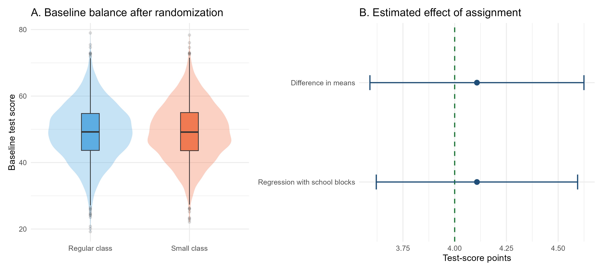
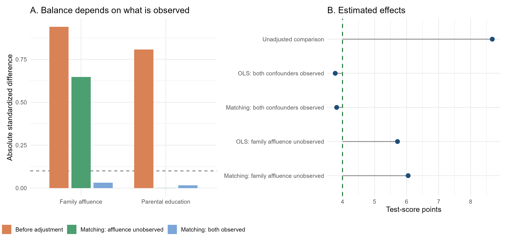

## Impact Evaluation Methods in Practice: Simulations with R

This chapter uses simulated data to illustrate how the main evaluation methods discussed in this book estimate causal effects. Simulations are preferred to real-world applications because they allow us to know the true causal effect and assess the circumstances under which each estimator successfully recovers it.

## Why Simulations Add Value {.unnumbered}

In real applications, the fundamental difficulty is that the correct counterfactual is never observed. We may obtain an estimate, but we do not know with certainty how far it is from the true causal effect. This makes it difficult to see from a real dataset alone exactly why a method succeeds or fails.

Simulation removes this obstacle. For teaching purposes, we construct an artificial population, specify its potential outcomes, assign treatment according to a known rule, and retain only the outcomes that would be observed by a researcher. Because we created the complete population, we know the missing counterfactual outcomes and the true causal parameter. We can therefore compare an estimate directly with the truth.

This approach adds value in three ways. First, it makes the mechanics of each estimator visible. Second, it allows us to change one feature at a time and isolate the role of a particular identifying assumption. Third, it separates ordinary sampling variation from systematic bias: an estimate may differ slightly from the truth by chance, or it may remain far from the truth because identification fails.

For each method, we consequently compare:

1. an **ideal setting**, in which the assumptions required for identification hold;
2. a **failure setting**, in which one important feature of the design is deliberately compromised.

The examples are deliberately stylized. They are not evidence about the real policies or studies that inspire them. Their purpose is to expose the logic of the estimators and the consequences of their assumptions.

::: {.callout-note appearance="simple"}

### Simulation and the data-generating process

A **simulation** is an artificial dataset created by a computer according to rules chosen by the researcher. These rules define how units are generated, how treatment is assigned, how outcomes are determined, and how random variation enters the process.

The complete set of these rules is called the **data-generating process (DGP)**. For example, a DGP may state that baseline scores follow a particular distribution, treatment is randomly assigned, and treatment raises outcomes by four points on average. Outcomes typically include an idiosyncratic random component that generates differences across otherwise similar units and prevents observations with the same characteristics from having identical values.

In real research, the true DGP is unknown. In a simulation, it is known because we specify both the systematic relationships among variables and the distributions from which the random components are drawn.

Knowing the DGP does not give the estimator extra information. We still estimate each model using only the variables that would be available in the corresponding empirical study. The additional information is used afterward to check whether the estimate recovered the truth.
:::

::: {.callout-note}
### Reproducing the simulations

The software chosen for this book is R because it is free, open source, widely used in applied empirical research, and supported by a large ecosystem of packages for data analysis and impact evaluation. Each main section has a separate, self-contained script:

- [`16-01-randomized-controlled-trial.R`](../code/16-01-randomized-controlled-trial.R) reproduces the RCT simulations in Section 16.1;
- [`16-02-selection-on-observables.R`](../code/16-02-selection-on-observables.R) reproduces the OLS and matching simulations in Section 16.2;
- [`16-03-difference-in-differences.R`](../code/16-03-difference-in-differences.R) reproduces the DiD simulations in Section 16.3;
- [`16-04-event-studies.R`](../code/16-04-event-studies.R) reproduces the staggered-adoption event-study simulation in Section 16.4;
- [`16-05-instrumental-variables.R`](../code/16-05-instrumental-variables.R) reproduces the Vietnam draft-lottery IV simulations in Section 16.5;
- [`16-06-regression-discontinuity.R`](../code/16-06-regression-discontinuity.R) reproduces the merit-scholarship RD simulations in Section 16.6;
- [`16-07-synthetic-control.R`](../code/16-07-synthetic-control.R) reproduces the youth-cycling SCM simulations in Section 16.7;
- [`16-08-causal-arima.R`](../code/16-08-causal-arima.R) reproduces the national workplace-safety Causal-ARIMA simulations in Section 16.8;
- [`16-09-mlcm.R`](../code/16-09-mlcm.R) reproduces the local-mortality MLCM simulation in Section 16.9.

For example, the RCT section can be reproduced from the root directory of the book with:

```r
source("code/16-01-randomized-controlled-trial.R")
rct_results <- run_rct_simulation(seed = 123, sample_size = 5000)
```

Each script creates its simulated dataset, estimates the models, saves the numerical results, and generates the corresponding figures. The convenience runner [`16-causal-methods-in-practice.R`](../code/16-causal-methods-in-practice.R) executes all section-specific scripts currently included in the chapter.

All examples use `123` as a common **master seed**.^[A **seed** is a number used to initialize the software’s random-number generator. Using the same seed reproduces the same sequence of pseudo-random numbers, and therefore the same simulated data and results.] Separate deterministic random-number streams are reserved for population characteristics, randomized assignment, compliance, and observational treatment selection. This makes the results reproducible and prevents changes to one simulation from unintentionally altering the random draws used in another.
:::

## Randomized Controlled Trial

### A stylized Project STAR experiment

The first simulation is inspired by the **Project STAR** experiment discussed in [Chapter 4](04-randomized-experiments.qmd#the-project-star-experiment). Project STAR randomly allocated pupils to small classes, regular classes, or regular classes with a teacher aide. Here we simplify the experiment to a binary comparison between:

- a **small class**, the treatment;
- a **regular class**, the control condition.

The simulated sample contains 5,000 pupils distributed across 20 schools. Within each school, exactly half of the pupils are randomly assigned to a small class. Randomization within schools reflects the idea of a blocked experiment: pupils are compared with other pupils attending the same school.

For each pupil, the simulation generates:

- a baseline test score;
- gender and socioeconomic disadvantage indicators;
- a latent motivation variable;
- a potential score at the end of the school year in a regular class, $Y_i(0)$;
- a potential score at the end of the school year in a small class, $Y_i(1)$.

::: {.callout-tip appearance="simple"}
### What does *latent* mean?

A **latent variable** is a characteristic that influences the process being studied but is not observed in the dataset used by the analyst. Motivation, ability, or risk preferences are common examples.

In a simulation, we can create such a variable and use it to determine treatment or outcomes. We can also display it afterward because we know the simulated truth. In a real application, however, the analyst could not include that variable in a regression, use it for matching, or check whether it is balanced across groups. If a latent variable affects both treatment selection and outcomes, it can therefore create bias that adjustment for the observed variables cannot remove.
:::

In this example, we assume a homogeneous treatment effect of four test-score points for every pupil:

$$
Y_i(1)-Y_i(0)=4.
$$

Consequently, the true ATE in the simulated population is also four points. The motivation variable and both potential outcomes are retained in the generated dataset only so that we can inspect the simulated truth. An analyst studying a real experiment would not observe all this information.

::: {.callout-tip appearance="simple"}
### Simulation variables versus observed variables

Variables whose names begin with `simulated_` reveal features of the data-generating process. They are useful for checking whether an estimator recovers the truth, but they must not be treated as variables that a researcher would ordinarily observe.
:::

### The ideal experiment: perfect compliance

Let $W_i$ indicate assignment to a small class and let $D_i$ indicate whether the pupil actually attends a small class. In the ideal experiment, every pupil complies with the assigned status:

$$
D_i=W_i.
$$

The observed outcome is therefore

$$
Y_i^{obs}
=
D_iY_i(1)+(1-D_i)Y_i(0).
$$

Because treatment assignment is random, the simplest estimator is the difference in average end-of-year scores between pupils assigned to small classes and those assigned to regular classes. In R, this difference can be estimated as the coefficient on the assignment indicator in a simple linear regression:

```r
ideal_unadjusted_model <- lm(end_school_year_score ~ assigned_small_class,
  data = ideal_data)
```

The coefficient on assigned_small_class is numerically identical to the raw difference in means:

```r
ideal_dim <- with(ideal_data,
  mean(end_school_year_score[assigned_small_class == 1]) -
    mean(end_school_year_score[assigned_small_class == 0]))
```

The regression formulation does not change the point estimate. Its practical advantage is that it also provides the estimated standard error, confidence interval, and corresponding hypothesis test using a familiar framework. The same quantities could be calculated directly from the two group means, but regression makes inference and subsequent extensions more convenient.

Because randomization was conducted within schools, we also estimate a model that includes school indicators:

```r
ideal_blocked_model <- lm(end_school_year_score ~ assigned_small_class +
factor(school_id),  data = ideal_data)
```

Including school indicators accounts for the blocked randomization design and removes persistent differences in average outcomes across schools. Randomization already ensures unbiasedness, but this adjustment can improve precision when schools differ substantially in their average test scores.

@fig-rct-star-ideal shows both parts of the exercise: baseline balance after randomization and the estimated treatment effects.

{#fig-rct-star-ideal width="100%"}

The numerical estimates are reported in @tbl-rct-star-ideal.

| Estimator | Estimate | Standard error | 95% confidence interval | True target |
|:--|--:|--:|:--:|--:|
| Difference in means | 4.11 | 0.26 | [3.59, 4.62] | 4.00 |
| $\rule{0pt}{0.2em}$ |  |  |  |  |
| Regression with school blocks | 4.11 | 0.25 | [3.62, 4.59] | 4.00 |

: Estimates from the ideal Project STAR simulation {#tbl-rct-star-ideal}

*Note:* Adding school indicators slightly improves precision by accounting for differences in average outcomes across schools. This is reflected in the smaller standard error and the narrower 95% confidence interval.

The estimate is not exactly four because randomization does not eliminate sampling variation. It makes the estimator unbiased across repeated random assignments. In one particular experiment, the estimate will generally differ somewhat from the true effect.

::: {.callout-note appearance="simple"}
### What makes this experiment ideal?

Assignment is genuinely random, every assigned pupil complies, outcomes are observed for everyone, and one pupil's class assignment does not affect another pupil's outcome. Under these conditions, the difference between assignment groups identifies the ATE.
:::

### When treatment received is no longer randomized

We retain random assignment to the small-class offer but allow some pupils not to comply with their assignment. Let $W_i=1$ indicate that pupil $i$ is randomly offered a place in a small class, while $W_i=0$ indicates assignment to a regular class. Let $D_i=1$ indicate that the pupil actually attends a small class.

Pupils assigned to a regular class cannot enter a small class, whereas some pupils offered a small class decline or fail to take up the offer. This is known as **one-sided non-compliance**, because deviations from the assigned status occur in only one direction: some pupils assigned to treatment do not receive it, but no pupil assigned to control gains access to treatment.

Compliance is selective, or non-random, in this simulation. Pupils with higher baseline scores and stronger latent motivation are more likely to take up the small-class offer, while disadvantaged pupils are less likely to do so. As a result, random assignment remains independent of pupil characteristics, but actual treatment receipt does not.

Let $C_i$ indicate whether pupil $i$ would comply if offered a small class. Actual treatment receipt is

$$
D_i=W_iC_i.
$$

Therefore, assignment $W_i$ remains randomized, but receipt $D_i$ does not. Pupils who actually enter a small class are now a selected subset of those offered one. In this simulation, 58.8% of the pupils assigned to a small class actually attend one, while the remaining 41.2% do not comply with their assignment. Since pupils assigned to a regular class cannot access a small class, the first-stage effect (the effect of assignment on the probability of actually receiving the treatment) is 58.8 percentage points.

This distinction produces three different comparisons:

1. The **intention-to-treat estimator** compares pupils according to random assignment. It estimates the ITT, i.e., the average causal effect of being offered a small class, regardless of take-up.
2. The **as-treated comparison** compares pupils according to the class they actually attend. It no longer benefits from randomization because receipt depends on pupil characteristics.
3. The **Wald ratio** divides the ITT estimate by the effect of assignment on receipt. Under additional IV assumptions, it estimates the LATE for compliers. This will be studied formally in the instrumental-variables application.

The R code for the first two comparisons is:

```r
itt_model <- lm(end_school_year_score ~ assigned_small_class,
  data = noncompliance_data)

as_treated_model <- lm(end_school_year_score ~ received_small_class,
  data = noncompliance_data)
```

The left panel of the following figure assesses balance using the **absolute standardized mean difference**, explained in the following box.

::: {.callout-note appearance="simple"}
### Reading the absolute standardized mean difference

For a pre-treatment characteristic $X$, the absolute standardized mean difference is

$$
\left|SMD(X)\right|
=
\frac{\left|\overline{X}_1-\overline{X}_0\right|}
{\sqrt{\left(s_1^2+s_0^2\right)/2}},
$$

where $\overline{X}_1$ and $\overline{X}_0$ are the group means, while $s_1^2$ and $s_0^2$ are the corresponding variances. Standardization expresses the difference in units of the pooled standard deviation, making balance easier to compare across variables measured on different scales.

An absolute standardized difference of zero indicates identical sample means. Values close to zero indicate good balance, while larger values indicate greater imbalance. A value below 0.10 is often used as a practical indication of adequate balance, although this is a rule of thumb rather than a formal statistical test. Randomization guarantees balance **in expectation**, not exact equality in every realized sample, so small non-zero differences can remain by chance.

Because the absolute value removes the sign, the measure reports the **size** of an imbalance but not its direction. To learn which group has the higher mean, we must also inspect the original group averages.
:::

The blue bars compare pupils according to their **random assignment**. They are close to zero for both baseline score and latent motivation, showing that the assigned groups are well balanced. The orange bars compare pupils according to the **treatment actually received**. They are substantially larger, approximately 0.38 for baseline score and 0.58 for latent motivation, because pupils who take up the offer are a selected group.

From the simulated data, we know that pupils who receive the treatment have higher baseline scores and stronger motivation on average. Motivation can be shown here because the simulation records it; in a real application, a latent characteristic could not be included in a conventional balance table.

@fig-rct-star-noncompliance contrasts the balance created by assignment with the selection generated by treatment receipt. The corresponding estimates are collected in @tbl-rct-star-noncompliance.

{#fig-rct-star-noncompliance width="100%"}

::: {.content-visible when-format="pdf"}
\newpage
:::

| Estimator | Causal target | Estimate | 95% confidence interval | True target |
|:--|:--|--:|:--:|--:|
| ITT: compare assignment groups | Effect of assignment | 2.46 | [1.92, 3.00] | 2.34 |
| $\rule{0pt}{0.2em}$ |  |  |  |  |
| Naive as-treated comparison | Effect of treatment receipt | 7.18 | [6.61, 7.74] | 4.00 |
| $\rule{0pt}{0.2em}$ |  |  |  |  |
| Adjusted as-treated regression | Effect of treatment receipt | 4.54 | [4.19, 4.89] | 4.00 |
| $\rule{0pt}{0.2em}$ |  |  |  |  |
| Wald ratio | LATE for compliers | 4.18 | [3.31, 5.06] | 4.00 |

: Estimates under selective non-compliance {#tbl-rct-star-noncompliance}

*Note:* The confidence interval for the Wald ratio uses the conventional homoskedastic 2SLS standard error. The other intervals use the standard errors from their corresponding OLS regressions.

### Reading the estimates

The rows in @tbl-rct-star-noncompliance answer different questions, so they should not be judged against the same target.

- The **ITT estimate** is 2.46 points. It measures the effect of *offering* a small class, not the effect of attending one. Because only 58.8% of offered pupils attend, an effect of assignment smaller than four points is exactly what we should expect. Its true target is 2.34, and the small difference between the estimate and this target reflects sampling variation.
- The **naive as-treated estimate** is 7.18 points. This does not mean that small classes raise scores by more than seven points. Pupils who attend them already have higher baseline scores and stronger motivation, on average, so the comparison mixes the treatment effect with pre-existing advantages.
- The **adjusted as-treated regression** lowers the estimate to 4.54 by controlling for observed characteristics. The estimate remains substantially above four because unobserved motivation affects both treatment take-up and outcomes, generating omitted-variable bias. Consistent with this bias, the true effect of four test-score points lies outside the confidence interval.
- The **Wald estimate** is 4.18 points, close to the true four-point effect. Although the Wald estimator generally identifies the LATE for compliers, treatment effects are homogeneous in this example. Therefore, the LATE, ATE, and ATT all coincide and equal four points.

### Why the Wald ratio recovers the LATE

The numerator of the Wald ratio is the **reduced-form effect** of random assignment on the outcome. In this simulation, pupils assigned to the small-class offer score 2.46 points more, on average, than pupils assigned to a regular class:

$$
\widehat{RF}
=
\overline{Y}_{W=1}-\overline{Y}_{W=0}
=2.46.
$$

The denominator is the **first-stage effect** of assignment on actual treatment receipt. Assignment to the offer increases small-class attendance by 58.8 percentage points:

$$
\widehat{FS}
=
\overline{D}_{W=1}-\overline{D}_{W=0}
=0.588.
$$

The Wald estimator divides the outcome change generated by assignment by the treatment-receipt change generated by assignment:

$$
\widehat{LATE}_{Wald}
=
\frac{\widehat{RF}}{\widehat{FS}}
=
\frac{2.46}{0.588}
=4.18.
$$

The ratio works because random assignment provides exogenous variation in treatment receipt. Under the **exclusion restriction**, assignment can affect the end-of-year score only by changing whether a pupil attends a small class. Under **monotonicity**, no pupil is induced by the offer to move in the opposite direction. In this one-sided non-compliance design, pupils assigned to control cannot access treatment, so the first stage represents the proportion of pupils whose treatment status is changed by the offer: the compliers. The reduced-form effect is therefore the complier share multiplied by the average treatment effect for compliers. Dividing by that share recovers the **LATE**. Relevance additionally requires the first stage to be different from zero. These assumptions and the LATE interpretation are examined more fully in [Chapter 8](08-instrumental-variables.qmd#binary-instruments-and-late).

The corresponding R calculation is:

```r
reduced_form <- coef(lm(end_school_year_score ~ assigned_small_class,
  data = noncompliance_data
))["assigned_small_class"]

first_stage <- coef(lm(received_small_class ~ assigned_small_class,
  data = noncompliance_data
))["assigned_small_class"]

wald_ratio <- reduced_form / first_stage
```

::: {.callout-warning appearance="simple"}
### What exactly fails under non-compliance?

Non-compliance does **not** destroy the randomization of the offer. The ITT estimator remains a valid estimator of the causal effect of assignment. What fails is the claim that a simple comparison based on treatment received identifies the ATT. Once take-up is selective, actual treatment status is no longer randomized.
:::

### Main lessons from the RCT simulation

The simulation highlights four general points:

- Randomization balances potential outcomes and pre-treatment characteristics in expectation, not perfectly in every realized sample.
- With perfect compliance, assignment and treatment receipt coincide, and the difference in means estimates the ATE.
- With partial compliance, the ITT remains causally interpretable but answers a policy question about assignment or access.
- Estimating the effect of treatment receipt requires additional assumptions and methods; a naive as-treated comparison generally produces a biased estimate of the treatment effect of interest because it conflates the effect of treatment with pre-existing differences in outcomes between those who receive the treatment and those who do not.

## Selection on observable methods

### Small Classes in an Observational Study

We now adapt the same small-class setting to an observational study. The potential outcomes and the true treatment effect remain unchanged: attending a small class raises every pupil's end-of-year score by four points. What changes is the treatment-assignment mechanism.

Pupils are no longer randomly allocated to class types. Instead, pupils with more highly educated and more affluent parents are more likely to attend small classes. This may reflect residential sorting, access to private schools, parental knowledge of the education system, or a greater ability to request particular class placements. Parental education and family affluence are modeled as two distinct pre-treatment variables. Both affect the probability of attending a small class and the outcome that the pupil would attain in a regular class. They are therefore **confounders**, that is, pre-treatment factors associated with both treatment receipt and potential outcomes.

Consequently, a raw comparison between pupils in small and regular classes does not identify the causal effect. It also captures pre-existing differences in family background. In this simulation, the unadjusted difference is 8.68 points even though the true ATT is only four points.

### Ideal case: both confounders are observed

Suppose the dataset contains both parental education and family affluence. Conditional on these variables, small-class attendance is independent of the potential outcomes in the simulated data. The selection-on-observables assumption is therefore satisfied by construction.

The first approach is an OLS regression:

$$
Y_i
=
\alpha
+
\tau D_i
+
\beta_1 Education_i
+
\beta_2 Affluence_i
+
u_i.
$$

In R, the model is estimated as follows:

```r
complete_ols_model <- lm(end_school_year_score ~ received_small_class +
    parental_education_years + simulated_parental_affluence,
  data = observational_data)
```

The second approach uses a logistic regression to estimate each pupil’s probability of attending a small class conditional on the two observed confounders. The resulting predicted probability is the pupil’s estimated propensity score. Each treated pupil is then matched to the untreated pupil with the closest estimated propensity score. The simulation uses one-nearest-neighbor matching with replacement:

```r
complete_propensity_model <- glm(received_small_class ~
parental_education_years + simulated_parental_affluence,
  family = binomial(),  data = observational_data)
```

As shown in @fig-star-observational, matching on both variables makes treated pupils and matched controls similar in terms of both parental education and family affluence. OLS estimates an effect of 3.77 points and matching estimates 3.82 points. Both are close to the true ATT of four.

### Failure case: family affluence is unobserved

Now suppose the researcher observes parental education but not family affluence. The data-generating process is unchanged; only the information available for adjustment has changed. OLS can include parental education, and matching can balance pupils on parental education, but neither method can directly account for economic differences between their families.

The incomplete OLS and propensity-score models are:

```r
incomplete_ols_model <- lm(end_school_year_score ~ received_small_class +
    parental_education_years,  data = observational_data)

incomplete_propensity_model <- glm(received_small_class ~
parental_education_years,  family = binomial(),  data = observational_data)
```

Panel A of @fig-star-observational explains what goes wrong. Matching successfully balances the variable supplied to the algorithm, parental education, but substantial imbalance in family affluence remains. In a real observational study, this residual imbalance would be invisible because family affluence would not be measured. It can be displayed here only because simulation reveals the complete data-generating process.

{#fig-star-observational width="100%"}

::: {.content-visible when-format="pdf"}
\newpage
:::

| Available information and estimator | Estimate | 95% confidence interval | True ATT |
|:--|--:|:--:|--:|
| No adjustment | 8.68 | [8.17, 9.18] | 4.00 |
| $\rule{0pt}{0.2em}$ |  |  |  |
| OLS: both confounders observed | 3.77 | [3.29, 4.26] | 4.00 |
| $\rule{0pt}{0.2em}$ |  |  |  |
| Matching: both confounders observed | 3.82 | [2.93, 4.70] | 4.00 |
| $\rule{0pt}{0.2em}$ |  |  |  |
| OLS: family affluence unobserved | 5.72 | [5.22, 6.21] | 4.00 |
| $\rule{0pt}{0.2em}$ |  |  |  |
| Matching: family affluence unobserved | 6.05 | [5.41, 6.69] | 4.00 |

: OLS and matching estimates in the observational small-class study {#tbl-star-observational}

*Note:* OLS intervals use conventional standard errors; matching intervals use the Abadie–Imbens standard errors from the `Matching` package.

@tbl-star-observational tells a simple story. Without adjustment, pupils in small classes appear to gain almost nine points because the comparison combines the true class-size effect with their more favorable family backgrounds. When both confounders are observed, OLS and matching recover approximately four points. When family affluence is omitted, both methods still produce an estimate, but neither recovers the causal effect. Their estimates remain too large because treated pupils are more affluent even after adjusting for parental education.

::: {.callout-warning appearance="simple"}
### A method can balance only what the data contain

OLS and matching use different adjustment procedures, but both rely on the same substantive requirement: all important confounders must be observed and appropriately included. Excellent balance on recorded covariates does not demonstrate balance on an omitted confounder. The final estimate may look precise and technically correct while still answering a non-causal comparison.
:::

### Main lessons from the observational simulation

- In observational data, treatment receipt may reflect systematic pre-treatment differences rather than random assignment.
- OLS and matching can recover the ATT when the relevant confounders are observed, overlap is adequate, and their models are appropriately specified.
- Omitting a variable that affects both treatment and outcomes creates selection bias in both approaches.
- Matching does not solve hidden confounding: it makes treated and control units comparable only with respect to the information used to construct the matches.

::: {.callout-warning appearance="simple"}
### Lack of common support: OLS extrapolation and matching with a caliper

Consider a more extreme assignment mechanism. Families with both a high affluence index and more than 14 years of parental education send their children to small classes with probability one. No comparable pupils attend regular classes in this region, so the overlap assumption fails. Moreover, even in the absence of treatment, pupils from these especially advantaged families would have particularly high test scores, and this increase becomes stronger at high levels of affluence and parental education. Estimating their untreated counterfactual therefore requires extrapolating beyond the characteristics observed in the control group. Linear OLS must therefore extrapolate into a region containing no untreated observations and estimates 4.85 rather than four. PSM instead applies an absolute caliper of 0.05 on the propensity-score scale, equivalent to five percentage points. A treated pupil can therefore be matched only with an untreated pupil whose estimated propensity score differs by no more than 0.05. This reduces poor matches but may leave some treated pupils unmatched and therefore excluded from the analysis.

| Estimator | Analysis sample | Estimate | 95% confidence interval | True effect |
|:--|:--|--:|:--:|--:|
| Linear OLS | All treated pupils | 4.85 | [4.34, 5.37] | 4.00 |
| $\rule{0pt}{0.2em}$ |  |  |  |  |
| PSM with a 0.05 caliper | Matched treated pupils | 3.98 | [3.52, 4.44] | 4.00 |
|:--|:--|--:|:--:|--:|

*Note:* Of 2,239 treated pupils, the caliper retains 1,775 and excludes 464. It recovers an effect close to four by avoiding unsupported comparisons, whereas OLS relies on functional-form extrapolation.

```{=latex}
\smallskip
```

The caliper does not restore common support for the excluded pupils. By trimming these observations, the analysis no longer estimates the ATT for the entire treated population, but the average treatment effect for treated pupils who lie within the region of common support. The two estimands are equal to four in this simulation only because the data were generated with homogeneous treatment effects. With heterogeneous treatment effects, which are much more common in real-world applications, trimming changes the population to which the estimate applies and may therefore also change the value of the causal effect itself.
:::

The datasets used in Sections 16.1 and 16.2 are available as [`rct_star_ideal.csv`](../data/simulations/rct_star_ideal.csv), [`rct_star_noncompliance.csv`](../data/simulations/rct_star_noncompliance.csv), [`star_observational.csv`](../data/simulations/star_observational.csv),
and [`star_observational_no_common_support.csv`](../data/simulations/star_observational_no_common_support.csv).

## Difference-in-Differences

### A stylized unilateral-divorce reform

The third simulation is inspired by Wolfers's analysis of unilateral divorce laws in the United States [@wolfers2006]. The purpose is not to reproduce the original data or estimates, but to translate the application into a simple setting in which the identifying assumption can be examined directly.

The simulated panel contains 50 states observed annually from 1975 to 1988:

- 20 states adopt a unilateral divorce law in 1979;
- 30 states remain untreated throughout the observation window;
- the four years from 1975 to 1978 form the pre-reform period;
- the ten years from 1979 to 1988 form the post-reform period.

The outcome is the annual number of divorces per 1,000 people. Treated states have higher divorce rates even before the reform. This baseline difference does not invalidate DiD because state fixed effects absorb permanent differences in outcome levels. What matters is whether, without the reform, the two groups would have followed the same average trend.

The treatment effect is homogeneous and constant in this stylized example. Once the reform is introduced, it raises the divorce rate in every treated state by

$$
ATT=0.30
$$

divorces per 1,000 people in every post-reform year.

### Ideal case: credible parallel trends

In the ideal setting, treated and control states have different average outcome levels but share the same untreated outcome trend. Common time shocks affect both groups equally. Therefore, the change observed among control states provides a credible estimate of the change that treated states would have experienced without the reform.

With a single treated cohort, the DiD effect can be estimated using the following TWFE model:

$$
Y_{st}
=
\alpha_s
+
\lambda_t
+
\tau D_{st}
+
u_{st},
$$

where $\alpha_s$ denotes state fixed effects, $\lambda_t$ denotes year fixed effects, and $D_{st}$ equals one for treated states from 1979 onward. In this setting, $\tau$ estimates the average post-reform ATT.

The corresponding R regression is:

```r
ideal_twfe_model <- lm(divorce_rate ~ treated_post + factor(state_id) +
factor(calendar_year),  data = ideal_data)
```

The point estimate could equivalently be obtained from the standard two-group DiD calculation. The fixed-effects formulation conveniently uses all four pre-treatment years and ten post-treatment years. Inference is based on standard errors clustered by state because outcomes observed repeatedly for the same state may be correlated over time.

Panel A of @fig-did-unilateral-divorce-simulation illustrates this case. Before the reform, the treated and control series move approximately in parallel despite their different levels. After the reform, the treated series lies above its untreated counterfactual by 0.30 divorces per 1,000 people.

### Failure case: different untreated trends

The failure dataset retains the same states, common shocks, random disturbances, true treatment effect, and outcome trajectory for the treated states. The only change concerns the control group. Relative to the ideal case, divorce rates in control states decline by an additional 0.06 divorces per 1,000 people every year. The treated and control groups are therefore already following different trends before treatment, even though the trajectory of the treated states has not changed.

Panel B shows the consequence. The observed and counterfactual trajectories of the treated states are identical to those in Panel A, but the control series now declines more rapidly. The dashed line is the treated states' true untreated counterfactual, which is known only because the data are simulated. The observed treated outcome lies 0.30 points above this counterfactual after treatment, but the control group no longer reproduces its evolution.

{#fig-did-unilateral-divorce-simulation width="100%"}

Panels C and D translate the same two scenarios into event-study plots. The year 1978, event time $-1$ and the final year before reform, is omitted from the regression and normalized to zero. Every other coefficient measures how the treated-control outcome gap in that year differs from the gap observed in 1978. The vertical bars are 95% confidence intervals based on standard errors clustered by state.

In Panel C, all pre-treatment estimates are close to zero, while the post-treatment estimates are approximately 0.30. This is the pattern expected when parallel trends holds and the treatment effect is constant. In Panel D, the pre-treatment coefficients move systematically toward zero as the reform approaches. The post-treatment estimates then become progressively larger, even though the true effect remains fixed at 0.30. This pattern is generated entirely by the faster decline in the control states.

The same TWFE regression is applied to both datasets. The estimates are reported in @tbl-did-unilateral-divorce.

| Setting | TWFE estimate | Clustered standard error | 95% confidence interval | True ATT |
|:--|--:|--:|:--:|--:|
| Ideal: parallel trends | 0.315 | 0.035 | [0.246, 0.383] | 0.300 |
| $\rule{0pt}{0.2em}$ |  |  |  |  |
| Failure: different untreated trends | 0.735 | 0.035 | [0.666, 0.803] | 0.300 |

: TWFE estimates in the unilateral-divorce simulation {#tbl-did-unilateral-divorce}

*Note:* Standard errors are clustered by state. The true ATT is the average causal effect among treated states from 1979 to 1988.

In the ideal case, the estimate of 0.315 is close to the true effect of 0.30, and the confidence interval contains the true value. The small discrepancy is due to sampling variation in the simulated state-period outcomes.

In the failure case, the estimate rises to 0.735 even though the reform still causes an effect of only 0.30. The regression attributes both the genuine policy effect and the relative decline in the control group to the reform. Because control states decline by an additional 0.06 points per year, the treated-control outcome gap increases by 0.06 points per year even without treatment. The average post-reform year is 1983.5, whereas the average pre-reform year is 1976.5. The seven-year difference generates an additional change of approximately

$$
0.06 \times 7 = 0.42.
$$

The expected DiD estimate is consequently approximately $0.30+0.42=0.72$, close to the simulated estimate of 0.735.

### Inspecting pre-treatment trends

Because four pre-treatment years, from 1975 to 1978, are available, we can estimate whether the two groups were already following different linear trends before the reform:

```r
pretrend_model <- lm(
  divorce_rate ~ treated_state + event_time + treated_state:event_time,
  data = subset(failure_data, event_time < 0)
)
```

The coefficient on `treated_state:event_time` measures the difference between the pre-treatment slopes of treated and control states. The results are shown in @tbl-did-pretrends.

| Setting | Estimated trend difference | Clustered standard error | 95% confidence interval | True trend difference |
|:--|--:|--:|:--:|--:|
| Ideal: parallel trends | 0.009 | 0.023 | [-0.037, 0.055] | 0.000 |
| $\rule{0pt}{0.2em}$ |  |  |  |  |
| Failure: different untreated trends | 0.069 | 0.023 | [0.023, 0.115] | 0.060 |

: Pre-treatment trend diagnostics {#tbl-did-pretrends}

In the ideal dataset, the estimated difference in slopes is close to zero. In the failure dataset, it is close to the true differential trend of 0.06 and its confidence interval excludes zero. This diagnostic reveals the problem in the simulation. In real applications, however, the absence of a statistically significant pre-trend does not prove that parallel trends would have continued after treatment: pre-treatment data may be noisy or cover too few periods to detect meaningful violations.

::: {.callout-warning appearance="simple"}
### What exactly fails when trends are not parallel?

The TWFE regression still returns a coefficient, but the coefficient no longer isolates the reform's causal effect. It combines the true ATT with the change that would have occurred anyway because the control group was following a different trend. More observations and smaller standard errors do not repair this identification failure.
:::

### Main lessons from the DiD simulation

- DiD does not require treated and control states to have the same initial outcome level.
- It requires their untreated outcomes to follow parallel average trends.
- State and period fixed effects remove permanent state differences and common time shocks, but they do not account for the possibility that treated and control units may already be following different trends over time.
- Examining pre-treatment trends is informative, but it cannot establish the unobserved post-treatment counterfactual with certainty.
- When the parallel-trends assumption is not credible, the TWFE estimate should not be given a causal interpretation.

The generated datasets are available as [`did_unilateral_divorce_ideal.csv`](../data/simulations/did_unilateral_divorce_ideal.csv) and [`did_unilateral_divorce_failure.csv`](../data/simulations/did_unilateral_divorce_failure.csv).

## Event Studies

### A staggered unilateral-divorce setting

We now extend the unilateral-divorce example to a staggered-adoption setting. The panel again covers the years from 1975 to 1988 and contains 50 states, but treatment timing now differs across groups:

- 30 states remain untreated throughout the observation window;
- 10 states introduce unilateral divorce in 1979;
- 10 states introduce unilateral divorce in 1982.

The untreated potential outcomes of all three groups follow parallel average trends. The 30 never-treated states can therefore provide a credible counterfactual for both treated cohorts. This section considers only this ideal identification setting.

Treatment effects are constant over time within each cohort but heterogeneous across cohorts. The reform raises divorce rates by 0.18 divorces per 1,000 people in the 1979 cohort and by 0.30 in the 1982 cohort:

$$
ATT(1979,t)=0.18
\qquad \text{and} \qquad
ATT(1982,t)=0.30
$$

for every post-treatment year available for the corresponding cohort. This distinction is intentional: because neither cohort has a dynamic effect, any change in the aggregated event-study profile must come from estimation noise or from changes in the cohorts contributing to the aggregation.

### Estimation with Callaway and Sant'Anna

We use the estimator proposed by Callaway and Sant'Anna [-@callaway2021], implemented in the R package [`did`](https://bcallaway11.github.io/did/). The method first estimates a separate group-time effect $ATT(g,t)$ for each treatment cohort $g$ and calendar year $t$. Each treated cohort is compared with the never-treated states, avoiding comparisons in which already-treated states serve as controls.

The group-time effects are estimated in R as follows:

```r
cs_group_time <- did::att_gt(yname = "divorce_rate",
  tname = "calendar_year",
  idname = "state_id",
  gname = "first_treat",
  data = event_study_data,
  panel = TRUE,
  control_group = "nevertreated",
  base_period = "universal",
  xformla = ~1,
  est_method = "reg",
  bstrap = TRUE,
  biters = 999,
  clustervars = "state_id")
```

The fixed base period is the year immediately preceding treatment for each cohort. Thus, 1978 is the reference year for the 1979 cohort and 1981 is the reference year for the 1982 cohort. Setting `base_period = "universal"` expresses all diagnostic and post-treatment estimates relative to these cohort-specific reference years.

The estimated group-time effects are then aggregated by event time:

```r
cs_event_study <- did::aggte(cs_group_time,
  type = "dynamic",
  na.rm = TRUE)
```

Let $\ell=t-g$ denote event time. For each value of $\ell$, the dynamic estimator combines the available cohort-specific effects:

$$
\widehat{ATT}^{ES}(\ell)
=
\sum_{g\in\mathcal{G}_{\ell}}
w_g(\ell)
\widehat{ATT}(g,g+\ell),
$$

where $\mathcal{G}_{\ell}$ is the set of cohorts observed at event time $\ell$, and $w_g(\ell)$ is the weight assigned to cohort $g$. In this simulation the two cohorts contain ten states each, so they receive equal weights whenever both are available.

### From cohort effects to one event-study plot

The cohort-average estimates are reported in @tbl-event-study-cohorts. Both are close to their true causal targets.

| Cohort | Treated states | Treatment begins | Estimated effect | 95% confidence interval | True effect |
|:--|--:|--:|--:|:--:|--:|
| 1979 cohort | 10 | 1979 | 0.182 | [0.121, 0.243] | 0.180 |
| $\rule{0pt}{0.2em}$ |  |  |  |  |  |
| 1982 cohort | 10 | 1982 | 0.290 | [0.227, 0.353] | 0.300 |

: Cohort-average Callaway-Sant'Anna estimates {#tbl-event-study-cohorts}

*Note:* The intervals are pointwise 95% confidence intervals obtained using the multiplier bootstrap with clustering by state.

@fig-event-study-cohort-aggregation shows how these estimates become a single event-study profile.

{#fig-event-study-cohort-aggregation width="100%"}

Panel A makes cohort heterogeneity visible. The estimated effect for the 1979 cohort fluctuates around 0.18, while that for the 1982 cohort fluctuates around 0.30. The pre-treatment estimates are centered near zero, consistently with the parallel-trends design of the simulation.

Panel B combines these cohort-specific building blocks. Between event times 0 and 6, both cohorts are observed. Since they have the same number of states, the true aggregated effect is

$$
0.5\times0.18+0.5\times0.30=0.24.
$$

The mean of the estimated event-study coefficients over these seven horizons is 0.236, close to this target.

At event times 7, 8, and 9, the composition changes. Observing the 1982 cohort at these horizons would require data for 1989, 1990, and 1991, which lie outside the panel. Consequently, only the 1979 cohort remains, its weight becomes one, and the true aggregated effect falls from 0.24 to 0.18. The mean of the three estimated coefficients is 0.181.

This composition is summarized in @tbl-event-study-composition.

| Event-time range | Contributing cohorts | Treated states | True aggregated effect | Mean estimated effect |
|:--|:--|--:|--:|--:|
| 0 to 6 | 1979 and 1982 | 20 | 0.240 | 0.236 |
| $\rule{0pt}{0.2em}$ |  |  |  |  |
| 7 to 9 | 1979 only | 10 | 0.180 | 0.181 |

: Changing composition of the aggregated event study {#tbl-event-study-composition}

The decline at the end of the event-study plot is therefore **not evidence that the causal effect fades over time**. The causal effect is constant within both cohorts. The line falls because the higher-effect 1982 cohort no longer contributes to the final three estimates.

::: {.callout-warning appearance="simple"}
### A changing event-study estimand

When all available event times are plotted, the set of treated cohorts contributing to the estimate may change across horizons. The event-study coefficient at $\ell=8$ may therefore describe a different treated population from the coefficient at $\ell=3$. A rising or falling profile can reflect genuine treatment dynamics, changing cohort composition, or both.

Researchers should report which cohorts contribute at each horizon and consider a balanced event window. In this example, restricting the post-treatment window to event times 0 through 6 would keep both cohorts in every aggregated estimate. The price is that effects at longer horizons could no longer be reported.
:::

### Main lessons from the event-study simulation

- Callaway and Sant'Anna estimate cohort-time effects before aggregating them, making the underlying comparisons explicit.
- Cohort heterogeneity does not necessarily imply that effects change over time within cohorts.
- Dynamic aggregation can compare different treated populations at different event times.
- Changes at the extremes of an event-study plot are particularly vulnerable to composition effects because fewer cohorts generally remain observable.
- A balanced event window improves comparability across horizons but shortens the period over which effects can be studied.

The simulated panel is available as [`event_study_unilateral_divorce.csv`](../data/simulations/event_study_unilateral_divorce.csv). The complete analysis is reproduced by [`16-04-event-studies.R`](../code/16-04-event-studies.R).

## Instrumental Variables

### A stylized Vietnam draft-lottery example

This simulation is inspired by Angrist's study of military service and later earnings using the Vietnam-era draft lottery [@angrist1990]. In the historical setting, lottery numbers based on dates of birth determined whether men were draft eligible. Eligibility did not perfectly determine military service: some eligible men did not serve, while some ineligible men served voluntarily. The lottery can therefore be interpreted as an instrument that shifted the probability of military service.

Our simulation does not attempt to reproduce Angrist's data or numerical estimates. It uses the same basic logic to study 5,000 individuals. Let

- $Z_i$ indicate draft eligibility;
- $D_i$ indicate military service;
- $Y_i$ denote annual earnings, measured in thousands of dollars.

The causal relationship of interest is the effect of military service on earnings. Treatment receipt is endogenous because individuals with a stronger latent preference for military service are more likely to serve and also have different potential earnings. Consequently, a direct comparison between veterans and non-veterans need not identify a causal effect.

### Potential treatment statuses and the LATE

Each individual has two potential treatment statuses:

$$
D_i(1)
\quad \text{and} \quad
D_i(0),
$$

which indicate whether that individual would serve if draft eligible and if not draft eligible, respectively. The simulation contains the three principal strata shown in @tbl-iv-principal-strata.

| Principal stratum | $D_i(0)$ | $D_i(1)$ | Share | Effect of service on annual earnings |
|:--|:--:|:--:|--:|--:|
| Always-takers | 1 | 1 | 10% | -$2,000 |
| Compliers | 0 | 1 | 35% | -$5,000 |
| Never-takers | 0 | 0 | 55% | -$3,500 |

: Principal strata in the stylized draft-lottery simulation {#tbl-iv-principal-strata}

There are no defiers, so the monotonicity assumption holds: draft eligibility cannot make someone who would otherwise serve avoid military service. Only the compliers change treatment status in response to the instrument. The causal effect identified by a valid IV design is therefore their **local average treatment effect** [@angrist1996iv]:

$$
LATE
=
E[Y_i(1)-Y_i(0)\mid D_i(1)>D_i(0)]
=
-5.
$$

The units are thousands of dollars, so this value represents a $5,000 reduction in annual earnings. The different effects assigned to the three strata emphasize that the LATE need not equal the ATE or the ATT.

### The ideal setting: random draft eligibility

In the ideal simulation, half of the individuals are selected at random to be draft eligible. Draft eligibility is therefore independent of potential earnings and potential treatment statuses. By construction, eligibility also affects earnings only through military service. Relevance, independence, exclusion, and monotonicity all hold.

Military service is not randomly assigned. Always-takers serve regardless of eligibility, never-takers do not serve, and compliers serve only when eligible. This is precisely why the lottery is useful: people who receive the service may differ systematically from those who do not, but lottery assignment creates a source of random variation in service receipt that can be used for causal identification.

The first-stage regression is

$$
D_i=\pi_0+\pi_1 Z_i+v_i,
$$

where $\pi_1$ measures the change in military service caused by draft eligibility. The reduced form is

$$
Y_i=\rho_0+\rho_1 Z_i+e_i,
$$

where $\rho_1$ measures how draft eligibility changes earnings. With one binary instrument and no covariates, the Wald estimator is

$$
\widehat{LATE}_{Wald}
=
\frac{
E[Y_i\mid Z_i=1]-E[Y_i\mid Z_i=0]
}{
E[D_i\mid Z_i=1]-E[D_i\mid Z_i=0]
}
=
\frac{\widehat{\rho}_1}{\widehat{\pi}_1}.
$$

In R, these components and the equivalent just-identified 2SLS estimator can be obtained as follows:

```r
first_stage_model <- lm(served_military ~ draft_eligible,
  data = ideal_data)

reduced_form_model <- lm(annual_earnings_thousands ~ draft_eligible,
  data = ideal_data)

wald_ratio <- coef(reduced_form_model)["draft_eligible"] /
  coef(first_stage_model)["draft_eligible"]

iv_model <- ivreg::ivreg(
  annual_earnings_thousands ~ served_military | draft_eligible,
  data = ideal_data
)
```

The service rate is 45.5% among draft-eligible individuals and 9.7% among ineligible individuals. The estimated first stage is therefore 0.358: eligibility raises military service by 35.8 percentage points. This estimate is close to the 35% share of compliers in the simulated population.

The reduced-form effect on earnings is $-1.710$ thousand dollars. Dividing this quantity by the first stage gives

$$
\frac{-1.710}{0.358}=-4.781,
$$

which is close to the true complier effect of $-5$. The 2SLS coefficient is numerically identical to this Wald ratio.

::: {.callout-note appearance="simple"}
### Why the Wald ratio recovers the LATE

Draft eligibility changes treatment only for compliers. Under independence and exclusion, its reduced-form effect on earnings is therefore the first-stage change in military service multiplied by the average service effect for compliers. Dividing the reduced form by the first stage removes the fraction induced to serve and leaves the causal effect for that group.

The calculation does not reveal the effects for always-takers or never-takers because their treatment status is unchanged by the lottery.
:::

### A failure: draft eligibility is not random

We now introduce a hypothetical failure scenario for illustrative purposes, rather than as a description of the historical lottery. We retain the same individuals, principal strata, potential earnings, treatment effects, and treatment response to eligibility. However, lottery order is now partly determined by latent ability: individuals with lower latent ability are more likely to be draft eligible.

The instrument remains relevant and the first stage remains large. It also has no direct structural effect on earnings, and monotonicity continues to hold. What fails is **instrument independence**. Draft-eligible and ineligible individuals now differ in characteristics that would affect earnings even if nobody served.

@fig-iv-vietnam-draft-simulation summarizes the two settings.

{#fig-iv-vietnam-draft-simulation width="100%"}

In Panel A, random eligibility produces absolute standardized differences close to zero. Under non-random eligibility, they increase to 0.652 for education and 0.868 for latent ability. The latter can be inspected only because this is a simulation; in an empirical application, the relevant source of imbalance may be unobserved.

Panel B makes the failure especially instructive. Eligibility still raises the service rate by 34.7 percentage points, almost the same as in the ideal setting. A strong first stage therefore does not establish that an instrument is valid.

The estimates are reported in @tbl-iv-vietnam-draft-results.

| Setting | Quantity | Estimate | Robust standard error | 95% confidence interval | Causal benchmark |
|:--|:--|--:|--:|:--:|:--|
| Ideal: random lottery | First stage | 0.358 | 0.012 | [0.335, 0.380] | 0.350 |
| $\rule{0pt}{0.2em}$ |  |  |  |  |  |
| Ideal: random lottery | Reduced form | -1.710 | 0.167 | [-2.037, -1.382] | -1.750 |
| $\rule{0pt}{0.2em}$ |  |  |  |  |  |
| Ideal: random lottery | Wald ratio / 2SLS | -4.781 | 0.483 | [-5.727, -3.834] | True LATE: -5.000 |
| $\rule{0pt}{0.2em}$ |  |  |  |  |  |
| Failure: non-random eligibility | First stage | 0.347 | 0.012 | [0.324, 0.370] | 0.350 |
| $\rule{0pt}{0.2em}$ |  |  |  |  |  |
| Failure: non-random eligibility | Reduced form | -4.778 | 0.161 | [-5.094, -4.463] | Not causally identified |
| $\rule{0pt}{0.2em}$ |  |  |  |  |  |
| Failure: non-random eligibility | Wald ratio / 2SLS | -13.779 | 0.636 | [-15.025, -12.532] | True LATE: -5.000, not identified |

: Instrumental-variable estimates in the stylized Vietnam draft-lottery simulation {#tbl-iv-vietnam-draft-results}

*Note:* Earnings effects are measured in thousands of dollars. Standard errors are heteroskedasticity robust. The ideal reduced-form benchmark equals the 0.35 population first stage multiplied by the true LATE of $-5$.

In the failure setting, the reduced-form difference combines two components: the effect of the additional military service caused by eligibility and the pre-existing earnings disadvantage of the eligible group. Dividing this contaminated reduced form by a strong first stage produces an IV estimate of $-13.779$, far from the true LATE of $-5$. The narrow confidence interval quantifies sampling uncertainty around the wrong causal quantity; it does not repair the invalid comparison.

For comparison, even in the ideal lottery the naive as-treated difference between veterans and non-veterans is only $-1.538$, whereas the true ATT among those who serve is $-3.913$. The lottery randomizes eligibility, not military service. Comparing outcomes by treatment receipt therefore remains confounded by the latent characteristics associated with service.

::: {.callout-warning appearance="simple"}
### Relevance is necessary but not sufficient

A large and precisely estimated first stage shows that the instrument moves treatment. It does not show that the instrument is independent of potential outcomes or that the exclusion restriction holds. An invalid instrument can be strong and can produce a substantially biased IV estimate.
:::

### Main lessons from the IV simulation

- A valid instrument supplies exogenous variation in an endogenous treatment.
- With heterogeneous effects, a binary instrument identifies the LATE for compliers under the standard IV assumptions.
- The Wald ratio and just-identified 2SLS have the same point estimate when there is one binary instrument and one endogenous treatment.
- A strong first stage establishes relevance, not instrument validity.
- Confidence intervals reflect sampling uncertainty and cannot diagnose a violation of instrument independence.

The generated datasets are available as [`iv_vietnam_draft_ideal.csv`](../data/simulations/iv_vietnam_draft_ideal.csv) and
[`iv_vietnam_draft_failure.csv`](../data/simulations/iv_vietnam_draft_failure.csv). The complete analysis is reproduced by [`16-05-instrumental-variables.R`](../code/16-05-instrumental-variables.R).

## Regression Discontinuity Design

### A stylized merit-scholarship setting

This simulation is inspired by the original regression-discontinuity study of Thistlethwaite and Campbell [-@thistlethwaite1960]. Their design exploited a rule under which students received a merit award when their test score crossed a known threshold. Students just below and just above the cutoff were expected to be very similar, but only those above it received the award.

Our stylized version contains 10,000 scholarship candidates. Let $S_i$ denote the test score measured relative to the award threshold, so the cutoff is normalized to zero. Scholarship receipt is determined by the sharp assignment rule

$$
D_i
=
\mathbb{1}(S_i\geq0).
$$

Every candidate with a recorded score at or above zero receives the scholarship, while every candidate below zero does not. The outcome $Y_i$ is a later academic score. The scholarship raises this outcome by four points for every candidate:

$$
Y_i(1)-Y_i(0)=4.
$$

The constant effect makes the causal benchmark especially transparent. The RD estimator should recover the four-point effect at the threshold if untreated potential outcomes are continuous there and candidates cannot precisely sort across the cutoff.

### The ideal RD setting

In the ideal dataset, the recorded score equals the candidate's true test score. The untreated potential outcome is a smooth function of this score, latent academic motivation, and random noise. Because motivation is continuously distributed around the threshold, its average value does not jump at zero.

Students with higher scores have better later academic outcomes even without the scholarship. Comparing all recipients with all non-recipients would therefore be misleading. RD instead compares the limits of the conditional mean outcome immediately to the right and left of the cutoff:

$$
\tau_{RD}
=
\lim_{s\downarrow0}E[Y_i\mid S_i=s]
-
\lim_{s\uparrow0}E[Y_i\mid S_i=s].
$$

We estimate this discontinuity using separate local linear regressions on the two sides of the threshold, a triangular kernel, and an MSE-optimal bandwidth. The [`rdrobust`](https://cran.r-project.org/package=rdrobust) package provides the robust bias-corrected estimate and confidence interval developed by Calonico, Cattaneo, and Titiunik [-@calonico2014]:

```r
ideal_rd <- rdrobust::rdrobust(y = ideal_data$later_academic_score,
  x = ideal_data$recorded_test_score,
  c = 0,
  p = 1,
  kernel = "triangular",
  bwselect = "mserd")
```

@fig-rdd-merit-scholarship-simulation presents the ideal design and the manipulation failure considered below.

{#fig-rdd-merit-scholarship-simulation width="100%"}

In Panel A, outcomes evolve smoothly with the score on either side of the cutoff and display a jump of approximately four points at zero. The estimated effect is 3.98, and its confidence interval contains the true effect.

### A failure: manipulation around the threshold

We next allow for some manipulation around the cutoff. Candidates with a true score between $-0.30$ and zero can obtain a recorded score just above the cutoff if their latent motivation is sufficiently high. In the simulated sample, 193 candidates manipulate their score, corresponding to only 1.93% of all observations.

The assignment rule remains sharp: scholarship receipt is still exactly determined by whether the **recorded** score is at least zero. The problem is that the recorded running variable no longer orders candidates smoothly around the cutoff. Some highly motivated candidates who should have appeared just below zero are moved just above it. Candidates on opposite sides of the cutoff consequently differ not only in scholarship receipt but also in latent motivation and untreated potential outcomes.

Panel B of @fig-rdd-merit-scholarship-simulation shows the consequence. The observed outcome jump contains both the true four-point scholarship effect and a positive selection component generated by manipulation. The estimated discontinuity rises to 7.05 even though the causal effect remains 4 for every candidate.

The numerical results are reported in @tbl-rdd-merit-scholarship-results.

| Setting | RD estimate | Robust standard error | 95% confidence interval | Selected bandwidth | True effect at cutoff |
|:--|--:|--:|:--:|--:|--:|
| Ideal: no manipulation | 3.984 | 0.342 | [3.315, 4.654] | 1.007 | 4.000 |
| $\rule{0pt}{0.2em}$ |  |  |  |  |  |
| Failure: manipulation near cutoff | 7.050 | 0.369 | [6.326, 7.774] | 0.511 | 4.000 |

: Robust local-linear RD estimates in the merit-scholarship simulation {#tbl-rdd-merit-scholarship-results}

*Note:* The reported coefficients are robust bias-corrected estimates obtained with a triangular kernel and an MSE-optimal common bandwidth. The confidence intervals use robust standard errors.

The smaller selected bandwidth in the failure setting does not solve the problem. Manipulation is concentrated precisely where RD obtains its identifying variation. Moving closer to the cutoff therefore selects more strongly into the contaminated comparison rather than restoring comparability.

### Diagnosing manipulation and sorting

A standard RD diagnostic examines whether the density of the running variable changes discontinuously at the cutoff [@mccrary2008]. A visible excess of observations immediately above the threshold, accompanied by a deficit immediately below it, may indicate sorting. In R, we implement this diagnostic using [`rddensity`](https://cran.r-project.org/package=rddensity):

```r
density_test <- rddensity::rddensity(X = failure_data$recorded_test_score,
  c = 0)
```

Panel C shows that the score distribution is smooth in the ideal setting. In the failure setting, candidates disappear from the interval just below zero and bunch immediately above it. The formal density test strongly rejects continuity.

Predetermined covariates provide a second diagnostic. A valid sharp RD should not generally produce a discontinuity in characteristics determined before treatment. Because this is a simulation, we can apply the same local RD estimator to latent motivation, even though this variable would normally be unobserved. The results are summarized in @tbl-rdd-manipulation-diagnostics.

| Setting | Candidates manipulating | Share manipulating | Density-test $p$-value | Motivation jump | 95% confidence interval |
|:--|--:|--:|--:|--:|:--:|
| Ideal: no manipulation | 0 | 0.00% | 0.910 | 0.183 | [-0.027, 0.394] |
| $\rule{0pt}{0.2em}$ |  |  |  |  |  |
| Failure: manipulation near cutoff | 193 | 1.93% | <0.001 | 1.433 | [1.206, 1.659] |

: Manipulation and predetermined-characteristic diagnostics {#tbl-rdd-manipulation-diagnostics}

In the ideal setting, the density test does not reject continuity and the estimated motivation jump is statistically compatible with zero. Under manipulation, candidates just above the threshold have substantially higher latent motivation than candidates just below it. This discontinuity explains why the outcome jump no longer isolates the scholarship effect.

::: {.callout-warning appearance="simple"}
### Manipulation matters through comparability

Manipulation threatens an RD design when it allows units with different potential outcomes to sort around the cutoff. In this simulation, manipulation is selective: highly motivated candidates move to the treated side, so continuity of untreated potential outcomes fails.

Density and covariate checks are important diagnostics for assessing the credibility of the RD design, as they can reveal patterns consistent with sorting or manipulation around the cutoff. However, they cannot definitively establish that manipulation is absent. For example, a density test may have limited power when sorting is modest or few observations lie near the cutoff, and sorting based on unobserved characteristics may not be detected by balance tests on observed covariates.
:::

### Main lessons from the RD simulation

- A sharp treatment rule is not sufficient for a valid sharp RD design.
- Identification requires potential outcomes to evolve continuously at the cutoff in the absence of treatment.
- Even a small manipulated share can be consequential when sorting is concentrated close to the threshold.
- Narrower bandwidths do not repair manipulation occurring at the cutoff itself.
- Density and predetermined-covariate checks are key diagnostics.
- The RD estimate remains local: it identifies the scholarship effect for candidates at the cutoff, not necessarily for candidates with very different test scores.

The generated datasets are available as [`rdd_merit_scholarship_ideal.csv`](../data/simulations/rdd_merit_scholarship_ideal.csv) and [`rdd_merit_scholarship_failure.csv`](../data/simulations/rdd_merit_scholarship_failure.csv). The complete analysis is reproduced by [`16-06-regression-discontinuity.R`](../code/16-06-regression-discontinuity.R).

## Synthetic Control Method

### Can a sports star inspire a generation?

The emergence of an internationally successful athlete may change how children perceive a sport. A star can become a visible role model, increase television coverage, attract sponsors and public investment, and encourage families to view the sport as a realistic opportunity. Tadej Pogačar and Primož Roglič may have played this role for cycling in Slovenia; Novak Djokovic offers a similar motivating example for tennis in Serbia, while Luka Dončić illustrates the possible visibility effect of a global basketball star.

These examples suggest interesting causal questions, but they do not by themselves establish causal effects. Participation may already have been increasing before the athlete became successful, and other changes in facilities, funding, or national sporting culture may occur at the same time.

Our simulation focuses on **Slovenia and youth cycling**. Slovenia is the only treated country, and the outcome is the number of new cycling-club registrations per 1,000 children. The observation period runs from 2008 to 2024. We treat 2019 as the year in which the emergence of a Slovenian cycling star begins to affect the visibility of the sport. The exact timing, outcome values, and treatment effects are entirely simulated and should not be interpreted as empirical estimates of Pogačar's impact.

The counterfactual question is:

> How would youth cycling participation in Slovenia have evolved after 2019 if the international cycling star had not emerged?

Because there is only one treated country, a conventional comparison based on averages across many treated and untreated units is unavailable. SCM constructs the missing Slovenian counterfactual as a weighted average of untreated countries [@abadie2015comparative].

### Choosing a credible donor pool

We deliberately restrict the donor pool to seven European countries with relatively small populations: Croatia, Estonia, Latvia, Lithuania, Slovakia, Finland, and Ireland. This restriction illustrates an important design choice. Countries on the same continent may share institutional, economic, and sporting environments, while population size may influence the number and organization of sports clubs. Large countries and established cycling powers, such as France, Italy, Spain, Belgium, or the Netherlands, may be less credible comparisons for Slovenia even if some combination of them improves the numerical fit.

A smaller donor pool can reduce the risk that SCM obtains a good pre-treatment fit by combining substantively unrelated countries. However, excessive restriction can also remove units needed to reproduce the treated country. The donor pool should therefore be selected using contextual knowledge and pre-treatment information, not by searching for the collection of countries that produces the preferred post-treatment result.

<!--::: {.callout-note appearance="simple"}
### Why restrict the donor pool before estimation?

SCM weights are data driven, but the set of countries eligible to receive weight is a research-design decision. The optimization algorithm can determine which credible donors are useful; it cannot determine whether a country is institutionally or substantively comparable.

Donor eligibility should therefore be justified before inspecting post-treatment outcomes. Population size, continent, exposure to common competitions, data comparability, and the absence of other major sporting shocks are examples of defensible criteria.
:::
-->
### The ideal setting: support within the donor pool

Let $Y_{1t}$ denote Slovenian cycling registrations and let $Y_{jt}$ denote the outcome for donor country $j$. SCM chooses non-negative weights that sum to one:

$$
w_j\geq0,
\qquad
\sum_{j=2}^{J+1}w_j=1.
$$

The weights minimize the discrepancy between Slovenia and the synthetic control over the pre-treatment years. The counterfactual trajectory is

$$
\widehat{Y}_{1t}(0)
=
\sum_{j=2}^{J+1}\widehat{w}_jY_{jt},
$$

and the estimated post-treatment effect is

$$
\widehat{\tau}_{1t}
=
Y_{1t}-\widehat{Y}_{1t}(0).
$$

In the R script, all pre-2019 outcomes are used to choose the weights:

```r
weights <- scm_solve_weights(
  treated_pre = slovenia_pre,
  donor_pre = donor_matrix_pre
)

synthetic_slovenia <- as.vector(donor_matrix %*% weights)
estimated_effect <- observed_slovenia - synthetic_slovenia
```

In the ideal simulation, Slovenia's untreated pre-2019 trajectory lies within the **convex hull** of the donor trajectories.^[The **convex hull** is the set of all weighted averages of the donor units obtained using non-negative weights that sum to one. If the treated unit lies inside this set, it can in principle be reproduced by a weighted combination of the donors without extrapolating beyond them.] This means that a weighted average satisfying the SCM restrictions can closely reproduce it. The estimated weights are shown in @tbl-scm-youth-cycling-weights.

| Donor country | Ideal weight | Failure weight |
|:--|--:|--:|
| Croatia | 23.1% | 0.0% |
| Estonia | 20.6% | 0.0% |
| Latvia | 0.0% | 0.0% |
| Lithuania | 23.3% | 0.0% |
| Slovakia | 8.0% | 0.0% |
| Finland | 11.9% | 100.0% |
| Ireland | 13.1% | 0.0% |

: Estimated SCM donor weights {#tbl-scm-youth-cycling-weights}

The ideal synthetic control draws information from several countries, while Latvia receives zero weight because it does not improve the pre-treatment fit. It is common for some donor units to receive zero weight in SCM: membership in the donor pool makes a country eligible to contribute, but does not require the algorithm to use it.

The simulated star effect grows gradually. It raises registrations by 0.5 per 1,000 children in 2019, then by 1.5, 2.5, 3.2, 3.8, and 4.2 in the subsequent years. The true average effect over 2019--2024 is therefore +2.617 registrations per 1,000 children.

@fig-scm-youth-cycling-simulation summarizes the simulation.

{#fig-scm-youth-cycling-simulation width="100%"}

Panel A shows an almost exact pre-treatment match. The pre-treatment root mean squared prediction error (RMSPE)^[The **pre-treatment RMSPE** summarizes how closely the synthetic control reproduces the treated unit before the intervention. It is the square root of the average squared gap between the treated and synthetic outcomes over the pre-treatment periods, so smaller values indicate a better pre-treatment fit.] is only 0.019. After 2019, observed Slovenia diverges from synthetic Slovenia, and the estimated gap closely tracks the true simulated effect.

The average post-treatment results are reported in @tbl-scm-youth-cycling-results.

| Setting | Pre-treatment RMSPE | Estimated average effect | True average effect | Estimation error |
|:--|--:|--:|--:|--:|
| Ideal: convex-hull support | 0.019 | 2.606 | 2.617 | -0.011 |
| $\rule{0pt}{0.2em}$ |  |  |  |  |
| Failure: no convex-hull support | 0.854 | 6.830 | 2.617 | 4.213 |

: SCM estimates in the youth-cycling simulation {#tbl-scm-youth-cycling-results}

The ideal SCM estimate of 2.606 is extremely close to the true average effect of 2.617. The small difference comes from the slight pre-treatment noise that prevents a literally perfect match.

::: {.callout-note appearance="simple"}
### Why is there no conventional confidence interval in this table?

Canonical SCM has one treated aggregate unit, so the usual standard-error formulas based on many independent treated units do not directly apply. Applied SCM studies commonly assess uncertainty using placebo or permutation exercises, conformal methods, or newer synthetic-control inference procedures.

This simulation focuses on identification and counterfactual fit. Because the DGP is known, we can compare the estimate directly with the true causal effect. The absence of a conventional confidence interval should not be interpreted as absence of uncertainty in a real SCM application.
:::

### A failure: Slovenia lies outside the convex hull

In the failure scenario, Slovenia has an unusually accelerating participation trend even before 2019. None of the donor countries displays comparable acceleration. By 2018, Slovenia has 9.788 registrations per 1,000 children, while the donor outcomes range only from 6.683 to 7.941. This creates a mechanical limitation: because SCM weights are non-negative and sum to one, the synthetic outcome must lie within the range of donor outcomes and therefore cannot reproduce Slovenia’s 2018 value. More generally, the full Slovenian pre-treatment trajectory cannot be reconstructed unless it lies inside, or sufficiently close to, the multivariate convex hull generated by the donor trajectories.

The SCM algorithm still returns a solution. As Panel C shows, it assigns 100% of the weight to Finland, the donor unit that comes closest to Slovenia's unusual path. But returning weights is not the same as constructing a credible counterfactual. Panel B reveals a large discrepancy well before treatment, and the pre-treatment RMSPE rises from 0.019 to 0.854.

After 2019, Slovenia's pre-existing acceleration continues. The estimated gap therefore combines:

1. the true effect of the cycling star;
2. the continuation of Slovenia's untreated trend that synthetic Finland cannot reproduce.

SCM consequently estimates an average effect of 6.830, even though the true effect is only 2.617. The remaining 4.213 reflects error in predicting the untreated counterfactual, which SCM incorrectly attributes to the emergence of the cycling star.

::: {.callout-warning appearance="simple"}
### An SCM algorithm always returns an answer

SCM may produce weights and post-treatment gaps even when the treated unit lacks support in the donor pool. The existence of a numerical solution does not establish the credibility of the synthetic control.

Pre-treatment fit must be evaluated before interpreting post-treatment gaps. If the treated and synthetic units visibly diverge before treatment, the post-treatment gap cannot be regarded as a credible estimate of the causal effect.
:::

### What the donor envelope does and does not show

The grey area in Panels A and B reports the minimum and maximum donor outcome in each year. A treated outcome outside this interval cannot be reproduced by a convex combination in that year, so it provides immediate evidence of a support problem.

Remaining inside the envelope in every individual year is necessary but not sufficient for a good SCM fit. The same fixed set of weights must reproduce the treated unit across all pre-treatment years simultaneously. A path may therefore remain inside every period-specific range yet still lie outside the multivariate convex hull of the donor trajectories.

### Main lessons from the SCM simulation

- SCM is useful when one aggregate unit is treated and no single untreated unit provides an adequate comparison.
- The donor pool should be restricted using substantive criteria such as geography, population size, institutional comparability, and the absence of contaminating shocks.
- A smaller donor pool can improve credibility but may also remove the support required to reproduce the treated unit.
- Good pre-treatment fit is a prerequisite for interpreting post-treatment gaps causally.
- Non-negative weights that sum to one prevent extrapolation outside the donor convex hull.
- The SCM algorithm can return weights even when the resulting synthetic control is not credible.
- In a failure setting, the post-treatment gap may combine a genuine causal effect with continuation of an unmatched pre-treatment trajectory.

The generated datasets are available as [`scm_youth_cycling_ideal.csv`](../data/simulations/scm_youth_cycling_ideal.csv) and
[`scm_youth_cycling_failure.csv`](../data/simulations/scm_youth_cycling_failure.csv). The complete analysis is reproduced by [`16-07-synthetic-control.R`](../code/16-07-synthetic-control.R).

## Causal-ARIMA

### A national workplace-safety regulation

Suppose a country introduces a new workplace-safety regulation for all firms at the same time. The policy is intended to reduce occupational accidents through stricter safety standards and prevention requirements. Because the reform is national, there is no contemporaneous untreated group within the country. The unit of analysis is therefore the country itself, observed repeatedly over time.

We simulate a single national monthly series covering January 2018 through December 2022. The first 50 months are pre-treatment periods, while the regulation begins in March 2022 and is followed by 10 post-treatment observations. The outcome is the number of recorded workplace accidents per 1,000 workers.

The counterfactual question is:

> How would the national workplace-accident rate have evolved from March 2022 onwards if the new safety regulation had not been introduced?

A control-based method cannot answer this question when untreated units are not available. Causal-ARIMA instead uses the 50 pre-treatment observations to model the untreated evolution of the national series and forecast its missing post-treatment path [@menchetti2023].

### The estimand and the data-generating process

Let $T_0=50$ denote the last pre-treatment period. For each post-treatment period $t>T_0$, the causal effect is

$$
\tau_t
=
Y_t(1)-Y_t(0),
$$

where $Y_t(1)$ is the observed accident rate under the regulation and $Y_t(0)$ is the accident rate that would have occurred without it. Causal-ARIMA estimates the missing counterfactual using only pre-treatment information:

$$
\widehat{\tau}_t
=
Y_t^{obs}-\widehat{Y}_t(0).
$$

We are also interested in the **temporal average treatment effect** over the 10 post-treatment months:

$$
\widehat{\overline{\tau}}
=
\frac{1}{10}
\sum_{t=T_0+1}^{T_0+10}
\widehat{\tau}_t.
$$

Negative effects indicate that the regulation reduces workplace accidents.

The simulated untreated accident rate has a mild trend, annual seasonality, and persistent AR(1) fluctuations. The policy effect develops gradually: it equals $-0.6$ accidents per 1,000 workers in the first post-treatment month and reaches $-2.0$ in the final month. Its true temporal average is therefore $-1.5$.

### The ideal setting: a stable untreated process

In the ideal scenario, the workplace-safety regulation is the only event that changes the accident series after March 2022. The untreated process continues to follow the same dynamics observed before treatment.

Because the DGP is known, we specify an ARIMA$(1,0,0)$ model and include a linear trend and annual sine and cosine terms as predictors. In a real application, model specification would instead require substantive reasoning, diagnostics, and an assessment of out-of-sample forecasting performance. The model is estimated using the [`CausalArima`](https://github.com/FMenchetti/CausalArima) package:

```r
ideal_fit <- CausalArima::CausalArima(
  y = ts(ideal_data$observed_accident_rate, frequency = 12),
  dates = ideal_data$date,
  int.date = as.Date("2022-03-01"),
  auto = FALSE,
  order = c(1, 0, 0),
  xreg = seasonal_covariates,
  nboot = 1000,
  alpha = 0.05
)
```

The model is fitted only on the 50 pre-treatment outcomes. It then produces 10 forecasts of the accident rate that would be expected if the pre-treatment process continued without the reform. These forecasts form the estimated counterfactual path.

@fig-causal-arima-workplace-safety summarizes the simulation.

![Causal-ARIMA in the stylized national workplace-safety simulation. Panels A and B use the same vertical scale and compare the observed accident rate with the forecasted no-reform path; the blue areas are 95% prediction intervals. The dotted black line marks the March 2022 safety regulation, while the gold dot-dashed line in Panel B marks the additional policy introduced in June 2022. Panel C compares period-specific Causal-ARIMA estimates with the true simulated policy effects. Panel D reports temporal average effects and 95% confidence intervals; the dashed green line marks the true average policy effect.](../images/causal-arima-workplace-safety-simulation.png){#fig-causal-arima-workplace-safety width="100%"}

Panel A shows that the observed accident rate falls below the forecasted no-reform path after the regulation. The estimated period-specific effects closely follow the true simulated policy effects in Panel C. Causal-ARIMA estimates a temporal average effect of $-1.504$ accidents per 1,000 workers, almost exactly reproducing the true effect of $-1.500$.

The numerical results are reported in @tbl-causal-arima-workplace-safety-results.

| Setting | Pre-treatment RMSE | Estimated average effect | 95% confidence interval | True policy effect | Estimation error |
|:--|--:|--:|:--:|--:|--:|
| Ideal: stable untreated process | 0.167 | -1.504 | [-1.710, -1.298] | -1.500 | -0.004 |
| $\rule{0pt}{0.2em}$ |  |  |  |  |  |
| Failure: additional policy from June 2022 | 0.167 | -2.204 | [-2.410, -1.998] | -1.500 | -0.704 |

: Causal-ARIMA estimates in the national workplace-safety simulation {#tbl-causal-arima-workplace-safety-results}

*Note:* The intervals in the table describe uncertainty around the temporal average effect. The blue areas in Panels A and B are prediction intervals for the missing counterfactual outcomes. The two intervals answer different questions and need not have the same width.

### A failure: an additional policy during the post-treatment period

We next introduce a second national policy in June 2022, three months after the workplace-safety regulation. The additional policy strengthens inspections and enforcement, lowering the accident rate by one additional accident per 1,000 workers from June through December. It has no effect during the first three post-treatment months.

The true average effect of the original workplace-safety regulation remains $-1.500$. Because the additional policy operates during seven of the ten post-treatment months, its average contribution over the full post-treatment window is $-0.700$. The observed series therefore contains two components:

$$
\underbrace{-1.500}_{\text{average policy effect}}
+
\underbrace{(-0.700)}_{\text{additional policy}}
=
-2.200.
$$

Panel B shows that the divergence becomes larger from June 2022 onward. Causal-ARIMA estimates an average effect of $-2.204$, which is an accurate estimate of the **total post-treatment departure from the forecast** but not of the original safety regulation's effect in isolation. The method overstates the regulation's average effect by approximately $0.7$ accidents per 1,000 workers because it also attributes the later policy's effect to the original intervention.

Importantly, the pre-treatment RMSE is identical in the two scenarios. Pre-treatment fit cannot reveal a shock that occurs only after treatment. A forecasting model may therefore fit the historical series extremely well and still fail to identify the policy effect when another event begins at the same time.

::: {.callout-warning appearance="simple"}
### A good forecast is not sufficient for causal identification

Causal-ARIMA can estimate how the observed outcome departs from its forecasted no-treatment path. Interpreting this departure as the effect of a particular policy additionally requires that no other intervention, measurement change, or unexpected shock affects the outcome over the post-treatment period.

With only one national series, the model cannot statistically separate the original intervention from another policy that begins later within the same post-treatment window. Institutional knowledge, alternative outcomes, sensitivity analyses, and explicit controls for known post-treatment changes are therefore essential complements to forecasting accuracy.
:::

### Main lessons from the Causal ARIMA simulation

- Causal-ARIMA can be used when one aggregate unit is treated and no contemporaneous control group is available.
- A sufficiently long and informative pre-treatment series is needed to learn the untreated dynamics.
- The method produces period-specific, cumulative, and temporal average causal-effect estimates.
- Prediction intervals quantify uncertainty about the missing counterfactual path; confidence intervals quantify uncertainty about estimated causal summaries.
- Credible causal interpretation requires stability of the untreated process and the absence of unmodeled contemporaneous shocks.
- Excellent pre-treatment fit does not protect the analysis from another event occurring within the post-treatment window.

The generated datasets are available as [`causal_arima_workplace_safety_ideal.csv`](../data/simulations/causal_arima_workplace_safety_ideal.csv) and [`causal_arima_workplace_safety_failure.csv`](../data/simulations/causal_arima_workplace_safety_failure.csv). The complete analysis is reproduced by [`16-08-causal-arima.R`](../code/16-08-causal-arima.R).

## MLCM

### Local excess mortality without a control group

This simulation is inspired by the application in Cerqua et al. [-@cerqua2021mortality], who estimate local excess mortality during the COVID-19 pandemic in Italy. The empirical challenge is especially clear: the pandemic affected the whole country, so there is no obvious contemporaneous group of untreated municipalities that can be used as controls.

The target quantity is local excess mortality: the difference between observed mortality during the pandemic and the mortality that would have occurred in an ordinary no-pandemic year. The counterfactual is not observed, so it must be predicted.

In this simulation, we create 800 municipalities observed from 2015 to 2020. Municipalities differ by macro-area, population size, age structure, population density, air pollution, hospital availability, and previous mortality. The year 2020 is the pandemic year. We assume that the true pandemic effect is highly heterogeneous across areas: it is largest in the North West, still large in the North East, moderate in the Center, and much smaller in the South and Islands.

The key counterfactual question is:

> What would mortality in each municipality have been in 2020 if the pandemic had not occurred?

### The MLCM logic

The Machine Learning Control Method uses pre-treatment information to predict counterfactual outcomes for treated units. In this example, all municipalities are treated by the pandemic in 2020, so the model is trained on ordinary pre-pandemic years and then used to predict each municipality's no-pandemic 2020 mortality.

The script compares three predictive approaches:

1. the **historical average**, which predicts 2020 mortality using the municipality's average mortality in previous years;
2. **LASSO**, estimated by trying 100 values of the penalty parameter $\lambda$ and selecting the value with the lowest cross-validation error^[Cross-validation evaluates predictive performance by repeatedly fitting the model on part of the data and assessing its performance on observations not used for estimation.];
3. **random forest**, estimated by cross-validating over three values of `mtry`: all covariates, half of the covariates, and one third of the covariates.

The code follows the same structure as the other simulations:

```r
source("code/16-09-mlcm.R")
mlcm_results <- run_mlcm_simulation(seed = 123)
```

Before estimating 2020 excess mortality, the script performs a placebo validation exercise. It trains and tunes the candidate models on ordinary years up to 2018 and asks how well they predict mortality in 2019, an ordinary year with no pandemic by construction. The best-performing ML model in this placebo year is then re-estimated using all available pre-pandemic years and used to predict the no-pandemic 2020 counterfactual.

| Method | Validation year | RMSE | MAE | Tuning choice | Selected for 2020 |
|:--|--:|--:|--:|:--|:--:|
| Historical average | 2019 | 1.155 | 0.923 | No tuning | No |
| LASSO | 2019 | 1.192 | 0.965 | $\lambda=0.322$ | No |
| Random forest | 2019 | 1.066 | 0.855 | `mtry = 3` | Yes |

: Prediction accuracy in an ordinary year {#tbl-mlcm-validation}

*Note:* In a random forest, `mtry` is the number of covariates randomly considered at each split of each tree. Thus, `mtry = 3` means that each tree considers only three candidate covariates at each split and chooses the best split among them. In this example, cross-validation selected `mtry = 3` because it produced the best prediction accuracy in the 2019 placebo year.

Random forest performs best in the placebo year, so it is selected as the MLCM predictor for the 2020 counterfactual. This matters because the credibility of a forecast-based counterfactual method depends first on whether it can predict untreated outcomes in ordinary periods.

::: {.callout-note appearance="simple"}
### Why use machine learning here?

The historical average uses only one piece of information: each municipality's past mortality. MLCM can use a richer set of predictors, such as demographic structure, pollution, population density, hospital availability, area, past mortality, and nonlinear relationships among them.

This does not make the estimate automatically causal. It only improves the construction of the missing no-pandemic outcome. The causal interpretation still requires that no other unmodeled shock affects 2020 mortality in a way that the model attributes to the pandemic.
:::

### The ideal setting: the pandemic is the only 2020 shock

In the ideal setting, the only reason why observed 2020 mortality differs from ordinary no-pandemic mortality is the pandemic itself. For municipality $i$, the estimated excess mortality is

$$
\widehat{\tau}_i
=
Y_i^{obs}
-
\widehat{Y}_i(0),
$$

where $\widehat{Y}_i(0)$ is the predicted no-pandemic mortality rate.

The figure summarizes the simulation and shows how the estimates vary across areas.

![MLCM in the stylized local-mortality simulation. Panel A compares true excess mortality, the historical-average estimate, and the selected MLCM estimate by area. Panel B shows the municipality-level distribution of MLCM estimates by area. Panel C shows how a non-pandemic reporting shock contaminates the estimates in the failure scenario. Panel D compares municipality-level 2020 prediction errors in the ideal scenario. Panel E reports placebo-year prediction errors for the historical average, LASSO, and random forest.](../images/mlcm-local-mortality-simulation.png){#fig-mlcm-local-mortality width="100%"}

Panel A shows the main message. The true excess mortality is strongly concentrated in the North West and North East. MLCM closely tracks this spatial heterogeneity, while the historical average slightly overstates excess mortality because it does not fully account for the ordinary evolution of municipal mortality.

| Area | Municipalities | True excess | Historical average | MLCM estimate |
|:--|--:|--:|--:|--:|
| North West | 199 | 16.495 | 17.293 | 16.827 |
| North East | 183 | 10.236 | 10.900 | 10.454 |
| Center | 162 | 4.854 | 5.520 | 5.105 |
| South and Islands | 256 | 1.539 | 2.289 | 1.756 |

: Area-level estimates in the ideal MLCM simulation {#tbl-mlcm-area-ideal}

At the national level, the true average excess mortality is 7.920 deaths per 10,000 inhabitants. The historical-average method estimates 8.645, while the selected MLCM method estimates 8.172.

### A failure: another shock affects recorded mortality

We now introduce a failure scenario. The pandemic effect is unchanged, but in 2020 there is also a non-pandemic reporting shock: recorded mortality increases by one death per 10,000 inhabitants in the Center and by three deaths per 10,000 inhabitants in the South and Islands. This shock is not caused by the pandemic, but it appears in the observed outcome.

This is precisely the type of problem that forecast-based methods cannot solve by prediction alone. MLCM observes a larger gap between observed mortality and predicted no-pandemic mortality, but the gap now combines the pandemic effect with the reporting shock.

| Setting | True excess | Historical average | MLCM estimate | Non-pandemic shock | MLCM RMSE |
|:--|--:|--:|--:|--:|--:|
| Ideal: pandemic shock only | 7.920 | 8.645 | 8.172 | 0.000 | 1.033 |
| Failure: extra reporting shock | 7.920 | 9.808 | 9.335 | 1.163 | 2.160 |

: Overall MLCM estimates {#tbl-mlcm-overall}

Panel C makes the failure visible by area. In the North West and North East, where there is no reporting shock, the MLCM estimate remains close to the true pandemic effect. In the Center and South and Islands, the estimated effect increases because the model attributes the additional non-pandemic mortality to the pandemic.

::: {.callout-warning appearance="simple"}
### MLCM predicts counterfactuals, not causes by itself

MLCM can build credible unit-level counterfactual predictions when the untreated outcome process is predictable from pre-treatment information. However, the observed-minus-predicted gap is causal only if the gap is generated by the treatment of interest.

If another event affects the outcome in the treatment period, MLCM will generally include that event in the estimated effect unless the researcher explicitly models it or shows that it is irrelevant.
:::

### Main lessons from the MLCM simulation

- MLCM is particularly useful when all units are exposed to a shock and no contemporaneous untreated control group is available.
- The method estimates unit-level counterfactual outcomes and can therefore describe how effects vary across units.
- Prediction should be validated in ordinary pre-treatment periods whenever possible.
- Rich predictors can improve the counterfactual relative to a simple historical average.
- Forecast accuracy is not the same as causal identification.
- Additional shocks in the treatment period can contaminate the estimated effect.

The generated datasets are available as [`mlcm_mortality_panel.csv`](../data/simulations/mlcm_mortality_panel.csv), [`mlcm_mortality_municipality_estimates.csv`](../data/simulations/mlcm_mortality_municipality_estimates.csv), and [`mlcm_mortality_area_estimates.csv`](../data/simulations/mlcm_mortality_area_estimates.csv). The complete analysis is reproduced by [`16-09-mlcm.R`](../code/16-09-mlcm.R).
